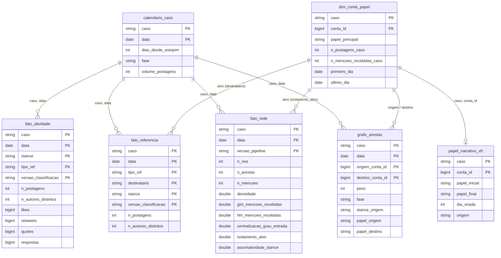
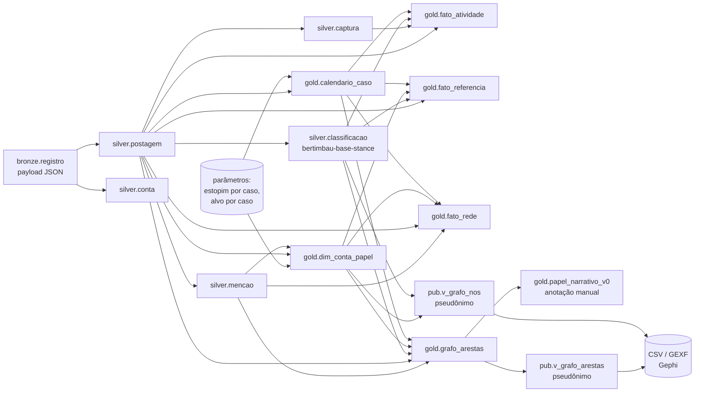

# scapegoat_pipeline — MVP de Engenharia de Dados

Pós-graduação em Ciência de Dados e Analytics — PUC-Rio · Sprint de Engenharia de Dados · Carlos A. Paes · entrega 27/09/2026 · tag `v1.0`

## Como usar este repositório

Este README é o documento avaliado do MVP; os sete títulos numerados abaixo são os exigidos pelo enunciado, nessa ordem. O código é referenciado a partir deles. Quem quiser rodar o pipeline precisa de um workspace Databricks (o MVP usou a Free Edition, que é a plataforma recomendada pelo enunciado) com um catálogo `scapegoat` e os esquemas `bronze`, `silver`, `gold` e `pub`, um Volume `bronze.raw` com os arquivos brutos — que **não estão neste repositório**, por decisão de projeto e conforme o item 4 do enunciado (ver a seção 2 e a licença no fim da seção 1) — e este repositório conectado como pasta Git do workspace. O DDL da Bronze está em `sql/02_bronze_ddl.sql`; o da Silver, em `sql/03_silver_ddl.ipynb`; a especificação relacional de referência, testada em PostgreSQL 16, em `sql/ddl_v3_1_mvp.sql`, com as 25 verificações de `tests/test_ddl_v3_1_mvp.sql` e o oráculo de contagens `tests/valores_esperados_qc.md`.

A ordem de execução é a das camadas. `notebooks/01_ingestao_bronze.py` lê o Volume e grava a Bronze (idempotente por hash; pode ser reexecutado). `notebooks/02_silver_promocao.ipynb` roda **uma vez por caso**, com os widgets `caso` (`monark` ou `arthur_do_val`) e `versao_pipeline`, normaliza, deduplica, aplica o portão de QC e promove para a Silver. `notebooks/03_classificacao.py` classifica `texto_limpo` com o modelo publicado e grava `silver.classificacao`. Os scripts `sql/sql/01_gold_calendario_caso.sql` a `05_gold_grafo_arestas.sql`, nessa ordem, constroem a Gold e as views `pub`; `06_` e `07_` gravam os comentários do catálogo; `sql/08_papel_narrativo_v0.sql.dbquery.ipynb` carrega a anotação de papéis. `notebooks/05_analise.py` lê só a Gold e a `pub` e produz as figuras e os CSV de `evidencias/bloco4/`, ou da pasta que o widget `saida` indicar. O job `scapegoat_pipeline`, definido no workspace, executa essa cadeia de ponta a ponta em dez tarefas, com os parâmetros `caso`, `versao_pipeline` e `saida`; rodá-lo uma vez por caso reproduz todas as tabelas do caso sem duplicar o que já existe e grava a análise na pasta indicada em `saida` (seção 4). `00_validacao_limpeza_texto.py` valida a regra de limpeza de texto contra o gabarito do classificador; é a terceira tarefa do job, logo após a promoção, e pode também ser rodado à parte a qualquer momento depois da Silver.

```
README.md                      este documento — os sete títulos avaliados
notebooks/
  01_ingestao_bronze.py        Volume → bronze.arquivo, bronze.registro (idempotente por hash)
  02_silver_promocao.ipynb     Bronze → Silver: normalização, dedup, QC bloqueante, promoção (widgets caso, versao_pipeline)
  02b_silver_conferencias.ipynb  células de exploração retiradas do 02
  03_classificacao.py          texto_limpo → silver.classificacao (BERTimbau, commit gravado como versão)
  05_analise.py                Gold/pub → figuras e CSV de evidencias/bloco4/ ou da pasta do widget saida (uma seção por pergunta)
  05b_conferencia_reexecucao.py  compara evidencias/bloco4 com a saída do job por SHA-256
  _quarentena/                 versões iterativas da análise e versões anteriores dos notebooks do plano C, mantidas por regra do projeto (mover, nunca apagar)
00_validacao_limpeza_texto.py  validação da regra de limpeza contra o gabarito (Teste A e Teste B)
sql/
  02_bronze_ddl.sql            DDL da Bronze (PK, FK, seis CHECK)
  03_silver_ddl.ipynb          DDL da Silver em Delta (PK, UNIQUE, FK, CHECK por ALTER TABLE)
  03_bronze_to_silver.sql      script original da promoção, do qual o notebook 02 é a versão em células
  08_papel_narrativo_v0.sql.dbquery.ipynb   carga da anotação de papéis narrativos
  ddl_v3_1_mvp.sql             especificação relacional v3.1 (PostgreSQL 16), referência do modelo
  roles_grants.sql             perfis de acesso e privilégios
  _quarentena/                 definição anterior de v_promovivel
  sql/
    01_gold_calendario_caso.sql … 05_gold_grafo_arestas.sql   construção da Gold e das views pub
    06_gold_catalogo_comments.sql, 07_gold_catalogo_comments_grafo.sql   COMMENT e tags do catálogo
tests/
  test_ddl_v3_1_mvp.sql        25 verificações da especificação; run_local.sh recria um banco limpo e as roda
  valores_esperados_qc.md      oráculo: contagens que a ingestão tem de reproduzir
  regua_reexecucao.sql         75 medidas: contagens, somas, rótulos, portão e domínios
  regua_reexecucao.md          a régua antes e depois do job, três colunas
catalog/
  catalogo_de_dados.md         Catálogo de Dados da Gold (transcrito na seção 3)
LICENSE                        licença MIT do código e da documentação (não cobre os dados)
evidencias/                    prints de cada etapa (raiz e bloco3/, bloco5/) e de cada resposta (bloco4/, bloco4/grafos/)
.gitignore                     dados, segredos e artefatos de modelo fora do Git desde o primeiro commit
```

---

## 1. Contexto de Negócios e Perguntas

Esta seção transcreve o Documento de Objetivo do MVP, **v6, congelado em 03/09/2026**, escrito **antes** das etapas de modelagem, carga e análise, conforme exige o enunciado. Perguntas não respondidas **permanecem registradas** e são discutidas na Autoavaliação (seção 7). O texto congelado não foi reescrito; duas **notas de retificação (13/09/2026)**, inseridas em §3 (data do estopim do caso 2) e §5.1 (checkpoint do classificador), em itálico e datadas, registram o que a execução mostrou. As referências "§N" usadas nas demais seções deste README apontam para as subseções abaixo.

### §1. Contexto

Episódios de hostilidade coletiva na internet — popularmente chamados de "cancelamentos" ou linchamentos virtuais — seguem um padrão reconhecível: uma tensão difusa, distribuída entre muitos, converge em pouco tempo sobre um alvo único, e a punição desse alvo produz uma sensação coletiva de alívio e reordenação. É o mecanismo que René Girard descreveu como **mecanismo do bode expiatório**, aqui observado em ambiente digital, onde deixa rastro registrável.

Esse rastro costuma ser estudado de forma pontual: uma coleta específica, um script específico, um gráfico específico. Cada caso é reprocessado do zero, com decisões metodológicas não documentadas, o que impede duas coisas essenciais: **comparar casos entre si** e **reproduzir um resultado** meses depois.

Este MVP ataca o segundo problema — o de engenharia — porque ele é a condição do primeiro.

### §2. Problema a resolver

> **Não existe, hoje, um repositório analítico que transforme coletas brutas de episódios de hostilidade coletiva online em medidas comparáveis entre casos, com proveniência auditável e qualidade verificada.**

O que existe são arquivos: JSON de coleta, CSVs intermediários, rótulos produzidos por um modelo, grafos exportados, notebooks avulsos. Falta o caminho documentado e repetível entre o arquivo bruto e a resposta analítica.

O MVP constrói esse caminho: um **pipeline de dados na nuvem** que vai do payload bruto da plataforma, guardado em camada Bronze, até um modelo dimensional consultável em camada Gold, passando por limpeza, classificação, verificação de qualidade e cálculo de métricas de rede — com catálogo de dados, linhagem registrada e controle de acesso.

**As perguntas de negócio da §4 são, ao mesmo tempo, o propósito e a prova do pipeline:** se puderem ser respondidas com uma consulta ao modelo final, o pipeline funcionou.

#### §2.1 Quem faria estas perguntas

- **A pessoa atingida** — que viveu o episódio como um caos sem forma e quer saber o tamanho real do que a atingiu.
- **O pesquisador** — que precisa de medidas comparáveis entre episódios para testar se existe um padrão estrutural recorrente.

### §3. Os casos analisados

Dois episódios, processados pelo mesmo pipeline. Dois, e não um, porque **um único caso não demonstra o modelo dimensional** nem que o pipeline aceita casos novos; e não mais que dois porque cada caso adicional multiplica a verificação de qualidade sem acrescentar ao que se quer provar.

Os dois foram escolhidos por critérios de engenharia explícitos, aplicados a **oito corpora disponíveis**: existência de um alvo identificável na rede de menções, volume não limitado pelo teto do coletor, e esquema tratável.

**Caso 1 — Monark / *Flow Podcast* (fevereiro de 2022).** Controvérsia surgida após declarações feitas ao vivo sobre a legalização de um partido nazista no Brasil. Estopim: **08/02/2022**.

**Caso 2 — Arthur do Val / "Mamãe Falei" (fevereiro–março de 2022).** Deputado estadual que, em viagem à fronteira da Ucrânia, gravou e divulgou áudios com comentários sobre mulheres ucranianas; o episódio levou a processo de cassação e à renúncia do mandato. Estopim: **28/02/2022**, dia em que os áudios vieram a público.

> *Nota de retificação (07/09/2026, registrada em 13/09): a data acima estava errada. A leitura de uma amostra de 20 postagens de 28/02/2022 mostrou que todas tratavam da ida do deputado à Ucrânia e nenhuma dos áudios; o máximo de volume daquele dia (1 359 postagens) pertence à polêmica anterior, não ao caso. O estopim do caso 2 é **04/03/2022**, dia da divulgação dos áudios, e é esse o parâmetro gravado em `gold.calendario_caso`. Consequências: a linha de base pré-crise passa de 3 para 7 dias (25/02 a 03/03) e é a polêmica anterior, não um patamar calmo; o pico do caso, calculado só a partir do estopim, é 05/03 (896 postagens), não 28/02. A tabela abaixo e a P1 da §4 mantêm os valores originais; a análise usa os corrigidos.*

| Característica | Monark | Arthur do Val |
|---|---|---|
| Registros brutos | 5.143 | **13.906** |
| Identificadores únicos | 4.803 | **13.906** |
| Duplicatas | 340 (6,6%) | **nenhuma** |
| Autores distintos | 4.140 | **9.268** |
| Cobertura temporal | 07 a 14/02/2022 (8 dias) | 25/02 a 14/03/2022 (18 dias) |
| Dias com postagem | 8 de 8 | 18 de 18 |
| Linha de base pré-estopim | **ausente** | **3 dias (25–27/02)** |
| Pico de volume | 09/02 (1.402) | 28/02 (1.359) |
| Arestas de menção | 6.934 | **23.202** |
| Contas mencionadas distintas | 1.648 | 2.943 |
| Respostas (replies) | 2.484 (48,3%) | **9.664 (69,5%)** |
| Respostas com o tweet-pai no corpus | 102 (4,1%) | 1.472 (15,2%) |
| **Menções ao alvo** | 1.490 (**21,5%** das arestas) | 9.239 (**39,8%**) |
| **Respostas dirigidas ao alvo** | 528 | 3.409 |
| Valores ausentes | nenhum | nenhum |
| Camada disponível | consolidado (19 atributos) | **payload GraphQL original** |
| Classificação de posição | existe (versão anterior) | **não existe** |
| Consulta de coleta | **não recuperável** (§10) | registrada no próprio bruto |

A consulta do caso 2, recuperada do `metadata` de cada arquivo bruto (o nome de usuário do alvo está mascarado neste documento, por política do projeto):

```
("Arthur do Val" OR "Arthur Doval" OR "Mamãe Falei" OR "Mamae Falei" OR @<handle do alvo>) lang:pt
```

Ambos os corpora são de postagens públicas na plataforma **X**, em português, **coletadas por raspagem da busca pública** — não por API oficial.

**Casos avaliados e descartados**, com o motivo, para que a escolha seja auditável: **Wagner Schwartz** (2017) e **Patrícia Moreira** (2014) não têm alvo na rede de menções — a hostilidade circulou por veículos de imprensa, sem endereçar a pessoa; **Patrícia Moreira** ainda tem o volume diário travado em ~990 postagens contra um alvo de 5.000, o que torna a série temporal um artefato do coletor; **Pugliesi** (2020) tem esquema pobre demais (apenas id, data e texto — sem autor nem menções); **Karol Conká** (2021) tem 15 MB de respostas da plataforma que **não contêm tweet algum** — a coleta falhou; **Eduardo Bueno** (2025) tem alvo forte, mas só existe em versão já processada e é três anos posterior aos demais, o que enfraqueceria a comparação; **MC Gui** (2019) e **Gkay** (2022) foram descartados por decisão do autor.

#### §3.1 Relação com trabalho anterior do autor

O corpus do Monark já foi objeto de um MVP anterior desta pós-graduação, de natureza **exploratória e analítica**.

| | MVP anterior (analítico) | Este MVP (engenharia de dados) |
|---|---|---|
| Insumo | Arquivos pré-processados manualmente | Payload bruto imutável em camada Bronze |
| Processamento | Scripts encadeados à mão num notebook | Pipeline orquestrado, Bronze → Silver → Gold, com QC bloqueante |
| Onde os dados moram | Repositório de arquivos | Lakehouse na nuvem, modelado |
| Rótulos de posição | Coluna pronta no arquivo | Registro com modelo, versão e confiança |
| Métricas | Calculadas em memória | Persistidas com grão, janela e versão de pipeline |
| Reprodutibilidade | Reexecutar o notebook | Linhagem rastreável do número ao arquivo bruto |
| Extensibilidade | Um caso por notebook | Novos casos pelo mesmo pipeline — **demonstrado com dois, de duas fontes diferentes** |

**Três delimitações éticas e metodológicas:**

1. **O trabalho não julga o mérito das controvérsias.** O objeto é a *dinâmica coletiva* — velocidade, concentração, forma da rede.
2. **"Alvo" é posição estrutural, não juízo.** Descreve para onde as menções convergiram, e nada além.
3. **Os casos são nomeados; as pessoas, não.** Os episódios são públicos e noticiados nacionalmente, e ambos os alvos são figuras públicas em exercício de atividade pública. As **contas individuais dos participantes comuns são pseudonimizadas** em toda tabela, gráfico, evidência e exportação, sem exceção.

### §4. Perguntas de negócio

Onze perguntas. A **viabilidade** registra, *antes de começar*, a expectativa honesta de respondê-las, informada pelo inventário dos corpora. Conforme o enunciado, **nenhuma pergunta é removida**, inclusive as que o inventário já mostrou serem irrespondíveis.

#### Bloco A — Forma temporal

**P1. Quanto tempo durou o episódio, do estopim ao retorno à linha de base?**
*Viabilidade:* **alta para o caso 2, média para o caso 1.** O corpus do Arthur do Val tem três dias anteriores ao estopim (25–27/02, com 920, 373 e 300 postagens) que servem de patamar de comparação. O do Monark começa no próprio estopim; para ele a resposta será a duração do estopim ao declínio, com a ausência de linha de base declarada.

**P2. Quando ocorreu o pico, e quão abrupta foi a escalada?** — *Viabilidade:* **alta**.

#### Bloco B — Participação

**P3. Quantas contas distintas participaram do episódio?**
*Regra fixada antes da análise:* contas automatizadas são excluídas da contagem de participantes e reportadas à parte. Verificado no inventário: nenhum dos dois corpora contém volume relevante de conta automatizada (o fenômeno aparece em corpora de 2025, não nos de 2022). A verificação permanece como item de QC.
*Viabilidade:* **alta**.

**P4. Que parcela dos participantes produziu conteúdo próprio, e que parcela apenas retransmitiu?**
*Viabilidade:* **nula — e a razão é conhecida antes de começar.* Nenhum dos corpora contém retweets. No payload bruto do caso 2, **nenhum dos 13.906 registros traz o campo `retweeted_status_result`**, e apenas um texto começa com "RT @". A ausência é propriedade da **busca pública da plataforma**, que não devolve retweets — não é falha do processamento. A proxy por citações (287 no Monark, 647 no Arthur) foi considerada e descartada: citação é comentário, não retransmissão.
*Mantida deliberadamente:* a pergunta é legítima, o mecanismo depende da distinção entre quem acusa e quem propaga, e a incapacidade de respondê-la **é um resultado sobre o instrumento de coleta**, a ser discutido na autoavaliação e a orientar coletas futuras.

#### Bloco C — Concentração

**P5. Quão concentrada foi a atenção? Que fração das menções recaiu sobre que fração das contas?**
*Como se responde:* Gini, HHI e top-1%/5%/10% das menções recebidas, por janela.
*Referência do inventário:* top-1 share global de 21,5% (Monark) e 39,8% (Arthur do Val).
*Viabilidade:* **alta**.

**P6. O pico de concentração coincide com o pico de volume, ou um antecede o outro?** — *Viabilidade:* **alta**.

#### Bloco D — Posições

**P7. Houve defesa? Qual a proporção entre acusadoras, defensoras e neutras, e como varia entre as fases?**
*Viabilidade:* **alta**, com a ressalva do §5.1 — o F1 de 0,391 na classe `defensor` é o limite superior de confiança desta resposta.

**P8. Acusadores interagem com acusadores? A rede é assortativa por posição?** — *Viabilidade:* **alta**, mesma ressalva.

#### Bloco E — Alvo e liderança

**P9. O alvo passa a ser *falado sobre* sem ser *falado com*?**

*Definição operacional (fixada antes da análise):* a **razão entre respostas dirigidas ao alvo e menções ao alvo**, por janela. Uma resposta é dirigir a palavra a alguém; uma menção em postagem não endereçada é falar a respeito dele.

*Por que esta definição e não a reciprocidade do ego-network:* o inventário mostrou que **o alvo não é autor em nenhum dos corpora** — a consulta de busca captura o que se diz *sobre* ele, e as postagens dele não casam com os termos. Sem arestas saindo do alvo, a reciprocidade seria zero por construção, não por fenômeno: mediria o método de coleta, não o episódio. `ego_density` (densidade entre os vizinhos do alvo) permanece como medida auxiliar.

*Referência global do inventário:* **35,4% no Monark** (528/1.490) e **36,9% no Arthur do Val** (3.409/9.239). A proximidade entre dois episódios independentes é precisamente o que a P11 vai examinar por janela.
*Viabilidade:* **alta**.

**P10. Há inversão de polo entre líderes de acusação e alvo?**
*Hipótese:* dinâmica **trifásica e defasada** — um núcleo acusador concentra atenção primeiro; a atenção converge sobre o alvo depois; parte retorna aos líderes após o pico.
*Definição operacional:* **líder de acusação** é a conta que, na janela, tem postagens acusadoras e figura entre as de maior centralidade de entrada, excluído o alvo e excluídas contas automatizadas. Mede-se `indeg_centralization`, `top1_share_in` e a participação do alvo *versus* a dos líderes.
*Viabilidade:* **alta** — no caso 2 há candidatos claros a líder no topo das menções, depois do alvo.

#### Bloco F — Comparação entre episódios

**P11. As assinaturas estruturais dos dois episódios coincidem quando alinhadas pelo dia do estopim?**

*Como se responde:* as métricas de P5, P7, P8, P9 e P10 por janela, alinhadas pelo `calendario_caso` (dias desde o estopim), e comparadas.
*Por que importa:* **é a pergunta que justifica o repositório existir.** Um caso é uma história; dois casos com a mesma forma são indício de mecanismo. É também a prova de que a modelagem dimensional cumpre sua função.
*Condições favoráveis, registradas de antemão:* os dois episódios são **do mesmo ano, na mesma plataforma, com consultas do mesmo tipo (por nome do alvo)** e separados por três semanas. É a comparação mais controlada que os corpora disponíveis permitem.
*Restrição declarada:* a comparação é entre **medidas normalizadas** — Gini, HHI, assortatividade, razão da P9, defasagens relativas — e **nunca entre volumes absolutos ou engajamento bruto**, porque as coletas têm janelas e rendimentos diferentes.
*Viabilidade:* **média** — é a pergunta que pode honestamente falhar, e depende de o segundo caso atravessar o pipeline inteiro dentro do prazo.

### §5. O modelo de classificação como componente do pipeline

#### §5.1 Ficha técnica

| Item | Valor |
|---|---|
| Nome | Scapegoat Stance Classifier |
| Modelo base | **BERTimbau Base** (`neuralmind/bert-base-portuguese-cased`) |
| Técnica | *Fine-tuning* com cabeça de classificação sobre o token `[CLS]` |
| Classes | `acusador`, `defensor`, `neutro` |
| Comprimento máximo | 192 tokens WordPiece |
| Desbalanceamento | Pesos de classe inversos à frequência, multiplicador 1,2 para `defensor` |
| Aumento de dados | Ruído e retrotradução PT→EN→PT, **somente** na classe `defensor`, só no treino |
| Treinamento | até 8 épocas, LR 1e-5, batch 8, *warmup* 10%, *weight decay* 0,01, *early stopping* por F1 macro |
| Reprodutibilidade | semente 42 em `transformers`, PyTorch, CUDA e NumPy; cuDNN determinístico |
| Conjuntos | treino 1.255 · validação 157 · teste 157, rotulagem manual por anotador único |
| **Checkpoint adotado** | **v2b** |
| **Desempenho no teste** | **acurácia 0,752 · F1 macro 0,666** · F1: `acusador` 0,827 · `defensor` **0,391** · `neutro` 0,779 |

**Advertência:** existe entre os checkpoints um modelo (`bertimbau_finetuned_weighted`) **degenerado** — prediz `acusador` para todas as entradas (F1 macro 0,253). Não será usado.

**Consequência analítica declarada:** o F1 de 0,391 em `defensor` é o **limite superior de confiança** de toda resposta que dependa de distinguir defesa — P7, P8 e, indiretamente, P11.

> *Nota de retificação (06/09/2026, registrada em 13/09): o modelo publicado e aplicado ao corpus é o checkpoint **v1b** (`carlospaes120/bertimbau-base-stance`, commit `a483947`), não o v2b declarado acima. Desempenho reproduzido dentro da plataforma sobre os 157 exemplos de teste, idêntico ao card do modelo: acurácia 0,732 · F1 `acusador` 0,824 · `defensor` 0,500 · `neutro` 0,676, com `max_length = 128` (e não 192). A tabela `silver.classificacao` grava o commit real como `versao`. A consequência analítica declarada acima permanece, com o número corrigido: o F1 de 0,50 em `defensor` é o limite de confiança de P7, P8 e P11, e toda contagem de `defensor` entra na análise como intervalo.*

#### §5.2 Como o modelo entra no pipeline

- Cada rótulo é armazenado com **qual modelo o produziu, em que versão e com que confiança** — nunca como atributo solto, nunca como fato sobre a pessoa.
- Modelo, conjunto de treino e métricas são **entidades de linhagem**.
- Reclassificar **não sobrescreve**: gera novo conjunto identificado por versão.

**A inferência é etapa obrigatória do pipeline, e desta vez por necessidade material:** o corpus do caso 2 **nunca foi classificado**. Sem a etapa, P7, P8 e a parte de posições da P11 ficam sem resposta para metade do trabalho. É a demonstração mais forte possível de que a classificação é componente permanente do pipeline, e não artifício.

**Condição favorável de controle:** o corpus do caso 1 existe em duas versões — uma sem rótulos e outra com. O pipeline carrega a versão sem rótulos, roda a inferência, e a versão rotulada serve de **gabarito**. A **taxa de concordância** entre as duas é métrica de qualidade calculável; o desacordo aponta as postagens ambíguas.

**Delimitação:** treinar ou avaliar o modelo **não** faz parte deste MVP. Integrá-lo com proveniência, versionamento e margem de erro declarada é que é o problema de engenharia.

### §6. Escopo

#### §6.1 Dentro do escopo

| Etapa | O que será feito |
|---|---|
| Busca | Dois corpora próprios de postagens públicas em português na plataforma X, **obtidos por raspagem da busca pública**, selecionados entre oito por critérios explícitos (§3) |
| Coleta | Persistência imutável em **camada Bronze** (Volume do Unity Catalog), com hash, metadados de ingestão e manifesto. **Duas fontes de ingestão**: o payload GraphQL original da plataforma (caso 2) e o extrato consolidado da coleta (caso 1), escrevendo na mesma camada |
| Modelagem | **Arquitetura medalhão**: Bronze → Silver (modelo relacional normalizado) → Gold (**esquema estrela**), mais Catálogo de Dados completo |
| Classificação | Integração do modelo próprio, com modelo, versão e confiança por rótulo |
| Carga | Pipeline ETL **dentro da plataforma**, em SQL/PySpark, com limpeza, deduplicação e QC **bloqueante**, por caso |
| Análise | Qualidade atributo a atributo + resposta às perguntas da §4 com discussão |
| Autoavaliação | Confronto entre este documento e o resultado obtido |

#### §6.2 Fora do escopo

- **Casos além dos dois** — os seis restantes ficam documentados no inventário, com o motivo do descarte.
- **Investigação de episódios sem centro** (Wagner Schwartz, Patrícia Moreira) — achado teórico relevante, registrado como trabalho futuro.
- **Verificação de quais postagens ainda existem na plataforma hoje** — a dimensão de qualidade *atualidade* não será medida.
- Publicação de site ou interface pública.
- Ingestão de outras plataformas, outros idiomas ou casos ocorridos fora da internet.
- Contribuições de terceiros, moderação e autenticação.
- Treinamento ou re-treinamento do modelo.
- Processamento distribuído: o volume não justifica cluster. Decisão documentada, não limitação.

### §7. Premissas e limitações conhecidas antes de começar

1. **Os corpora são anteriores a este MVP.** Provêm de pesquisa própria e não foram coletados para este trabalho. Os dados existiam, e o objetivo foi escrito sabendo o que contêm — o que torna a avaliação de viabilidade da §4 mais informada, não menos legítima.

2. **A coleta foi por raspagem da busca pública**, não por API oficial. Os termos de uso da plataforma restringem a redistribuição de conteúdo; **os dados não são redistribuídos** — o enunciado dispensa expressamente sua disponibilização.

3. **A consulta de coleta do caso 1 não é recuperável.** A do caso 2 está registrada no próprio payload bruto e é uma busca **por nome do alvo**. Para o caso 1 sabe-se o que é verificável — busca pública, em português, na janela conhecida — e nada além. **A perda dessa informação é, ela própria, o argumento de existência deste pipeline:** `COLETA.consulta` passa a ser obrigatório, e uma decisão que determina tudo o que vem depois deixa de poder se perder.

4. **Uma plataforma, duas janelas, um idioma.** As conclusões valem para o que foi capturado, não para "a internet". O caso 2 contém 90 postagens em outros idiomas apesar do filtro `lang:pt` — item de QC.

5. **Classificação automática é interpretação, não fato** — com modelo, versão e confiança registrados, e margem declarada.

6. **Linha de base de qualidade já conhecida.** Caso 1: 340 identificadores duplicados (6,6%), respostas rotuladas como originais, dois formatos de data, nenhum valor ausente. Caso 2: nenhuma duplicata, nenhum valor ausente, mas **volume diário notavelmente regular entre 01 e 13/03 (785 a 900 postagens)** — possível teto de rendimento do coletor, a verificar com um indicador que compare rendimento diário e alvo de coleta.

7. **Os rótulos existentes do caso 1 não trazem grau de confiança.** O modelo o produz e ele se perdeu no armazenamento — decisão de modelo persistida sem o metadado que permite avaliá-la.

8. **Reuso declarado de trabalho anterior.** O que este trabalho acrescenta é a infraestrutura de dados, não a interpretação dos casos.

9. **Comparabilidade entre os dois casos.** Favorável — mesmo ano, mesma plataforma, consultas do mesmo tipo — mas não perfeita: as janelas têm larguras diferentes (8 e 18 dias) e os rendimentos de coleta diferem. **P11 compara apenas medidas normalizadas.**

10. **A busca da plataforma não devolve retweets.** Verificado no payload bruto. Consequência direta em P4 (§4) e limitação de toda leitura sobre amplificação.

11. **O alvo não é autor em nenhum dos corpora**, por construção da consulta. Motivou a operacionalização de P9 e impede qualquer medida que dependa de arestas saindo do alvo.

12. **Assimetria de camada entre os casos.** O caso 2 entra pelo payload original; o caso 1, por um extrato consolidado produzido em etapa anterior a este MVP, cujo payload original não foi preservado. A camada Bronze recebe os dois **como vieram**, e a diferença é registrada na linhagem.

### §8. Critérios de sucesso

**Técnicos**

- T1. O bruto persistido em camada Bronze na nuvem, imutável e catalogado, com proveniência registrada.
- T2. O pipeline executar de ponta a ponta, com log e versão identificável.
- T3. A verificação de qualidade ser **bloqueante**.
- T4. Existir modelo em esquema estrela consultável e Catálogo de Dados com tipo, **domínio de valores** e origem de cada atributo.
- T5. O caminho de qualquer número até o arquivo bruto ser rastreável — **inclusive para rótulos de modelo**.
- T6. **O segundo caso entrar pelo mesmo pipeline, sem código específico para ele** — e por uma fonte de ingestão diferente da do primeiro.

**Analíticos**

- A1. P1, P2, P3, P5 e P6 respondidas com discussão. *(Meta mínima.)*
- A2. P7 e P8 respondidas com discussão e margem de erro do classificador, **nos dois casos** — o que exige a inferência funcionando. *(Meta esperada.)*
- A3. P9 e P10 respondidas ou com sua impossibilidade explicada. *(Meta desejável.)*
- A4. P11 respondida ou com sua impossibilidade explicada. *(Meta ambiciosa.)*
- A5. **P4 discutida como não respondível**, com a limitação do instrumento de coleta caracterizada.

**De conformidade**

- C1. Nenhum dado pessoal de participante comum — texto, nome de usuário ou perfil — no repositório público, nas evidências ou no documento entregue.
- C2. Licença e termos de uso dos dados declarados explicitamente no documento de entrega.

### §9. Glossário mínimo

| Termo | Significado neste trabalho |
|---|---|
| **Episódio / caso** | Evento delimitado de hostilidade coletiva online, com data de estopim e alvo identificável |
| **Alvo** | Pessoa ou instituição sobre quem a hostilidade converge. Descrição estrutural, não juízo |
| **Menção** | Referência de uma conta a outra dentro de uma postagem; é a aresta do grafo |
| **Resposta (reply)** | Postagem dirigida a outra conta; distingue-se da menção por ser fala **com**, não **sobre** |
| **Posição (*stance*)** | Rótulo de uma postagem: acusadora, defensora ou neutra |
| **Papel** | Função de um participante **dentro de um caso**; atributo da atuação, não da pessoa |
| **Convergência** | Concentração progressiva das menções hostis sobre um único alvo |
| **Fase** | Etapa do ciclo: pré-crise, estopim, escalada, pico de convergência, declínio, pós-rito |
| **Janela** | Recorte temporal sobre o qual uma métrica de rede é calculada |
| **Assinatura** | Conjunto de métricas estruturais que caracteriza um episódio e permite compará-lo a outro |

**Aviso semântico:** *acusador* aparece em dois níveis — **posição de uma postagem** (rótulo do classificador) e **papel de um participante no caso**. São coisas diferentes, em tabelas diferentes, e o Catálogo de Dados as distinguirá.

### §10. Pontos a confirmar antes do congelamento

**Resolvidos:** identificação e número dos casos (§3); **caso 2: Arthur do Val**, com os critérios de escolha e os motivos de descarte dos demais registrados; **datas de estopim** — 08/02/2022 e 28/02/2022; **método de coleta: raspagem**, confirmado pelo autor; **consulta do caso 2**, recuperada do payload; execução da inferência dentro do pipeline; definições operacionais de P9 e P10; desempenho medido do modelo (BERTimbau **Base**, checkpoint v2b); tratamento de P4 e de contas automatizadas; **camada Bronze definida** — payload original no caso 2, extrato consolidado no caso 1, ambos como vieram.

**Em aberto — único item:**

- **`[CONFIRMAR 4]` — situação do repositório público anterior.** O corpus classificado do caso 1, com texto integral e nomes de perfil, está publicado em repositório público do autor, assim como cerca de 99 MB de JSON bruto de outro caso. Anterior à Política de Dados do projeto, conflita com C1, e a decisão precisa ser tomada **antes de o novo repositório ir a público**.

### §11. Congelamento

Resolvido o ponto da §10, este documento é **congelado**. Conforme o enunciado, perguntas não respondidas **não são removidas**: o confronto entre o planejado aqui e o obtido é o objeto da autoavaliação.

*Documento de Objetivo — MVP de Engenharia de Dados, PUC-Rio. v6, 03/09/2026. Notas de retificação de 13/09/2026 em §3 e §5.1.*

### Licença e termos de uso dos dados

Os dois corpora são postagens públicas da plataforma X, coletadas por raspagem da busca pública, e são usados exclusivamente para fins acadêmicos, nesta pesquisa de pós-graduação. Os termos de uso da plataforma restringem a redistribuição de conteúdo; por isso os dados não são redistribuídos — o enunciado dispensa expressamente a disponibilização da base — e o repositório não contém texto de postagem, nome de usuário, identificador nativo de conta ou de postagem, nem perfil de participante. O tratamento segue a Política de Dados do projeto: os dados foram tornados manifestamente públicos pelos titulares, o tratamento observa finalidade, boa-fé e interesse público (LGPD, art. 7º, §§ 3º e 4º) e se apoia no legítimo interesse (art. 7º, IX), com o teste de proporcionalidade documentado na própria Política — finalidade legítima, minimização no ambiente público e salvaguardas efetivas (pseudonimização, controle de acesso, canal para pedidos de remoção). O que sai da plataforma e pode ser publicado são apenas agregados por caso, janela e fase e grafos com rótulos pseudonimizados por hash estável, sem nome para nenhuma conta, inclusive a do alvo; a tabela de correspondência entre pseudônimo e conta permanece no ambiente privado. Os alvos dos dois casos são figuras públicas em exercício de atividade pública e os episódios foram noticiados nacionalmente; os casos são nomeados, as pessoas comuns não. O código e a documentação deste repositório são distribuídos sob a licença MIT (arquivo `LICENSE` na raiz); a licença cobre o código e a documentação, não os dados, que não são redistribuídos.

## 2. Carga dos Dados

Os dois corpora são anteriores a este MVP e vieram de pesquisa própria: postagens públicas da plataforma X, em português, obtidas por **raspagem da busca pública** com sessão autenticada, executada por automação de navegador na máquina local — e não por API oficial. A raspagem não roda dentro da plataforma de dados, nem rodaria bem em nuvem alguma, porque a busca do X desafia endereços de datacenter; por isso a coleta é local e o que sobe para a nuvem é o arquivo, o "caso simples" de carga que o enunciado descreve e autoriza. A consulta que gerou o caso 2 está registrada no próprio payload bruto e é uma busca **por nome do alvo** (transcrita, com o nome de usuário mascarado, na seção 1, §3); a do caso 1 **não é recuperável** — sabe-se que foi busca pública, em português, na janela conhecida, e nada além. Essa perda é um dos argumentos de existência do pipeline: a consulta de coleta passa a ser campo obrigatório na camada Bronze, e uma decisão que determina tudo o que vem depois deixa de poder se perder. Duas propriedades do instrumento de coleta condicionam toda a análise e ficam declaradas desde aqui: a busca pública **não devolve retweets** (P4 da seção 1 é irrespondível por isso), e **o alvo não é autor** em nenhum dos corpora, porque a consulta captura o que se diz sobre ele, não o que ele diz.

Os dados chegam em **duas fontes de formato distinto**, e a Bronze recebe as duas como vieram. O caso 2 (Arthur do Val) entra pelo **payload GraphQL original** da plataforma, em 18 arquivos JSON, um por dia de coleta, cobrindo 25/02 a 15/03/2022, com a consulta e a janela de cada arquivo no seu `metadata`. O caso 1 (Monark) entra por um **extrato consolidado** de 19 atributos, em um único arquivo JSONL produzido em etapa anterior a este MVP, cujo payload original não foi preservado, cobrindo 07 a 15/02/2022. A assimetria é registrada na linhagem (coluna `fonte` de `bronze.arquivo`: `graphql` e `consolidado`) e absorvida adiante, na normalização para a Silver, por um ramo por formato de fonte — não por caso (seção 4). O que já se sabia dos dados antes da carga, e que a seção 5 trata indicador a indicador, fica só nomeado aqui: 340 linhas duplicadas no Monark, dois formatos de data, nenhum valor ausente em nenhum dos casos, e 90 postagens do Arthur do Val com `lang` diferente de `pt` apesar do filtro da consulta.

A subida para a nuvem tem três peças. A primeira é o **Volume `bronze.raw` do Unity Catalog**, onde os arquivos brutos são depositados por upload a partir da máquina local e permanecem imutáveis; a plataforma escolhida é o Databricks Free Edition, o recomendado pelo enunciado, e o Volume é a única forma de armazenamento de arquivos que ela oferece. A segunda é o notebook **`notebooks/01_ingestao_bronze.py`**, que inventaria o Volume, calcula o **SHA-256 de cada arquivo**, recupera a consulta de coleta e o período a partir do payload quando existem, e grava duas tabelas cujo DDL está em **`sql/02_bronze_ddl.sql`**: `bronze.arquivo`, o inventário dos objetos brutos (caso, fonte, formato, tamanho, hash, período coberto, consulta e instante de ingestão), e `bronze.registro`, uma linha por registro do arquivo, fiel à fonte, ligada ao arquivo de origem. A ingestão é **idempotente por hash**: um arquivo cujo SHA-256 já está em `bronze.arquivo` é ignorado, de modo que reexecutar o notebook não duplica nada — a evidência mostra a segunda execução encontrando um arquivo novo e zero repetidos. A terceira peça é a **conferência contra um oráculo escrito antes da execução**, `tests/valores_esperados_qc.md`: uma consulta compara a contagem real de arquivos e registros por caso com a esperada e devolve `OK`, `DIVERGE` ou `NÃO INGERIDO`. O resultado foi `OK` nos dois casos — **18 arquivos e 13.906 registros para o Arthur do Val (86,8 MB), 1 arquivo e 5.143 registros para o Monark (5,5 MB)** —, e a Bronze fechou na tag `v0.1.0` do repositório, ponto para o qual a linhagem gravada nas tabelas aponta.

Os dados brutos **não estão neste repositório**, por decisão de projeto e conforme o item 4 do enunciado; o `.gitignore`, presente desde o primeiro commit, exclui todo arquivo de dados (`*.json`, `*.jsonl`, `*.csv`, `*.parquet` e as pastas de dados), além de segredos e artefatos de modelo. A licença de uso e os termos de tratamento dos dados estão declarados no fim da seção 1.

**Evidências desta seção.** `evidencias/linhagem_bronze_arquivo.png` — as 19 linhas de `bronze.arquivo`, com fonte, formato, tamanho, hash, período e instante de ingestão de cada arquivo; `evidencias/carga_contagem_por_caso.png` — arquivos, registros, volume em MB, consultas distintas e período coberto, por caso e fonte; `evidencias/carga_idempotencia.png` — a célula de ingestão pulando os arquivos já ingeridos por hash; `evidencias/carga_veredito_oraculo.png` — a conferência de contagens contra `tests/valores_esperados_qc.md`, com veredito `OK` nos dois casos.

## 3. Modelagem e Catálogo de Dados

### 3.1 Arquitetura medalhão

O catálogo `scapegoat`, no Unity Catalog do Databricks, tem quatro esquemas, e o pipeline reflete a progressão que o enunciado ensina: Bronze recebe o bruto como veio, Silver o normaliza e valida, Gold o organiza em esquema estrela para consulta analítica, e uma quarta camada, `pub`, expõe views pseudonimizadas — a fronteira do que sai da plataforma. A pseudonimização acontece só nessa fronteira: Silver e Gold carregam `conta_id`, chave surrogate reversível apenas por `silver.conta`, e são camadas restritas a um único usuário.

| Camada | Esquema | Conteúdo |
|---|---|---|
| **Bronze** | `bronze` (Volume + tabelas) | JSON e JSONL como vieram, mais metadados de ingestão: arquivo de origem, hash SHA-256, período coberto, consulta, instante de ingestão. Cofre de evidências. |
| **Silver** | `silver` | O modelo relacional v3.1 normalizado: contas, postagens, capturas, menções, hashtags, classificação de stance e resultados do QC. Limpo, deduplicado, tipado, validado. |
| **Gold** | `gold` | Esquema estrela: calendário do caso, dimensão de contas e papéis, fatos de atividade, de rede e de referência, tabela de arestas e papéis narrativos. Sem texto nem handle. |
| — | `pub` | Views de publicação: nós e arestas do grafo com pseudônimo estável. O que vira export. |

```
coleta (máquina local)
   │  upload dos arquivos brutos
   ▼
BRONZE   Volume bronze.raw + bronze.arquivo (inventário com hash) + bronze.registro (registros fiéis à fonte)
   │  SQL: parse do JSON, unificação dos dois formatos de fonte, normalização de datas, dedup, tipagem
   │  ── QC bloqueante: não passou, não promove ──
   ▼
SILVER   v3.1 em Delta (conta, postagem, captura, mencao, postagem_hashtag, classificacao, qc_resultado)
   │  inferência BERTimbau (hf@a483947) → classificacao com modelo, versão e confiança
   │  SQL → métricas por dia e por caso
   ▼
GOLD     estrela: calendario_caso, dim_conta_papel, fato_atividade, fato_rede, fato_referencia, grafo_arestas, papel_narrativo_v0
   │  views pub.v_grafo_nos / pub.v_grafo_arestas (pseudônimo)
   ▼
CSV / GEXF → Gephi (grafos) · CSV/PNG da análise
```

Não há cluster nem Spark distribuído por necessidade: o volume é de dezenas de megabytes e tudo rodou no warehouse serverless e em CPU serverless da Free Edition. É decisão documentada no objetivo (seção 1, §6.2), não limitação.

### 3.2 Bronze

Duas tabelas, com DDL em `sql/02_bronze_ddl.sql`. `bronze.arquivo` é o inventário dos objetos brutos do Volume — uma linha por arquivo, com caso, fonte (`graphql` ou `consolidado`), formato (`json` ou `jsonl`), tamanho em bytes, SHA-256, período coberto, consulta de coleta quando recuperável e instante de ingestão. `bronze.registro` guarda uma linha por registro de cada arquivo, com o payload como veio e a posição da linha, ligada ao arquivo por chave estrangeira. A Bronze tem chave primária em `arquivo`, chave estrangeira de `registro` para `arquivo` e seis restrições `CHECK` que protegem o mínimo que uma camada bruta precisa garantir: tamanho positivo, formato conhecido, período ordenado, hash com 64 caracteres hexadecimais, linha positiva e payload que começa como JSON. No Delta com Unity Catalog essas restrições têm alcance diferente do de um banco relacional — chaves primárias e estrangeiras são declarativas (`NOT ENFORCED`) e os `CHECK` entram por `ALTER TABLE`, não no `CREATE TABLE` — e a consequência disso para o controle de qualidade está na seção 5.

### 3.3 Silver

A Silver é a implementação em Delta de uma especificação escrita e testada antes: `sql/ddl_v3_1_mvp.sql`, o modelo relacional v3.1 em PostgreSQL 16, com dezoito tabelas, e `tests/test_ddl_v3_1_mvp.sql`, as vinte e cinco verificações que provam as regras desse modelo num banco limpo (`tests/run_local.sh`). O MVP implementa desse modelo o que os dois corpora exigem: seis tabelas de dados, uma de resultados de QC e quatro views que compõem a promoção Bronze → Silver. A tabela abaixo transcreve o propósito e o grão de cada objeto tal como gravados em `COMMENT` no Unity Catalog em 13/09/2026 (Silver) e 16/09/2026 (`qc_resultado` e `v_promovivel`).

| Objeto | Tipo | Propósito e grão |
|---|---|---|
| `silver.conta` | tabela | Uma linha por conta da plataforma vista no corpus, autora ou mencionada; grão `conta_id` (surrogate) × id nativo. Carrega handle, por isso é camada restrita: nunca sai em print, README ou `pub`. Os alvos existem aqui apenas como mencionados, com zero postagens. |
| `silver.postagem` | tabela | Postagens deduplicadas dos casos; uma linha por (caso, id nativo). Linhagem `bronze.registro` → `v_normalizado` → `v_deduplicado` → QC → `v_promovivel` → `MERGE`. `texto_limpo` reproduz a regra de limpeza do classificador; idioma preservado como veio da fonte; datas normalizadas de dois formatos. Contém texto, portanto restrita. |
| `silver.captura` | tabela | Snapshots dos contadores de engajamento; uma linha por postagem × captura, sem restrição de unicidade em `postagem_id` por desenho. Contadores usados a jusante são o máximo por postagem entre capturas. |
| `silver.mencao` | tabela | Arestas autor → conta mencionada; uma linha por postagem × conta mencionada, resolvida para `silver.conta` por id nativo. `quote` não carrega `ref_conta_id`; só `reply` conta como "falado com". |
| `silver.postagem_hashtag` | tabela | Pares postagem × hashtag extraídos do payload. Não usado na análise do MVP. |
| `silver.classificacao` | tabela | Stance de cada postagem em relação ao alvo (`acusador`, `defensor`, `neutro`) com confiança; uma linha por postagem × versão do modelo. Linhagem `postagem.texto_limpo` → `carlospaes120/bertimbau-base-stance`, commit `a483947` (`versao = hf@a483947`). |
| `silver.qc_resultado` | tabela | Resultado do QC de promoção (21 indicadores, 7 bloqueadores) e dos 4 indicadores pós-promoção; uma linha por caso × indicador × `versao_pipeline`. 96 linhas: 48 em `v0.2.0-dev`, da primeira carga de 05–06/09, preservadas como registro, e 48 em `v1.0`, gravadas pela execução do job de 16/09 (25 do Monark, 23 do Arthur do Val). |
| `silver.v_normalizado` | view | Une as duas fontes de ingestão (`graphql` e `consolidado`) num único esquema, com datas e campos unificados. |
| `silver.v_deduplicado` | view | Uma linha por postagem; contadores = máximo entre capturas. |
| `silver.v_qc_portao` | view | Agrega `qc_resultado` por caso e versão em bloqueios, alertas e `pode_promover` (verdadeiro somente sem bloqueador reprovado). |
| `silver.v_promovivel` | view | Linhas de `v_deduplicado` que passam o portão e já trazem `texto_limpo` calculado; entrada dos `MERGE`/`INSERT` da Silver. Definição regravada em 16/09: a versão anterior, no catálogo, não aplicava o portão nem calculava `texto_limpo` (seção 7.3). |

Restrições declarativas de chave primária, unicidade e estrangeira e restrições `CHECK` foram criadas em todas as tabelas de dados por `ALTER TABLE`; como o Delta não as impõe em carga, a unicidade e a integridade referencial são garantidas pelo QC e pelas conferências de contagem entre camadas (seção 5).

### 3.4 Gold e `pub`

A Gold é a camada analítica: uma constelação com o calendário do caso como eixo comum, uma dimensão de contas e papéis, três fatos e uma tabela de arestas, desnormalizada, sem texto nem handle, construída em SQL puro sobre a Silver (`sql/sql/01_gold_calendario_caso.sql` a `05_gold_grafo_arestas.sql`; comentários do catálogo em `06_` e `07_`). Duas tabelas foram acrescentadas durante a análise sem alterar o esquema existente: `fato_referencia`, para separar o falado *com* do falado *sobre* (P9), e `papel_narrativo_v0`, anotação manual dos papéis narrativos de quarenta contas (P4 e P4b). `dim_stance` (acusador, defensor, neutro) e `dim_mecanismo` (original, reply, quote) são dimensões degeneradas — vivem como colunas dos fatos, porque têm três valores fixos e nenhum atributo além do nome.



A linhagem entre camadas, do payload bruto ao export:



Seis decisões de modelagem ficam registradas. Pico e limiar de declínio são calculados só a partir do estopim, porque o máximo global do Arthur do Val (28/02, 1.359 postagens) pertence a outra polêmica e ancorar o pico nele deixava o caso sem fase `pico`. Os alvos são identificados por lista declarada, não por autoria, porque não têm postagens no corpus; a dimensão de papéis nasce de autores ∪ mencionados. `papel_principal` fica aberto: o MVP marca só `alvo` e `demais`, e os papéis narrativos entram por `papel_narrativo_v0` sem alterar a dimensão. Dimensões degeneradas para stance e mecanismo. Nenhum handle nem texto na Gold; a `pub` expõe views pseudonimizadas por hash estável. E a estrutura do grafo fica separada das métricas: `fato_rede` responde às perguntas, `grafo_arestas` alimenta as figuras, e qualquer janela temporal é um filtro na exportação, não uma tabela nova.

**Pseudonimização (`pub`).** O identificador público de uma conta é `n` seguido de dez caracteres hexadecimais de um SHA-256 calculado sobre um sal e o `conta_id`. A mesma conta recebe o mesmo pseudônimo em qualquer caso, dia ou export, o que permite ver que 533 contas participam dos dois casos; 16.932 linhas de nó (caso × conta) produzem 16.399 pseudônimos distintos, sem colisão. Ninguém tem nome na `pub`, nem o alvo. O valor do sal não aparece neste documento nem nas evidências; onde ele está e o que isso implica é tratado na seção 5.

### 3.5 Catálogo de Dados

Os comentários de tabela e de coluna abaixo estão gravados no Unity Catalog (`COMMENT ON TABLE`, `ALTER COLUMN … COMMENT`) e podem ser consultados em `system.information_schema.tables` e `.columns`; todas as tabelas da Gold carregam as tags `layer = gold`, `owner = carlos`, `domain = scapegoating`, `refresh = manual`, e `classification` igual a `anonimizado` para `calendario_caso`, `fato_atividade`, `fato_rede` e `fato_referencia` (nenhum identificador de conta) e `pseudonimizado` para `dim_conta_papel`, `grafo_arestas` e `papel_narrativo_v0` (carregam `conta_id`). A coluna **domínio** traz, para os categóricos, os valores admitidos pelos `CHECK`, e, para os numéricos e datas, o mínimo e o máximo observados no dado carregado em 15/09/2026 (consulta em `evidencias/bloco5/catalogo_dominios_numericos.png` e `catalogo_dominios_numericos_2.png`). Uma leitura desses extremos precisa ser feita com o dia degenerado em mente: o Monark tem um dia com 2 nós (07/02, dia anterior ao estopim), e é ele que produz os máximos de 1,0 em centralização, HHI e parcela do alvo e o mínimo de 0,5 do Gini; a análise exclui dias com menos de 30 nós (seção 5). A versão completa do catálogo está em `catalog/catalogo_de_dados.md`.

#### `gold.calendario_caso`

| | |
|---|---|
| **Propósito** | Eixo temporal normalizado de cada caso: traduz a data-calendário em dias desde o estopim e em fase da crise, para comparar casos sem usar volume absoluto. |
| **Grão** | 1 linha por caso × data com pelo menos uma postagem coletada. 26 linhas (Monark 8, Arthur do Val 18). |
| **Linhagem** | `silver.postagem` (volume diário) + parâmetros declarados: estopim `monark` = 2022-02-08, `arthur_do_val` = 2022-03-04. |
| **Regra das fases** | `pre_crise` (data < estopim) · `estopim` (data = estopim) · `escalada` (entre estopim e pico) · `pico` (dia de maior volume **a partir do estopim**) · `declinio` (volume ≥ 25 % do pico) · `pos_rito` (< 25 %). Avaliada dia a dia; não é monotônica. |
| **Atualização** | Manual, `INSERT OVERWRITE`. |

| coluna | tipo | domínio | descrição |
|---|---|---|---|
| `caso` | string | `monark` \| `arthur_do_val` | Slug do caso. Igual a `silver.postagem.caso_slug`. |
| `data` | date | 2022-02-07 a 2022-03-14 | Data-calendário (UTC) das postagens. |
| `dias_desde_estopim` | int | −7 a 10 | `data − data_estopim`. 0 = estopim; negativo = pré-crise. |
| `fase` | string | `pre_crise` \| `estopim` \| `escalada` \| `pico` \| `declinio` \| `pos_rito` | Fase derivada do volume (ver regra). |
| `volume_postagens` | int | 2 a 1.359 | Postagens do caso no dia. Aditiva. |

#### `gold.dim_conta_papel`

| | |
|---|---|
| **Propósito** | Papel de cada conta dentro de cada caso (alvo do bode expiatório vs demais), com contadores de participação. Base de `isolamento_alvo`. |
| **Grão** | 1 linha por caso × `conta_id`. Contas de um caso = autores de postagens do caso ∪ contas mencionadas em postagens do caso. 16.932 linhas. |
| **Linhagem** | `silver.postagem` (autoria) + `silver.mencao ⋈ silver.postagem` (menções) + lista declarada de alvos (`monark` → conta 5238; `arthur_do_val` → conta 5046). |
| **Privacidade** | Só `conta_id` (chave surrogate da Silver). Sem handle, sem texto. |
| **Nota** | Os alvos não postam no corpus (`n_postagens_caso = 0`); existem no grafo apenas como mencionados. |

| coluna | tipo | domínio | descrição |
|---|---|---|---|
| `caso` | string | `monark` \| `arthur_do_val` | Slug do caso. |
| `conta_id` | bigint | chave surrogate | Chave de `silver.conta`. |
| `papel_principal` | string | `alvo` \| `demais` | Papel estrutural no MVP. Os papéis narrativos vivem em `papel_narrativo_v0`. |
| `n_postagens_caso` | int | 0 a 77 | Postagens da conta como autora, no caso. |
| `n_mencoes_recebidas_caso` | int | 0 a 9.132 | Menções recebidas pela conta em postagens do caso. |
| `primeiro_dia` / `ultimo_dia` | date | 2022-02-07 a 2022-03-14 | Primeira e última data em que a conta aparece no caso (autora ou mencionada). |

#### `gold.papel_narrativo_v0`

| | |
|---|---|
| **Propósito** | Papel narrativo de contas selecionadas — `instituicao_legitimadora`, `veiculo`, `lider_acusacao`, `acusador`, `aliado_do_alvo`, `aliado_afastado`, `vitima_secundaria`, `outro` — com papel inicial e final e dia da virada. |
| **Grão** | 1 linha por caso × `conta_id`: 19 contas no Monark, 21 no Arthur do Val. |
| **Origem** | Anotação manual com fonte externa (`origem = declarado`), não medida. Candidatas = as 25 contas não-alvo mais mencionadas de cada caso (`gold.grafo_arestas`) + leitura do caso. |
| **Cuidados** | Três contas do top-10 do declínio do Monark ficaram sem papel (decisão de 11/09) e permanecem como `demais`; papéis com uma ou duas contas têm n pequeno. Semente da futura tabela de rótulos públicos. |
| **Privacidade** | Só `conta_id`; a correspondência com nomes fica fora do repositório. |

| coluna | tipo | domínio | descrição |
|---|---|---|---|
| `caso` | string | `monark` \| `arthur_do_val` | Slug do caso. |
| `conta_id` | bigint | chave surrogate | Chave de `silver.conta`. |
| `papel_inicial` | string | os oito papéis acima | Papel narrativo no início do episódio (ou único, se não há virada). |
| `papel_final` | string | os oito papéis acima; NULL sem virada | Papel após a virada; NULL se o papel não muda. |
| `dia_virada` | int | 1 a 4; NULL sem virada | Dia da virada em `dias_desde_estopim` (0 = estopim). Declarado, não medido. |
| `origem` | string | `declarado` \| `medido` (nenhum `medido` na v0) | `declarado` = atribuído por leitura do caso; `medido` = derivado de métrica. |
| `justificativa` | string | texto livre | Motivo do rótulo, sem nome nem texto de postagem. |
| `decidido_em` | date | 2026-09-08 | Data da decisão. |

#### `gold.fato_atividade`

| | |
|---|---|
| **Propósito** | Atividade diária de cada caso decomposta por posição (stance) e mecanismo de referência. Responde P1–P4 e P7. |
| **Grão** | 1 linha por caso × data × stance × tipo_ref × versao_classificacao. |
| **Linhagem** | `silver.postagem ⋈ silver.captura ⋈ silver.classificacao ⋈ gold.calendario_caso`. |
| **Aditividade** | `n_postagens`, `likes`, `retweets`, `quotes`, `respostas` aditivas. `n_autores_distintos` **semi-aditiva** (não somar entre linhas). |
| **Versionamento** | Reclassificar não sobrescreve: nova `versao_classificacao` gera novas linhas. |
| **Conferência** | Σ `n_postagens` = 4.803 (Monark) + 13.893 (Arthur do Val) = 18.696, igual à Silver. |

| coluna | tipo | domínio | descrição |
|---|---|---|---|
| `caso`, `data` | string, date | como em `calendario_caso` | Chave para `calendario_caso`. |
| `dias_desde_estopim`, `fase` | int, string | como em `calendario_caso` | Copiados de `calendario_caso`. |
| `stance` | string | `acusador` \| `defensor` \| `neutro` \| `sem_rotulo` | Rótulo de `silver.classificacao`; `sem_rotulo` se não classificada (zero ocorrências). |
| `tipo_ref` | string | `original` \| `reply` \| `quote` | Mecanismo de referência da postagem. |
| `versao_classificacao` | string | `hf@a483947` | Commit do classificador. |
| `n_postagens` | int | 1 a 623 | Postagens no grão. |
| `n_autores_distintos` | int | 1 a 530 | Autores distintos no grão. Semi-aditiva. |
| `likes` | bigint | 0 a 333.577 | Soma dos likes (máximo por postagem entre capturas). |
| `retweets` | bigint | 0 a 41.208 | Idem, retweets. |
| `quotes` | bigint | 0 a 4.930 | Idem, citações. |
| `respostas` | bigint | 0 a 2.939 | Idem, respostas recebidas. |

#### `gold.fato_referencia`

| | |
|---|---|
| **Propósito** | Postagens por mecanismo de referência e destinatário (`alvo`, `terceiros`, `nao_se_aplica`), para separar o falado *com* do falado *sobre* (P9). |
| **Grão** | 1 linha por caso × data × tipo_ref × destinatario × stance × versao_classificacao (v1, 10/09). 296 linhas. |
| **Linhagem** | `silver.postagem` (`tipo_ref`, `ref_conta_id`) + `silver.classificacao` + `gold.dim_conta_papel` (alvo) + `gold.calendario_caso`. |
| **Cuidados** | `quote` não tem `ref_conta_id`, logo `destinatario = nao_se_aplica`; o alvo não posta, logo um reply a ele é interpelação a uma postagem fora da coleta. `n_autores_distintos` semi-aditiva. |
| **Histórico** | A v0 tinha `ref_ao_alvo BOOLEAN` na chave e falhou na carga (coluna de PK é NOT NULL implícita no Unity Catalog); está em quarentena como `fato_referencia_v0_quarentena`; as constraints da v1 levam sufixo `_v1`. |
| **Conferência** | Totais 13.893 / 4.803 = `fato_atividade`; replies ao alvo 3.409 / 501. |

| coluna | tipo | domínio | descrição |
|---|---|---|---|
| `caso`, `data` | string, date | como em `calendario_caso` | Chave para `calendario_caso`. |
| `dias_desde_estopim`, `fase` | int, string | como em `calendario_caso` | Copiados de `calendario_caso`. |
| `tipo_ref` | string | `original` \| `reply` \| `quote` | Mecanismo de referência (`silver.postagem.tipo_ref`). |
| `destinatario` | string | `alvo` \| `terceiros` \| `nao_se_aplica` | Para `reply`: `alvo` se `ref_conta_id` é o alvo do caso (`dim_conta_papel.papel_principal = alvo`), senão `terceiros`; `nao_se_aplica` para `original` e `quote`. NOT NULL. |
| `stance` | string | `acusador` \| `defensor` \| `neutro` \| `sem_rotulo` | Rótulo de `silver.classificacao`; `sem_rotulo` se não classificada na versão (zero ocorrências). |
| `versao_classificacao` | string | `hf@a483947` | `silver.classificacao.versao`. Reclassificar gera novas linhas, não sobrescreve. |
| `n_postagens` | int | 1 a 372 | Postagens no grão. Aditiva. |
| `n_autores_distintos` | int | 1 a 357 | Autores distintos no grão. Semi-aditiva: não somar entre linhas. |

#### `gold.fato_rede`

| | |
|---|---|
| **Propósito** | Snapshot diário da estrutura do grafo de menções: concentração, centralização e parcela do alvo. Responde P5, P6 e P9. |
| **Grão** | 1 linha por caso × data × `versao_pipeline`. Grafo do dia: nós = autores ∪ mencionados nas postagens do dia; arestas = pares autor → mencionado, peso = nº de menções. 26 linhas. |
| **Linhagem** | `silver.mencao ⋈ silver.postagem` (arestas) + `gold.dim_conta_papel` (alvo) + `gold.calendario_caso` (fase). |
| **Natureza** | Snapshot — medidas **não aditivas**; nunca somar entre dias. Comparar entre casos apenas por `dias_desde_estopim` e por medida normalizada. |
| **Cuidados** | Dias com poucos nós produzem métricas degeneradas (Monark 2022-02-07: 2 nós); a análise adota mínimo de 30 nós. `assortatividade_stance` é NULL por construção (só autores têm stance). |
| **Versão** | `versao_pipeline = v1.0`, igual à tag `v1.0` do repositório, gravada pela execução do job `scapegoat_pipeline` em 16/09/2026. A carga inicial de 07/09 usara o rótulo de trabalho `gold-v1` (tag `v0.4.0`), substituído pela reexecução (seção 5.7). |
| **Conferência** | Σ `n_mencoes` = 5.868 (Monark) + 22.954 (Arthur do Val), igual a `silver.mencao`. |

| coluna | tipo | domínio | descrição |
|---|---|---|---|
| `caso`, `data` | string, date | como em `calendario_caso` | Chave para `calendario_caso`. |
| `dias_desde_estopim`, `fase` | int, string | como em `calendario_caso` | Copiados de `calendario_caso`. |
| `versao_pipeline` | string | `v1.0` | Versão do cálculo de rede; recalcular gera nova versão. |
| `n_nos` | int | 2 a 1.113 | Contas no grafo do dia. |
| `n_arestas` | int | 1 a 1.958 | Pares distintos autor → mencionado. |
| `n_mencoes` | int | 1 a 2.552 | Soma dos pesos das arestas. |
| `densidade` | double | 0,0011 a 0,5 | `n_arestas / (n_nos · (n_nos − 1))`, grafo dirigido. |
| `gini_mencoes_recebidas` | double | 0,5 a 0,968 | Gini das menções recebidas entre os nós (0 = igualdade, 1 = tudo em um nó). |
| `hhi_mencoes_recebidas` | double | 0,029 a 1,0 | Herfindahl: Σ (participação de cada nó nas menções)². |
| `centralizacao_grau_entrada` | double | 0,16 a 1,0 | Freeman por grau de entrada não ponderado: Σ(grau_max − grau_i) / (n − 1)². 1 = estrela perfeita. |
| `isolamento_alvo` | double | 0,127 a 1,0 | Menções ao alvo / menções do dia. Mede centralidade do alvo (a análise a chama "parcela do alvo"). |
| `assortatividade_stance` | double | NULL | NULL no MVP, por construção. |

#### `gold.grafo_arestas`

| | |
|---|---|
| **Propósito** | Lista de arestas do grafo de menções no grão mais fino, para exportação (Gephi) e para qualquer recorte de janela. `fato_rede` guarda as métricas; esta tabela guarda a estrutura. |
| **Grão** | 1 linha por caso × data × origem → destino (aresta dirigida do autor para a conta mencionada). Qualquer janela é `WHERE` + `SUM(peso)` agrupado por par. |
| **Linhagem** | `silver.mencao ⋈ silver.postagem` + `silver.classificacao` (stance) + `gold.dim_conta_papel` (papéis) + `gold.calendario_caso` (fase). |
| **Privacidade** | Só `conta_id`; a pseudonimização acontece nas views `pub`. |
| **Conferência** | Σ `peso` = 5.868 / 22.954 (= `silver.mencao`); pares = 4.899 / 17.585 (= `fato_rede.n_arestas`); o alvo nunca aparece como origem. |

| coluna | tipo | domínio | descrição |
|---|---|---|---|
| `caso`, `data` | string, date | como em `calendario_caso` | Chave para `calendario_caso`. |
| `dias_desde_estopim`, `fase` | int, string | como em `calendario_caso` | Copiados de `calendario_caso`. |
| `origem_conta_id` | bigint | chave surrogate | Autor da postagem. |
| `destino_conta_id` | bigint | chave surrogate | Conta mencionada. |
| `peso` | int | 1 a 46 | Menções origem → destino no dia. Aditiva. |
| `stance_origem` | string | `acusador` \| `defensor` \| `neutro` | Stance mais frequente entre as postagens que geraram a aresta no dia. |
| `papel_origem`, `papel_destino` | string | `alvo` \| `demais` | De `dim_conta_papel`. `destino = alvo` isola o subgrafo dirigido à vítima. |

#### Camada `pub`

| view | grão | o que faz |
|---|---|---|
| `pub.v_grafo_arestas` | = `grafo_arestas` | Troca os `conta_id` por pseudônimo e nomeia as colunas como o Gephi espera (`source`, `target`, `weight`), mantendo `caso`, `data`, `dias_desde_estopim`, `fase`, `stance_origem`, `papel_origem`, `papel_destino`. |
| `pub.v_grafo_nos` | caso × conta | Um nó por caso com `id` (pseudônimo), `papel` (`alvo` \| `demais`), `stance_modal` (`acusador` \| `defensor` \| `neutro` \| `nao_autor` para quem só é mencionado, inclusive o alvo), `n_postagens_caso`, `n_mencoes_recebidas_caso`, `primeiro_dia`, `ultimo_dia` — atributos para cor e tamanho. |

#### Bronze e quarentenas

`bronze.arquivo` e `bronze.registro` estão descritas em 3.2. Duas tabelas da Gold permanecem no catálogo com o sufixo `_quarentena`, por regra do projeto (substituição por `RENAME`, nunca `DROP`): `dim_conta_papel_v0_quarentena`, primeira versão da dimensão, com handle no esquema, substituída em 07/09 pela versão só com `conta_id`; e `fato_referencia_v0_quarentena`, a v0 cuja carga falhou, vazia. Ambas comentadas como "não usar; não exportar".

#### Inventário

Em 13/09/2026 o catálogo `scapegoat` tinha **24 objetos** — 2 na Bronze, 11 na Silver (7 tabelas e 4 views), 9 na Gold (7 tabelas e 2 quarentenas) e 2 views na `pub` — **todos com `COMMENT` de tabela**, e todas as colunas da Gold e da `pub` com `COMMENT` de coluna, conforme `system.information_schema.tables` e `.columns`.

**Evidências desta seção.** `evidencias/modelagem_pk_fk.png` — chave primária e estrangeira da Bronze em `information_schema.table_constraints`; `evidencias/modelagem_checks.png` — as seis restrições `CHECK` da Bronze lidas de `SHOW TBLPROPERTIES` (`delta.constraints.*`), já que o `information_schema` não as lista; `evidencias/bloco3/04_dim_conta_papel_alvos.png` — um `alvo` por caso, com zero postagens e 1.335 / 9.132 menções recebidas; `evidencias/bloco3/11_pub_pseudonimo_injetivo.png` — 16.399 contas distintas → 16.399 pseudônimos distintos, 16.932 linhas caso × conta; `evidencias/bloco3/12_catalogo_colunas_information_schema.png` — comentários de coluna gravados no Unity Catalog, esquema `gold`; `evidencias/bloco3/13_catalogo_tabelas_gold_pub.png` — comentários de tabela e view em `gold` e `pub`; `evidencias/bloco5/inventario_catalogo_final.png` — os 24 objetos do catálogo, todos com `COMMENT`; `evidencias/bloco5/catalogo_v_grafo_nos_colunas.png` — as oito colunas comentadas da view `pub.v_grafo_nos`; `evidencias/bloco5/catalogo_dominios_numericos.png` e `catalogo_dominios_numericos_2.png` — a consulta de mínimo e máximo por coluna das sete tabelas Gold, rodada em 15/09, em dois recortes.

## 4. Pipeline de Dados

### 4.1 Organização

O pipeline está organizado em notebooks e scripts numerados pela camada que produzem, versionados no GitHub a partir da pasta Git do Databricks. Cada etapa fechou numa tag do repositório, e é essa tag que a linhagem gravada nas tabelas referencia.

| Etapa | Arquivo | Lê | Escreve | Tag |
|---|---|---|---|---|
| Ingestão Bronze | `notebooks/01_ingestao_bronze.py` | Volume `bronze.raw` | `bronze.arquivo`, `bronze.registro` | `v0.1.0` |
| Promoção Bronze → Silver | `notebooks/02_silver_promocao.ipynb` (versão em células do script `sql/03_bronze_to_silver.sql`) | `bronze.registro` | `silver.v_normalizado`, `v_deduplicado`, `qc_resultado`, `v_qc_portao`, `v_promovivel`; `conta`, `postagem`, `captura`, `mencao`, `postagem_hashtag` | `v0.2.0` |
| Validação da limpeza de texto | `00_validacao_limpeza_texto.py` | Silver + gabarito no Volume | `silver.postagem.texto_limpo`; indicador `qc_texto_limpo_reproduz_oraculo` | `v0.3.0` |
| Classificação | `notebooks/03_classificacao.py` | `silver.postagem.texto_limpo` | `silver.classificacao` | `v0.3.0` |
| Gold | `sql/sql/01_gold_calendario_caso.sql` … `05_gold_grafo_arestas.sql`; `sql/08_papel_narrativo_v0.sql.dbquery.ipynb`; `fato_referencia` (10/09) | Silver | as sete tabelas Gold e as views `pub` | `v0.4.0` |
| Catálogo | `sql/sql/06_gold_catalogo_comments.sql`, `07_gold_catalogo_comments_grafo.sql` | — | `COMMENT` e tags no Unity Catalog | `v0.4.0` |
| Análise | `notebooks/05_analise.py` | Gold e `pub` | PNG e CSV em `evidencias/bloco4/` | — |

Onde cada coisa roda segue a regra do enunciado: só a coleta e o upload do bruto acontecem na máquina local; toda transformação — normalização, limpeza, deduplicação, controle de qualidade, classificação, cálculo de métricas e exportação — roda dentro do Databricks, em SQL e PySpark. A classificação, que exige um modelo de 109 milhões de parâmetros, rodou em CPU serverless da própria plataforma, sem recorrer a ambiente externo.

| Etapa | Onde roda | Por quê |
|---|---|---|
| Coleta | máquina local | raspagem exige sessão autenticada e não roda em endereço de datacenter |
| Upload do bruto | máquina local → Volume | o "caso simples" de carga por arquivo que o enunciado autoriza |
| Normalização, limpeza, dedup, tipagem, QC | Databricks, SQL | é transformação: tem de estar na plataforma |
| Classificação | Databricks, PySpark + `transformers`, CPU serverless | 18.696 textos em minutos; sem Colab |
| Métricas e Gold | Databricks, SQL | idem |
| Exportação (CSV, GEXF) | Databricks → arquivo | saída, não transformação |

### 4.2 Transformações de Bronze para Silver

A promoção é parametrizada por `caso` e `versao_pipeline` (widgets do notebook, com os mesmos nomes dos parâmetros do job) e roda uma vez por caso; o segundo caso atravessou exatamente o mesmo código que o primeiro. Cada transformação está descrita a seguir com o que faz, por que existe e qual foi o seu impacto no dado.

A primeira é o **parse do JSON e a unificação das duas fontes** na view `silver.v_normalizado`. O payload GraphQL do caso 2 e o extrato consolidado do caso 1 têm nomes de campo, aninhamentos e tipos diferentes; a view tem um ramo por formato de fonte, selecionado pela coluna `fonte` de `bronze.arquivo`, e produz um único esquema de vinte e uma colunas. O ramo é por fonte, e não por caso: `caso_slug` passa como coluna, e nenhum literal de caso decide lógica — é isso que permite que um terceiro caso, em qualquer dos dois formatos, entre sem código novo. Sem essa etapa, cada caso exigiria seu próprio normalizador, que era a situação do trabalho anterior. As menções chegam como array de estruturas dentro do payload e são explodidas para uma linha por menção, já resolvidas para a conta mencionada pelo id nativo, sem heurística de nome.

A segunda é a **normalização das datas**. O Monark chegou com datas ISO; o Arthur do Val, com o formato clássico da plataforma (`Wed Mar 02 14:23:11 +0000 2022`), que o Spark 3 recusa por causa do dia da semana no padrão. A view corta o dia da semana e aplica um padrão explícito, produzindo um único carimbo UTC para os dois casos. O bloqueador `qc_data_nao_parseada` garante que nenhuma data fique sem conversão; sem ela, todo o eixo temporal do caso 2 — calendário, fases, séries diárias — seria impossível. A regra que ficou para o pipeline: nunca confiar no parser padrão para datas de plataforma; declarar o formato.

A terceira é a **deduplicação** em `silver.v_deduplicado`, por (caso, id nativo). A Bronze do Monark tem 5.143 linhas para 4.803 postagens distintas, capturadas mais de uma vez pela raspagem com contadores idênticos; a view colapsa as repetições, guarda o máximo de cada contador de engajamento e o número de capturas. O impacto é o total de 4.803 postagens do Monark em toda a Silver e a Gold, e a garantia de que uma captura repetida não infla likes nem menções.

A quarta é o **portão de qualidade**: 21 indicadores calculados sobre `v_normalizado` e `v_deduplicado`, dos quais 7 são bloqueadores, gravados em `silver.qc_resultado` com a versão do pipeline; a view `v_qc_portao` os agrega em `pode_promover`, uma célula do notebook interrompe a execução se ele for falso, e só o que passa entra em `v_promovivel` (o código da view passou a aplicar o portão em 16/09; seção 7.3). Os indicadores, limiares e resultados estão na seção 5; aqui importa a arquitetura — o QC não é relatório, é condição de promoção — e o motivo: o Delta não impõe unicidade nem integridade referencial em carga, então a garantia tem de vir de uma etapa explícita antes do `MERGE`.

A quinta é a **promoção**: `MERGE` em `silver.conta` e `silver.postagem` (idempotente pela chave natural) e `INSERT` em `silver.captura`, `silver.mencao` e `silver.postagem_hashtag`. As tabelas foram criadas com chave primária, unicidade, `CHECK` e chave estrangeira por `ALTER TABLE`, com `NOT NULL` explícito nas colunas de chave, porque a plataforma não o infere de `GENERATED ALWAYS AS IDENTITY`. O resultado, conferido por caso logo após a execução, foi 13.893 postagens, 13.893 capturas, 22.954 menções e 1.034 pares postagem-hashtag para o Arthur do Val, e 4.803, 4.803, 5.868 e 1.138 para o Monark; a conferência `capturas = postagens` é a que detecta reexecução indevida da célula de `INSERT` (seção 5).

A sexta é o **cálculo de `texto_limpo`**, a coluna sobre a qual o classificador roda. O modelo foi treinado sobre um texto limpo por uma regra específica (remoção de menções iniciais, URLs e espaços redundantes, com normalização de espaços Unicode), e a coluna tem de reproduzi-la exatamente, senão os rótulos gravados não são os do modelo validado. A regra foi implementada como expressão Spark, validada em dois níveis contra o gabarito de 1.569 pares do treino — em memória e, decisivamente, sobre a coluna materializada a partir do texto cru — e incorporada a `v_promovivel` e ao `MERGE`, de modo que toda carga a calcula; o notebook `00_validacao_limpeza_texto` é o que a valida contra o gabarito. O indicador `qc_texto_limpo_reproduz_oraculo` bloqueia qualquer promoção abaixo de 100 %.

### 4.3 Classificação

O notebook `03_classificacao` carrega o modelo publicado `carlospaes120/bertimbau-base-stance` (BERTimbau Base com cabeça de classificação; commit `a483947`) dentro da plataforma e, **antes de tocar a Silver**, prova a identidade do modelo: reclassifica os 157 exemplos do conjunto de teste e compara com o card publicado — acurácia 0,732 e F1 0,824 / 0,500 / 0,676 (acusador / defensor / neutro), idênticos, com `max_length = 128`. Só então roda a inferência sobre `texto_limpo` das 18.696 postagens, em CPU serverless, e grava `silver.classificacao` com rótulo, confiança e `versao = hf@a483947`, o commit real do checkpoint e não o nome pretendido. Reclassificar não sobrescreve: um modelo novo gera linhas com outra versão, e a Gold as separa por `versao_classificacao`. A cobertura foi de 100 % nos dois casos, com 18,6 % de neutros no Monark e 24,8 % no Arthur do Val — longe do colapso de classe de um checkpoint degenerado que existe entre os candidatos e não foi usado.

### 4.4 De Silver para Gold, e a orquestração

A Gold é construída por cinco scripts SQL, um por tabela, na ordem das dependências: `calendario_caso` recebe como parâmetros gravados o estopim e o alvo de cada caso e deriva `dias_desde_estopim` e `fase` do volume diário, com pico e limiar calculados só a partir do estopim; `dim_conta_papel` nasce de autores ∪ mencionados, com o alvo marcado pela lista declarada; `fato_atividade`, `fato_rede` e `grafo_arestas` juntam Silver e calendário no grão de cada uma. Duas tabelas entraram durante a análise, sem alterar as existentes: `fato_referencia` (script de 10/09) e `papel_narrativo_v0` (`sql/08_papel_narrativo_v0.sql.dbquery.ipynb`). As views `pub` são a última etapa e a única em que o `conta_id` é trocado pelo pseudônimo. Cada carga foi conferida contra a Silver antes de seguir: soma de postagens em `fato_atividade` igual a 18.696, soma de menções em `fato_rede` e em `grafo_arestas` igual a 5.868 e 22.954, pares de `grafo_arestas` iguais a `n_arestas` de `fato_rede` (4.899 e 17.585), o alvo nunca como origem de aresta, e pseudônimos distintos iguais a contas distintas na `pub`.

O pipeline executa de ponta a ponta pelo job `scapegoat_pipeline`, definido no Databricks Jobs, com dez tarefas em cadeia — `ingestao_bronze` → `bronze_para_silver` → `validacao_limpeza_texto` → `classificacao` → `gold_calendario_caso` → `gold_dim_conta_papel` → `gold_fato_atividade` → `gold_fato_rede` → `gold_grafo_arestas` → `analise` — e três parâmetros: `caso`, `versao_pipeline` (`v1.0`, a tag do repositório) e `saida`, a pasta em que a análise grava. A primeira carga, entre 04 e 07/09, tinha sido feita em etapas encadeadas manualmente, com conferência de contagem em cada uma, porque o pipeline não era reexecutável: a promoção inseria em `captura`, `mencao` e `postagem_hashtag` sem verificar o que já existia, e uma execução orquestrada sobre as tabelas carregadas duplicaria dados. Em 16/09 essas escritas passaram a apagar o caso antes de inserir, os widgets dos notebooks foram alinhados aos parâmetros do job, a view `v_promovivel` foi regravada e o portão de QC virou condição de execução (uma célula que falha a tarefa se `pode_promover` for falso); a classificação, o `qc_resultado` e os scripts da Gold já eram reexecutáveis por desenho. O procedimento de reexecução tem uma proteção e uma régua. Antes de qualquer alteração, as catorze tabelas da Silver e da Gold foram clonadas por `DEEP CLONE` para o esquema `scapegoat.backup`, com contagem origem × clone conferida, e a consulta `tests/regua_reexecucao.sql` gravou 75 medidas — contagem de linhas das catorze tabelas, somas por caso, distribuição de rótulos, portão de QC e os 27 domínios do catálogo — em `tests/regua_reexecucao.md`. O job foi então executado uma vez por caso. A execução do Monark concluiu depois de dois reparos, registrados na tela Runs e discutidos na seção 7.3: a tarefa `classificacao` falhou porque não tratava o caso de zero postagens a classificar, que é o caso normal de uma reexecução, e a tarefa `analise` falhou porque o notebook importado ficara com o nome errado; corrigidas as duas, as dez tarefas concluíram. A execução do Arthur do Val concluiu na primeira tentativa. A régua rodada depois de cada execução deu conteúdo idêntico ao de antes nas 75 medidas, nos dois casos; só mudaram as chaves de versão, como previsto: `fato_rede` passou de `gold-v1` a `v1.0`, `qc_resultado` ganhou as 48 linhas `v1.0` ao lado das 48 da primeira carga, e `v_qc_portao` passou a quatro linhas, todas com `pode_promover = true`. A análise, gravada pelo job em `evidencias/bloco5/analise_reexecucao/` sem tocar em `evidencias/bloco4/`, foi comparada arquivo a arquivo por SHA-256 (`notebooks/05b_conferencia_reexecucao.py`): 35 de 35 idênticos, 23 CSV e 12 PNG. Nenhum número da seção 6 mudou.

**Evidências desta seção.** `evidencias/05_silver_contagens_por_caso.png` — postagens, capturas, menções e pares postagem-hashtag por caso após a promoção; `evidencias/06_silver_retrato_final.png` — contagem de linhas das sete tabelas da Silver em 06/09; `evidencias/06_texto_limpo_teste_a_1569.png` e `06_texto_limpo_teste_b_600.png` — a regra de limpeza reproduzindo o gabarito em memória (1.569 de 1.569) e sobre a coluna materializada (600 de 600, zero divergências); `evidencias/bertimbau_carregado.png` — o modelo base carregado dentro da plataforma (109 milhões de parâmetros); `evidencias/bertimbau_metricas_reproduzidas.png` e `06_classificador_acuracia_teste.png` — a prova de identidade do checkpoint contra o card publicado; `evidencias/06_classificacao_distribuicao_por_caso.png` — distribuição dos rótulos e confiança média por caso, ao lado da distribuição do gabarito anotado; `evidencias/bloco3/01_calendario_caso_carga_inicial.png` e `03_calendario_caso_por_fase_corrigida.png` — a carga do calendário antes e depois da regra de pico a partir do estopim; `evidencias/bloco3/05_fato_atividade_por_fase_stance.png`, `06_fato_rede_carga_26_linhas.png`, `08_fato_rede_totais_vs_silver.png`, `09_grafo_arestas_soma_pesos_pares.png` e `10_grafo_arestas_alvo_nunca_origem.png` — as conferências de carga da Gold contra a Silver; `evidencias/bloco5/backup_clones_contagem.png` — as catorze tabelas clonadas para `scapegoat.backup`, com contagem origem × clone igual em todas; `evidencias/bloco5/regua_antes.png` — a régua de 75 medidas antes de qualquer alteração de código; `evidencias/bloco5/v_promovivel_texto_limpo_zero_div.png` — a view regravada: linhas iguais às postagens, zero postagens fora, zero divergências de `texto_limpo` contra a coluna gravada; `evidencias/bloco5/job_pipeline.png` — o job `scapegoat_pipeline` com as dez tarefas em cadeia; `evidencias/bloco5/job_run_monark_succeeded.png` e `job_run_arthur_succeeded.png` — a tela Runs de cada execução, a do Monark com os dois reparos e a do Arthur do Val na primeira tentativa; `evidencias/bloco5/classificacao_reexecucao_zero_pendentes.png` — o classificador encontrando zero postagens sem rótulo na reexecução; `evidencias/bloco5/regua_depois_arthur.png` — a régua depois da segunda execução, idêntica à de antes exceto nas chaves de versão; a coluna intermediária, depois do Monark, está registrada em `tests/regua_reexecucao.md`; `evidencias/bloco5/analise_reexecucao_csv_identicos.png` — a conferência por SHA-256, 35 de 35 arquivos idênticos. A régua completa, com as três colunas, está em `tests/regua_reexecucao.md`; a consulta, em `tests/regua_reexecucao.sql`.

## 5. Qualidade de Dados

### 5.0 O portão de promoção

A qualidade foi controlada em um único ponto do pipeline: a promoção da Bronze para a Silver só acontece se o caso passar por um QC de 21 indicadores, dos quais 7 são bloqueadores — `qc_id_fora_do_padrao`, `qc_pct_sem_autor`, `qc_data_nao_parseada`, `qc_data_no_futuro`, `qc_reply_sem_destino`, `qc_contador_negativo` e `qc_stance_previa_fora_do_dominio` — e os demais são alertas ou informativos, que registram sem impedir. Os indicadores cobrem as dimensões clássicas de qualidade (completude, consistência, unicidade, acurácia e validade de domínio) coluna a coluna, na lógica da avaliação de qualidade do DMBOK vista na disciplina: cada regra tem um nome, um limiar e um resultado gravado, e a decisão de promover é binária. Depois da promoção entram mais quatro indicadores, sobre transformações que só existem na Silver: `qc_texto_limpo_reproduz_oraculo`, que bloqueia se a limpeza de texto não reproduzir o dado de referência do classificador em 100 %, e três alertas sobre a classificação de stance — cobertura, percentual de neutros e acurácia no conjunto de teste. Os resultados ficam em `silver.qc_resultado`, com a versão do pipeline: `v0.2.0-dev` na primeira carga, de 05–06/09/2026, e `v1.0` na reexecução pelo job, em 16/09, que gravou os mesmos resultados. O Monark passou com 25 indicadores avaliados, nenhum bloqueio e nenhum alerta; o Arthur do Val, com 23 — os 21 do portão mais cobertura e neutros; o Monark tem ainda a acurácia no teste e a reprodução do oráculo da limpeza, porque só ele tem gabarito —, nenhum bloqueio e dois alertas, tratados nas subseções de completude e acurácia. Os dois casos saíram com `pode_promover = true`, nas duas versões. Desde 16/09 o portão é também condição de execução no código: o notebook de promoção falha a tarefa do job se `pode_promover` for falso, e a view `v_promovivel` só deixa passar o que o portão aprovou — antes disso a condição estava descrita no comentário da view e não no seu código, achado registrado na seção 7.3. Os indicadores pós-promoção registram e não bloqueiam a execução, como dito acima. Uma retificação fica registrada: o roteiro apresentado na aula falava em 19 indicadores e 8 bloqueadores; a contagem real do QC executado é a acima, e é ela que consta da tabela de resultados.

### 5.1 Completude

O indicador `qc_pct_sem_autor` mede a parcela de registros da Bronze sem identificador de autor e bloqueia a promoção acima de 1 %: o limiar separa o ruído individual de uma falha sistêmica de coleta. No Arthur do Val ele disparou como alerta — 13 registros (0,09 %) chegaram sem `screen_name`, provavelmente perfis suspensos ou excluídos entre a publicação e a raspagem. Sem autor não há nó no grafo, e os 13 foram descartados na promoção e contados em `qc_descartadas_sem_autor`; a conferência fecha, 13 906 registros na Bronze contra 13 893 postagens na Silver. No Monark o indicador não disparou. Uma lacuna maior apareceu na primeira carga da Silver: a coluna `texto_limpo` estava NULL nas 18 696 postagens, porque a tradução do script `03_bronze_to_silver` para células de notebook perdeu o cálculo. Foi preenchida pelo notebook `00_validacao_limpeza_texto` e o cálculo incorporado a `v_promovivel` e ao MERGE, de modo que a lacuna não se repete em nova carga. A tabela `classificacao` nasceu vazia nos dois casos, o que é esperado e não defeito: os arquivos brutos não trazem stance prévio, e ela só se preenche quando o classificador roda sobre `texto_limpo` — hoje com cobertura de 100 % das 18 696 postagens. Três ausências restantes são de desenho e ficam declaradas com o que as substitui. A referência `quote` não carrega `ref_conta_id` na Silver, portanto só os replies contam como "falado com" na `fato_referencia`, e quotes ao alvo ficam em `nao_se_aplica`. A coluna `assortatividade_stance` da `fato_rede` é NULL por construção, já que só quem escreve tem stance e a maior parte das menções vai ao alvo ou a contas apenas mencionadas; no lugar dela a análise usa o coeficiente de Newman restrito às arestas entre autores e o mix de stance por destino. E a `papel_narrativo_v0`, anotação manual, não cobre três contas do top-10 do Monark a partir do dia 2; por decisão registrada em 11/09 elas não foram classificadas e permanecem como `demais`.

### 5.2 Consistência

A verificação mais importante de consistência foi entre a Silver e o classificador: o modelo de stance foi treinado sobre um texto limpo por uma regra específica, e a coluna `texto_limpo` tem de reproduzi-la exatamente, senão os rótulos gravados não são os do modelo validado. A regra foi testada contra o dado de referência do treino — o gabarito de 1 569 pares (Monark 600 + Wagner 969) — em dois níveis. Em memória, a expressão Spark reproduziu o `clean_text` do gabarito em 1 569 dos 1 569 pares (Teste A). Mas a coluna materializada a partir do texto cru da Bronze, comparada por id, deu 578 de 600 na primeira rodada (Teste B), e chegou a 600 de 600 em três correções: 21 pares em que os anotadores escreveram o marcador `[IRONY]` dentro do texto, ignorado na comparação; um par com espaço não separável (U+00A0), que o `\s` do Python normaliza e o do Java, motor do Spark, não — a regra ganhou um passo de normalização de espaços Unicode (`\p{Z}`); e os dois erros de dialeto e de transporte registrados no diário de execução. O indicador `qc_texto_limpo_reproduz_oraculo` gravou 100 e bloqueia qualquer promoção abaixo disso. A lição fica registrada: o Teste A passou três vezes enquanto a coluna de produção estava errada, porque o `text` do gabarito já é semi-processado e difere do tweet cru em 530 de 600 casos; validar a transformação sobre o dado de referência não substitui validá-la sobre o dado de produção. Na Bronze, as datas do X chegaram em dois formatos — ISO no Monark, formato clássico `Wed Mar 02 14:23:11 +0000 2022` no Arthur do Val, que o Spark 3 recusa por causa do dia da semana — e foram normalizadas para um único carimbo em `v_normalizado` (`substring` mais padrão explícito), sob o bloqueador `qc_data_nao_parseada`. Entre camadas, a soma de menções foi conferida ponta a ponta: 5 868 no Monark e 22 954 no Arthur do Val na Silver, na `fato_rede` e nas cinco janelas exportadas para os grafos, com `confere = true` em todas as linhas da conferência. Duas regras de cálculo do calendário precisam ser lidas junto com os números que produzem. O pico e o limiar de linha de base são calculados só a partir do estopim, decisão tomada quando o máximo global do Arthur do Val (28/02, 1 359 postagens, a polêmica da Ucrânia) deixou o caso sem pico e com dez dias de "declínio" acima do estopim; corrigida a regra, o pico do Arthur do Val é 05/03. E a regra de fase não é monotônica nem imune ao calendário: o Monark vai de declínio a pós-rito em 13/02, um domingo com 177 postagens, e volta a declínio na segunda-feira (539, 40 % do pico) — o limiar de 25 % é sensível à sazonalidade semanal, e a sequência de fases é preservada como está, com essa cautela declarada, em vez de suavizada. Por fim, as restrições declarativas têm alcance limitado na plataforma e isso condiciona o que o QC precisa cobrir: no Delta com Unity Catalog, `CHECK` só entra por `ALTER TABLE`, chaves primárias e estrangeiras são `NOT ENFORCED` (a FK ainda exige PK declarada na tabela referenciada), e uma coluna de chave primária é NOT NULL implícita mesmo assim — foi essa última regra que derrubou a carga da v0 da `fato_referencia`, com `ref_ao_alvo` booleano na chave, substituída pela v1 com `destinatario` não nulo e a v0 movida para quarentena por `RENAME`.

### 5.3 Unicidade

A Bronze do Monark chegou com 5 143 linhas para 4 803 postagens distintas: 305 ids repetidos, gerando 340 linhas excedentes. O indicador `qc_duplicatas_divergentes` deu zero — as repetições têm contadores de engajamento idênticos, ou seja, o mesmo snapshot capturado mais de uma vez pela raspagem, e não capturas em momentos diferentes. A deduplicação colapsa por `(caso, id_nativo)`, guarda o máximo de cada contador e o número de capturas, e a conferência de saída bate com a contagem feita na validação do esquema, antes da carga. O Arthur do Val não tinha duplicatas. A unicidade precisa ser garantida pelo QC porque a plataforma não a garante: no Delta, chaves primárias e únicas são declarativas e `NOT ENFORCED`, então a carga repetida de uma célula não é rejeitada. Isso aconteceu na tabela `captura`, que por desenho é uma tabela de snapshots sem restrição de unicidade em `postagem_id` e aceitou três execuções da mesma célula; a conferência `capturas = postagens` acusou a triplicação, as linhas repetidas foram movidas para `silver.captura_quarentena` antes do DELETE, e a quarentena foi removida em 06/09 depois de conferida — antes de a regra "mover, nunca apagar" ser fixada como norma do projeto, em 10/09, e desde então seguida. Na camada `pub`, a unicidade do pseudônimo foi verificada diretamente: 16 399 contas produziram 16 399 pseudônimos distintos, sem colisão do hash, e 533 delas aparecem nos dois casos com o mesmo pseudônimo, o que é o comportamento esperado de um pseudônimo estável por conta e não por caso.

### 5.4 Acurácia

A acurácia foi verificada em três lugares: no metadado da fonte, na resolução das referências e no classificador. No metadado, o segundo alerta do Arthur do Val: 90 postagens (0,65 %) chegaram com `lang` diferente de `pt` apesar do filtro de coleta — 54 `es`, 10 `it`, 6 `in`, 4 `ca`, 4 `tl`, 4 `fr`, 3 `tr` e unitários, sem nenhum `en` nem `und`. Uma amostra aleatória de 15 textos deu 15 em português: frases curtas, gíria, risada, nomes próprios, a falha conhecida do detector da plataforma em mensagens curtas. O campo `idioma` foi preservado como veio, sem correção, e as postagens seguem no grafo e na classificação; excluí-las seria confiar num metadado que o próprio dado mostra ser pouco confiável. O indicador fica como alerta e não bloqueio porque mede a acurácia do metadado, não a do conteúdo. Na resolução das referências, o resultado é o oposto: `qc_pct_mencoes_com_id = 100` nos dois casos, toda menção traz o id nativo da conta mencionada e a resolução para `silver.conta` é por chave, sem heurística de handle — ponto forte da fonte, que dispensa a etapa mais sujeita a erro na construção de um grafo de menções. O classificador de stance (`carlospaes120/bertimbau-base-stance`) teve sua identidade provada antes de tocar a Silver: reclassificados dentro da plataforma os 157 exemplos de teste, reproduziu acurácia 0,732 e F1 0,824 / 0,500 / 0,676 (acusador / defensor / neutro), idêntico ao card, com `max_length = 128`; a tabela `classificacao` grava o commit real como versão (`hf@a483947`). Esses são os números do checkpoint v1b; o documento de objetivo declarava o v2b (0,752) e recebe uma nota de retificação. O modelo foi treinado com exemplos anotados de dois casos, Monark e Wagner, e é aplicado por desenho aos casos que entram no banco — é isso que torna a comparação entre casos possível com um único instrumento. Duas propriedades do treino condicionam a leitura dos rótulos. A primeira é a classe `defensor`: com F1 de 0,50, o modelo a atribui a 41 % do corpus do Monark contra 20 % na amostra anotada; no conjunto de teste ele prevê `defensor` 31 vezes para 25 reais, inflação de cerca de 25 % e não o dobro, o que indica que a maior parte da diferença vem da amostra anotada, que não foi sorteada ao acaso. Toda contagem de `defensor` entra na análise como intervalo, não como ponto. A segunda é o marcador `[IRONY]`, escrito pelos anotadores em 21 dos 1 569 exemplos de treino (1,3 %, todos do Monark): o modelo viu esse token e em produção ele nunca aparece — diferença pequena entre distribuição de treino e de aplicação, declarada. Dois cuidados de interpretação, mais que de medida, completam a subseção. O stance é sempre em relação ao alvo, porque foi para isso que o modelo foi treinado; uma menção "neutra" a uma vítima secundária ou a uma instituição pode ser uma acusação a ela, e o modelo não distingue — na pré-crise do Arthur do Val, o rótulo mede posição sobre a polêmica anterior. Os papéis narrativos (`gold.papel_narrativo_v0`) são anotação manual com fonte externa, gravados com `origem = declarado`, e os likes são o máximo por postagem entre capturas, dominados por poucas postagens; por isso número e alcance são sempre reportados separados.

### 5.5 Outliers e valores extremos

Os valores extremos do corpus foram tratados por regra, não por exclusão caso a caso, e cada regra fica declarada junto com o dado que a motivou. O primeiro é o dia anterior ao estopim do Monark, 07/02, com 2 postagens e 2 nós: as métricas de rede de um grafo desse tamanho são degeneradas, e a análise adotou um mínimo de 30 nós por dia — abaixo dele o dia é reportado como "n.d." em todas as séries, inclusive nas que cruzam rede com postagens, e a linha correspondente fica no print da conferência das janelas sem ser exportada para os grafos. O segundo é a leitura das métricas normalizadas de concentração: a centralização de grau de entrada é lida sempre ao lado da parcela de menções recebidas pelo alvo e do HHI, nunca sozinha, porque os três índices respondem de modo diferente ao tamanho e à forma do grafo diário. O terceiro é o engajamento: no dia do pico do Arthur do Val as postagens de defesa recebem em média 409 likes contra 14 das acusatórias, 85 % dos likes do dia, mas com cerca de 160 postagens de defesa isso corresponde a uma ou duas peças virais, e é lido como outlier de alcance, não como movimento; no Monark, o estopim concentra 587 likes por postagem acusatória num único dia, o que domina qualquer média do caso inteiro — daí a série diária de alcance da defesa ter substituído a razão agregada. O quarto são as bordas da janela de coleta: o 28/02 do Arthur do Val (1 359 postagens) é o máximo global da série e pertence à polêmica anterior, motivo da regra de pico a partir do estopim já descrita; e o 14/03 (453) é o último dia de coleta, possivelmente parcial, de modo que nenhuma queda observada nesse dia é lida como tendência. O quinto foi detectado e corrigido durante a produção dos grafos: numa primeira importação no Gephi, um CSV truncado e o completo entraram na mesma área e a duplicação de arestas inflou o grau de entrada do alvo do Arthur do Val na pré-crise para 5 287; refeita a importação, o valor correto é 4 789 no grafo completo e 3 425 com o filtro de grau ≥ 2 — e a diferença virou achado, porque 28 % das menções ao alvo nessa janela vêm de contas de uma única aresta. Da correção saiu uma regra de forma: a estatística de grau roda sempre antes do filtro, para que o tamanho do nó seja a menção recebida na janela inteira e o filtro apenas esconda nós, sem alterar medidas. Nenhum número do README foi lido dos grafos; eles ilustram, e a evidência de plataforma é o print da conferência.

### 5.6 Representatividade

O corpus é definido pela consulta ao nome do alvo, e isso é o instrumento da pesquisa, não uma limitação dela: o objeto é a multidão que se forma em torno de alguém, e a consulta pelo nome é o que a recorta. Três consequências de desenho ficam declaradas com o tratamento dado. A primeira é que o alvo, as instituições e as vítimas secundárias entram no banco apenas como mencionados — o alvo não tem nenhuma postagem em nenhum dos dois corpora, e existe em `silver.conta` só porque é citado; a `dim_conta_papel` nasce por isso da união de autores e mencionados, e não da coluna de autoria. Uma consulta pelo nome das instituições ou das vítimas secundárias veria outra multidão, e não foi feita. A segunda é o que o corpus não distingue: não há marcador de automação na Silver nem na Gold, e o sinal mais simples de conta descartável — contas criadas dentro da janela de coleta — deu zero nos dois casos; o resultado é reportado como zero, não como exclusão, e nenhuma conta foi removida por suspeita de automação. A terceira é o que a janela de coleta cobre de cada caso: o Monark não tem pré-crise capturada (a coleta começa no dia anterior ao estopim, com 2 postagens) e o Arthur do Val não tem fim capturado (a janela de 18 dias termina com o caso ainda acima do limiar de linha de base); a pré-crise do Arthur do Val, por sua vez, é outra polêmica, a da Ucrânia, e não um patamar calmo — as comparações entre casos são feitas sobre a forma das curvas normalizadas e a partir do estopim, que é o ponto que os dois corpora têm em comum.

### 5.7 Linhagem e governança

A linhagem segue o vocabulário PROV visto na disciplina: as entidades são os arquivos brutos, as tabelas de cada camada e os artefatos publicados; as atividades são a ingestão, a promoção com QC, a classificação, o cálculo das métricas e a geração dos grafos; os agentes são quem coletou, o pipeline numa versão e o classificador num commit. Três chaves gravadas nos dados sustentam a cadeia. `bronze.arquivo.hash_sha256` é o hash do arquivo bruto, calculado na ingestão idempotente, e fecha o caminho até o bruto imutável no Volume. `classificacao.versao` grava o commit real do modelo aplicado (`hf@a483947`), não o nome do checkpoint pretendido — foi essa gravação que permitiu registrar a diferença entre o v1b aplicado e o v2b declarado no objetivo. E `versao_pipeline` identifica a execução que produziu cada tabela e é a tag do repositório git: `v1.0` em `silver.qc_resultado` e em `gold.fato_rede`, gravada pela execução do job `scapegoat_pipeline` em 16/09. A primeira carga tinha gravado rótulos de trabalho — `v0.2.0-dev` na Silver, `gold-v1` na Gold —; a reexecução substituiu o da `fato_rede` e deixou em `qc_resultado` as 48 linhas `v0.2.0-dev` ao lado das 48 `v1.0`, como registro da primeira carga. A régua de reexecução é a verificação de consistência e de reprodutibilidade desta seção: 75 medidas idênticas antes e depois do job nos dois casos, exceto as chaves de versão, e os 35 arquivos da análise reproduzidos byte a byte (seção 4.4, `tests/regua_reexecucao.md`). O catálogo do Unity Catalog documenta os 24 objetos das quatro camadas com `COMMENT` de tabela — propósito, grão, linhagem e cuidados — e todas as colunas da Gold e da `pub` com `COMMENT` de coluna, além de tags de camada, classificação, dono, domínio e atualização nas tabelas da Gold. A proteção das pessoas está na separação entre camadas. Silver e Gold carregam `conta_id`, chave surrogate reversível só por `silver.conta`, e são camadas restritas a um único usuário; `pub` é a única camada publicável, e nela cada conta é um pseudônimo `n` mais dez caracteres hexadecimais de um SHA-256 com sal, estável entre casos e exportações, sem nome nem para o alvo. Um cuidado de governança fica declarado: o sal está em claro na definição da view `pub.v_grafo_nos` e no script `sql/sql/05_gold_grafo_arestas.sql`, que faz parte do repositório e do seu histórico; com o repositório público, o sal do MVP deve ser considerado público. Isso não expõe nenhuma conta, porque o pseudônimo é calculado sobre o `conta_id`, chave surrogate, e a ligação entre `conta_id` e nome de usuário fica em `silver.conta`, fora do repositório e restrita; quem tem o sal e não tem a Silver não reverte nada. A troca do sal por um segredo da plataforma, com pseudônimos regerados, é item da próxima versão (seção 7.4), e a ficha do catálogo diz isso. Duas regras de política valem para tudo o que sai do banco: nenhum print, evidência ou trecho do README traz handle ou texto de postagem — só saídas de `gold`, `pub` ou do `information_schema`, e só números e chaves surrogate — e nenhuma estrutura é apagada: tabelas substituídas vão para quarentena por `RENAME`, e a v0 da `fato_referencia` e a v0 da `dim_conta_papel` continuam no catálogo com esse sufixo. O repositório do pipeline nasceu privado, com `.gitignore` de dados no primeiro commit, e é tornado público na tag `v1.0`, depois de uma revisão do histórico completo do Git contra credenciais, nomes de usuário e arquivos de dados. Um incidente com credencial no repositório público anterior do projeto, detectado por varredura dirigida durante a sprint, foi tratado conforme a política: o repositório foi tornado privado e o incidente, registrado e encerrado.

**Evidências desta seção.** `evidencias/QC_monark.png` e `evidencias/QC_Arthur_do_val.png` — os 21 indicadores do portão por caso, com valor, severidade, aprovação e regra; `evidencias/QC_portao.png` — `v_qc_portao` com zero bloqueios nos dois casos, dois alertas no Arthur do Val e `pode_promover = true`; `evidencias/06_qc_alertas_arthur_do_val.png` — os dois alertas do Arthur do Val (13 postagens sem autor; 90 com idioma inesperado); `evidencias/06_qc_classificacao_e_portao.png` — os indicadores pós-promoção sobre a classificação (cobertura 100 %, percentual de neutros, acurácia no teste) e o portão final; `evidencias/06_texto_limpo_teste_a_1569.png` e `06_texto_limpo_teste_b_600.png` — os dois níveis de validação da limpeza de texto; `evidencias/print_conferencia_janelas.png` — a conferência das seis janelas dos grafos contra a `fato_rede`, com `confere = true` em todas e a linha do dia degenerado do Monark; `evidencias/bloco3/11_pub_pseudonimo_injetivo.png` — a unicidade do pseudônimo na `pub`; `evidencias/bloco5/inventario_catalogo_final.png` — os 24 objetos do catálogo, todos comentados; `evidencias/bloco5/regua_antes.png` e `regua_depois_arthur.png` — a régua de reexecução antes e depois, idêntica exceto nas chaves de versão; as três colunas, inclusive a intermediária do Monark, em `tests/regua_reexecucao.md`; `evidencias/bloco5/analise_reexecucao_csv_identicos.png` — os 35 arquivos da análise reproduzidos byte a byte; `evidencias/bloco5/v_promovivel_texto_limpo_zero_div.png` — a view regravada com zero divergências de `texto_limpo`.

## 6. Análise de Dados

### 6.0 Como a análise foi feita

A análise está no notebook `notebooks/05_analise.py`, com uma seção por pergunta. Cada seção lê a Gold com `spark.sql` (nunca a Silver nem a Bronze), confere o resultado com `assert` contra os totais conhecidos — 18.696 postagens, 5.868 e 22.954 menções, 26 dias de calendário —, e grava em `evidencias/bloco4/` uma figura (`pN_*.png`) e o resumo em CSV (`pN_resumo.csv`); o print do resumo na plataforma é a evidência de cada resposta. Nenhum número deste documento foi digitado: todos saem desses resumos, e o parágrafo de cada pergunta foi escrito depois do resultado, nunca antes. Duas regras de comparação atravessam tudo. Os dois casos têm tamanhos muito diferentes e nunca se comparam por volume absoluto: toda comparação é feita por `dias_desde_estopim` e por medidas normalizadas — parcelas, razões, índices de concentração. E dias com menos de 30 nós ficam fora das séries de rede, reportados como "n.d." (o único é o dia −1 do Monark, com 2 nós). Os oito grafos da subseção 6.2 foram desenhados no Gephi a partir das views `pub` e ilustram os achados; nenhum valor desta seção foi lido deles. As proporções que dependem do classificador carregam a ressalva da seção 5: o rótulo `defensor` tem F1 de 0,50, e toda contagem de defensores entra como intervalo.

### 6.1 As perguntas

#### P1 — Quanto tempo durou o episódio, do estopim ao retorno à linha de base?

*Fonte:* `gold.calendario_caso`. *Figura:* `evidencias/bloco4/p1_duracao.png`. *Print:* `evidencias/p1_print_resumo.png`.

Pela regra do calendário (linha de base = volume abaixo de 25 % do pico, contado a partir do estopim), o episódio do Monark durou 5 dias: estopim em 08/02, pico em 09/02 e primeiro dia de pós-rito em 13/02. A resposta, porém, é mais frágil do que o número sugere. O dia 13/02 foi um domingo, com 177 postagens; na segunda-feira seguinte o volume voltou a 539 (40 % do pico) e a coleta terminou com o caso ainda em declínio. O "retorno à linha de base" observado é um único dia e se confunde com a queda de fim de semana — a regra de 25 % é sensível à sazonalidade semanal, e a janela de 8 dias não permite saber se o caso se extinguiu ou apenas respirou. No caso do Arthur do Val a pergunta não tem resposta dentro dos dados: o volume permanece entre 776 e 878 postagens por dia (0,87–0,98 do pico) durante os oito dias seguintes ao pico, sem nenhum dia de pós-rito, e o 453 do último dia (14/03) é corte da coleta, não queda — ainda está acima do limiar. A duração é ≥ 10 dias, com fim não observado. O Monark mostra a queda de fim de semana em 12–13/02; o Arthur não: sábado e domingo 05–06/03 seguem em 96 % e 90 % do pico. A diferença entre os dois casos aparece já aqui: um episódio agudo, que cai à metade dois dias após o pico, e um platô sustentado, cujo estopim (04/03, 507) nem é o dia mais alto da semana — a linha de pré-crise do Arthur (média 770/dia) é a polêmica anterior da Ucrânia, e não um patamar "calmo" ao qual o caso pudesse retornar. Comparar as duas durações em dias absolutos, portanto, diz menos do que comparar a forma das curvas normalizadas, que é o que a figura faz.

#### P2 — Quando ocorreu o pico, e quão abrupta foi a escalada?

*Fonte:* `gold.calendario_caso`. *Figura:* `evidencias/bloco4/p2_abruptez.png`. *Print:* `evidencias/print_resumo_p2.png`.

Nos dois casos o pico chegou um dia depois do estopim — 09/02 no Monark (1.339 postagens) e 05/03 no Arthur do Val (896). A semelhança termina aí. A abruptez, medida com grão diário, lê-se melhor na queda do que na subida, porque a subida está comprometida nos dois corpora: no Monark a coleta começa no dia anterior ao estopim com 2 postagens, de modo que a variação do dia 0 mede o início da coleta e não o caso; no Arthur, o dia anterior ao estopim já tinha 861 postagens, herdadas da polêmica da Ucrânia. Feita essa ressalva, a razão pico/estopim é 1,20 no Monark e 1,77 no Arthur — mas, comparado à média da sua própria pré-crise (770/dia), o pico do Arthur é só 1,16 vezes maior, e a maior variação diária de toda a janela (+118 pontos do pico) é o 28/02 da Ucrânia, não o estopim de 04/03, que aliás é uma queda (−40 pontos). Na descida, os regimes divergem: o Monark perde 56 pontos no dia seguinte ao pico, cai à metade em 1 dia e a um quarto em 4; o Arthur oscila entre −9 e +11 pontos por oito dias, e não atinge a metade do pico dentro da janela — o último dia (453) fica cinco postagens acima desse limiar, e é corte de coleta. Em termos girardianos, o Monark tem a forma do rito: convergência súbita, descarga e dispersão; o Arthur tem a forma de uma crise que já estava instalada e à qual o estopim acrescenta um motivo, não um salto. As duas variações positivas que restam — +27 pontos na segunda-feira 14/02 do Monark (de 13 % para 40 % do pico) e +43 pontos do estopim ao pico do Arthur — lembram, respectivamente, que a sazonalidade semanal e a polêmica precedente são confundidores que uma coleta de 8 ou 18 dias não permite separar.

#### P3 — Quantas contas distintas participaram do episódio?

*Fonte:* `gold.dim_conta_papel`. *Figura:* `evidencias/bloco4/p3_participacao.png`. *Print:* `evidencias/print_resumo_P3_2.png`.

Participaram 11.358 contas no caso Arthur do Val e 5.574 no Monark — contando como participante quem postou ou quem foi mencionado em postagens do caso. Em ambos, cerca de 80 % são autoras (9.267 e 4.140) e o restante só aparece porque alguém o cita (2.091 e 1.434, entre elas o próprio alvo, que não posta em nenhum dos corpora). Não há como separar contas automatizadas: nem a Silver nem a Gold têm marcador de automação, o inventário não encontrou volume relevante em 2022, e nenhuma das 16.932 contas foi criada dentro da janela de coleta — o sinal mais simples de conta descartável dá zero, e é reportado como zero, não como exclusão. O que a contagem esconde é o perfil da participação: a multidão é larga e rasa. No Monark, 91 % das autoras escreveram uma única postagem (78 % no Arthur); a média é 1,16 e 1,5 postagens por autora; a conta mais ativa tem 37 e 77; e o 1 % mais prolífico responde por apenas 5,5 % e 9,6 % do volume, o décimo mais prolífico por 22 % e 32 %. A produção, portanto, é quase igualitária — o que vai contrastar com a atenção recebida, cujo Gini passa de 0,8 (P5): o linchamento não é obra de poucos que falam muito, mas de muitos que falam uma vez sobre poucos. A entrada das contas repete os dois regimes de P1 e P2: no Monark, 54 % das contas aparecem pela primeira vez no estopim ou no pico, dois dias em que a multidão se forma quase inteira; no Arthur, a entrada é chapada — 5 a 8 % das contas por dia durante toda a janela, com o maior dia sendo o 28/02 da Ucrânia (10 %) e não o estopim (4,6 %). Uma multidão que se forma de uma vez e outra que se renova todo dia são, também aqui, formas diferentes de crise.

#### P4 — Que parcela dos participantes produziu conteúdo próprio, e que parcela apenas retransmitiu?

A pergunta, tal como formulada no objetivo, **não é respondível com este instrumento de coleta**, e isso já se sabia antes de começar: a busca pública da plataforma não devolve retweets, nenhum dos registros brutos traz o campo de retransmissão, e a proxy por citações foi considerada e descartada porque citar é comentar, não retransmitir. A pergunta foi mantida no objetivo porque é legítima e porque a incapacidade de respondê-la é um resultado sobre a coleta, caracterizado na Autoavaliação (seção 7, critério A5). Na análise, a posição 4 foi ocupada pela pergunta que os dados permitem responder sobre a mesma dimensão do mecanismo — quem, além do alvo, recebe a pressão da multidão —, em duas partes.

**P4 (análise) — Houve contágio, e para onde a multidão transfere a pressão?**

*Fonte:* `gold.grafo_arestas` × `gold.papel_narrativo_v0` × `gold.fato_rede`. *Figura:* `evidencias/bloco4/p4_contagio.png`. *Print:* `evidencias/p4_print_resumo.png`.

Contágio, no sentido estrito de uma segunda pessoa que passa a ser atacada por associação com o alvo, só aparece no caso Monark: o convidado que relativizou a mesma tese no episódio e o apresentador de outra emissora que fez um gesto lido como adesão ao tema recebem juntos 229 menções (3,9 % do caso), com pico no dia 2 — um dia depois do pico de volume e um antes do pico de menções ao alvo. No Arthur do Val não há segunda vítima. Mas a pergunta revelou algo mais importante do que o contágio entre pessoas: para onde a multidão transfere a pressão. Entre as 25 contas mais mencionadas de cada caso, as vítimas secundárias são minoria; a maioria são instituições com poder de punir. No Monark, oito patrocinadoras, o programa e a emissora do segundo alvo recebem 17 % de todas as menções do caso — três quartos do que recebe o próprio alvo — e fazem pico no dia 1, quando o alvo ainda recebe só 13 % das menções do dia; o alvo só passa a concentrar a atenção (38 % no dia 3) depois que as instituições agiram. A multidão pressiona o mercado primeiro e converge na vítima depois. No Arthur do Val a transferência é para a política: os parlamentares e a casa legislativa recebem 37 % das menções do dia 8, num bloco de postagens que marca os deputados em conjunto para cobrar a cassação, enquanto a parcela do alvo cai de 53 % (dia 3) para 23 %. E o papel dos aliados diverge: no Monark o sócio do programa passa da aliança à acusação no dia 1; no Arthur o movimento a que o alvo pertence se afasta no dia 4 sem acusar e retoma o vínculo depois da janela — o aliado que acusa e o aliado que se cala são duas formas de o alvo ficar sozinho, e a segunda é a que a teoria mimética chama de unanimidade. Os papéis são declarados por leitura do caso, não medidos (`gold.papel_narrativo_v0`, `origem = declarado`), porque o classificador de posição diz de que lado o autor está em relação ao alvo, não em relação a quem ele menciona; o que os dados medem é o reflexo: quem recebe a atenção, quando, e em que proporção do alvo.

**P4b — Os papéis narrativos vistos pela multidão: quem é mencionado, quando e por quem?**

*Fonte:* `gold.grafo_arestas` × `gold.papel_narrativo_v0` (papel vigente após `dia_virada`) × `gold.fato_rede` × `gold.fato_atividade`. *Figura:* `evidencias/bloco4/p4b_papeis.png`. *Resumos:* `p4b_papeis_dia.csv`, `p4b_papeis_fase.csv`, `p4b_defasagem.csv`, `p4b_sobreposicao.csv`.

Depois do alvo, quem a multidão mais menciona não é quem a lidera, e sim quem legitima ou sofre a crise. Nos dois casos o segundo centro da rede é institucional: os patrocinadores do Monark recebem, nos dois primeiros dias, mais menções que o próprio alvo (33 % e 29 % contra 14 % e 13 %), e o bloco de parlamentares do Arthur do Val toma 37 % das menções do dia 8. A ordem em que a atenção se move no Monark — instituição, vítima secundária, alvo — mostra a multidão convergindo sobre o alvo por último. A instituição é invocada por quem acusa: no Arthur, 75 % das menções a ela vêm de acusadores do alvo, mais do que as menções ao próprio alvo, e nove em cada dez de seus acusadores também o acusam. O líder narrativo, ao contrário, mal é mencionado (menos de 1 % das menções); o co-apresentador que trocou de lado recebe 33 menções, a maioria de defensores do alvo. Os aliados do Arthur têm seu pico no dia do estopim e, ao se afastarem, continuam mencionados pela mesma multidão acusadora. A vítima secundária do Monark é acusada em parte pelos mesmos acusadores do alvo (54 %), mas por um público mais neutro — o modelo, que só lê a posição em relação ao alvo, não vê se ela é acusada ou defendida.

#### P5 — Quão concentrada foi a atenção?

*Fonte:* `gold.fato_rede` (Gini, HHI, centralização por dia) e `gold.grafo_arestas` (top-1/5/10 % por fase). *Figura:* `evidencias/bloco4/p5_concentracao.png`. *Print:* `evidencias/P5_print_resumo.png`.

A atenção é muito concentrada nos dois casos, mas em graus e trajetórias diferentes. O Gini das menções recebidas por dia fica entre 0,85 e 0,97 em todos os dezoito dias do Arthur do Val e entre 0,81 e 0,84 no núcleo do Monark (dias 0 a 3 e 6), caindo a 0,75 e 0,62 no sábado e no domingo do declínio — a afirmação preliminar de "Gini acima de 0,8 sempre" vale para o Arthur e para o miolo do Monark, não para a sua cauda. A distribuição é a mesma nos dois: entre 57 % e 81 % das contas mencionadas em cada fase recebem uma única menção, enquanto uma só conta — o alvo, em toda janela e nos dois casos — recebe 40 % de todas as menções do Arthur (o inventário anterior à limpeza dava 39,8 %) e 23 % das do Monark. O que distingue os casos é a direção. No Arthur do Val, a concentração é máxima na pré-crise (centralização de grau de entrada 0,83 no dia −7, HHI 0,41 no dia −3, 46 % das menções no alvo e 67 % no 1 % mais mencionado) e decai ao longo da janela até 0,28, 0,07 e 34 %: a atenção se dispersa — pelos aliados e antagonistas da polêmica anterior, depois pelos parlamentares do dia 8. No Monark é o inverso: no estopim e no pico o alvo recebe só 14 % e 13 % das menções e a centralização é 0,18 e 0,16, os menores valores da série, porque a multidão está espalhada pelos patrocinadores e pelo programa (P4); a concentração sobe no declínio — centralização 0,40 no dia 3 e 0,43 no dia 6, HHI de 0,03 para 0,18, alvo em 31 % das menções da fase. Concentração da atenção e convergência na vítima não são, portanto, a mesma coisa: o Monark mostra uma multidão que primeiro se dispersa entre os que podem punir e depois se fecha sobre o punido; o Arthur do Val, uma multidão que já chegou concentrada e se dilui à medida que a crise se institucionaliza. Os índices são de grafos diários (nós = autores ∪ mencionados do dia) e, por serem normalizados, comparáveis entre casos; o dia −1 do Monark, com dois nós, foi omitido.

#### P6 — O pico de concentração coincide com o pico de volume?

*Fonte:* `gold.fato_rede` × `gold.calendario_caso`, dias com ≥ 30 nós. *Figura:* `evidencias/bloco4/p6_defasagem.png`. *Print:* `evidencias/P6_print_resumo.png`.

Os picos não coincidem em nenhum dos dois casos, e a defasagem tem sinal contrário. No Monark, o volume faz pico no dia 1 e toda medida de concentração faz pico depois: as menções ao alvo no dia 3, a centralização de grau de entrada e a parcela do alvo nas menções no dia 6. A correlação entre volume diário e centralização é negativa (−0,38; com a parcela do alvo, −0,49): os dias em que mais se fala são os dias em que a atenção está mais espalhada — pelos patrocinadores, pelo programa, pelas vítimas secundárias — e a multidão só se fecha sobre o alvo quando o volume já caiu à metade; no dia 6, com 40 % do volume do pico, a concentração é a maior da série. Ao longo de todo o caso, a centralização do grafo e a parcela do alvo andam coladas: o único centro é ele. É a sequência que a teoria mimética prevê para a convergência — a crise indiferenciada antes da unanimidade contra um só. No Arthur do Val a resposta depende da janela. A partir do estopim, a concentração acompanha o volume de perto e sem relação estatística (correlação 0,06): centralização no dia 2, parcela do alvo no dia 3, e daí em diante o volume fica estável enquanto a concentração cai — mais gente fala, de mais gente. Aqui as duas linhas se separam: na pré-crise e no dia 8 o grafo tem um centro que não é o alvo (os aliados e antagonistas da viagem; os parlamentares cobrados pela cassação), e no dia 8 a centralização sobe sem que a parcela do alvo suba. Na janela inteira, todos os picos de concentração caem nos dias −3 e −4, e o maior volume da série é o 28/02: a atenção mais concentrada sobre o Arthur do Val não é a do caso analisado, é a da polêmica da Ucrânia que o antecede. Os dois casos compartilham um único gesto — a concentração sobe no dia seguinte ao pico de volume, quando a multidão olha para o alvo — e divergem no que vem depois: o Monark continua convergindo; o Arthur dispersa. As correlações são descritivas (7 e 11 pontos), e a centralização de Freeman tende a crescer em grafos menores, o que pode inflar os dias de cauda; a parcela do alvo, que não tem esse viés, conta a mesma história.

#### P7 — Houve defesa? Qual a proporção entre acusadoras, defensoras e neutras, e como varia entre as fases?

*Fonte:* `gold.fato_atividade`, versão única do classificador `hf@a483947`. *Figura:* `evidencias/bloco4/p7_defesa.png`. *Print:* `evidencias/P7_print_resumo.png`.

Houve defesa nos dois casos, com pesos muito diferentes. No Monark ela aparece já no dia do estopim (32 % das postagens, contra 53 % de acusação) e ultrapassa a acusação no dia seguinte, o pico (43 % contra 35 %), mantendo a maioria relativa até o fim da janela; a razão defesa/acusação sobe de 0,60 no estopim para 1,25 no pico e 1,33 no pós-rito, e o caso inteiro termina empatado (1,03). O alcance demora mais: no estopim as postagens acusatórias têm 587 likes cada uma contra 123 das de defesa, e no caso inteiro a defesa é 41 % das postagens e 13 % dos likes — mas esse total é do primeiro dia; a partir do dia 2 a defesa passa a ter mais likes que a acusação e nos dias 4 e 5 concentra três quartos deles. A unanimidade contra o alvo, no Monark, é uma unanimidade de audiência que dura um dia. No Arthur do Val a defesa é minoritária em toda fase (13 a 19 % das postagens; razão entre 0,21 e 0,30) e o máximo diário é 25 %, no dia 2. A única exceção é de engajamento, não de contagem: no dia do pico as postagens de defesa recebem 409 likes cada uma contra 14 das acusatórias — 85 % dos likes do dia — o que, com cerca de 160 postagens de defesa, aponta para uma ou duas peças virais, e no declínio esse alcance desaparece (8 % dos likes). Na chave girardiana, o Monark tem uma contra-multidão que se forma em um dia, não se dissolve e acaba por ser ouvida; o Arthur do Val tem a unanimidade numérica do rito, com a defesa reduzida a um gesto isolado que a multidão vê e não repete. Estas proporções dependem de um classificador cujo rótulo `defensor` tem F1 0,50; a parcela de defesa entra como intervalo, e a pré-crise do Arthur do Val mede posição sobre outra polêmica.

#### P8 — Acusadores interagem com acusadores? A rede é assortativa por posição?

*Fonte:* `gold.grafo_arestas` (mix de stance por destino; Newman restrito a arestas autor → autor). *Figura:* `evidencias/bloco4/p8_destino_stance.png`. *Print:* `evidencias/P8_print_resumo.png`.

A assortatividade por posição não pode ser calculada no grafo inteiro: só quem escreve tem stance, e a maior parte das menções vai ao alvo ou a contas que apenas são mencionadas (81 % no Arthur do Val, 93 % no Monark). Restrita às arestas entre autores, a partir do estopim, a mistura é aleatória no Arthur do Val (r = 0,01 sobre 2.363 menções): acusadores mencionam acusadores em 53 % das vezes, e 53 % dos destinos-autores são acusadores. No Monark o coeficiente é 0,21 sobre apenas 401 menções, mas vem inteiramente do bloco neutro-neutro — 56 menções em 19 pares, poucas contas se citando repetidamente; entre acusadores e defensores o r cai a 0,01, e os defensores mencionam acusadores (80) mais do que outros defensores (70). Não há câmaras de eco entre quem escreve: a contra-multidão do Monark responde a quem acusa. O mix por destino confirma a leitura e a estende ao alvo. No Arthur do Val as menções ao alvo são um pouco mais acusatórias que as aos demais em toda fase (70–73 % contra 64–69 %), e a defesa, no pico, fala menos com ele (13 %) do que com terceiros (16 %): defende-se o Arthur do Val falando com aliados e adversários, não com ele. No Monark acusação e defesa convergem as duas para o alvo — a parcela acusatória das menções a ele supera a das menções aos demais em toda fase (por exemplo 39 % contra 33 % no declínio) e a parcela defensora também (48 % contra 41 %); o que sobra para os demais é o neutro (26 % no declínio contra 12 % ao alvo): patrocinadores, programa e instituições recebem menção informativa. No pico, as menções ao Monark estão exatamente divididas, 44 % acusadoras e 45 % defensoras. As proporções carregam a ressalva do classificador (`defensor` F1 0,50), e a assortatividade do Monark descreve 401 menções.

#### P9 — O alvo passa a ser falado sobre sem ser falado com?

*Fonte:* `gold.fato_referencia` (replies ao alvo / postagens) × `gold.fato_rede.isolamento_alvo` (parcela do alvo nas menções). *Figura:* `evidencias/bloco4/p9_falado_com_sobre.png`. *Print:* `evidencias/P9_print_resumo.png`.

Ser o centro da rede não é o mesmo que ser interpelado. No Monark, enquanto a multidão está reunida (estopim e pico) só 3 % das postagens respondem ao alvo e ele recebe 13 % das menções; a partir do dia 2 as duas medidas sobem juntas (19 % de replies e 31 % das menções no declínio), e quem passa a falar com ele é a defesa que a essa altura já supera a acusação. No Arthur do Val ocorre o inverso: antes do estopim 42 % das postagens eram respostas diretas a ele; depois, o isolamento permanece alto (35–53 % das menções), mas os replies caem a 11–14 % e a conversa se desloca para terceiros (40–49 %). O rito agudo termina com a multidão falando com o alvo; o platô o mantém como assunto e o remove como interlocutor. Duas cautelas de medida: só replies contam como "falado com", porque `quote` não carrega o destinatário na Silver; e, como o alvo não posta no corpus, um reply a ele é interpelação a uma postagem fora da coleta, não diálogo.

#### P10 — Há inversão de polo entre líderes de acusação e alvo?

*Fonte:* `gold.grafo_arestas` × `gold.dim_conta_papel` × `gold.papel_narrativo_v0`; líderes identificados por posição no ranking (L1–L10). *Figura:* `evidencias/bloco4/p10_lideres.png`. *Print:* `evidencias/P10_resumo_print.png`.

Não há inversão de polo porque não há segundo polo. A definição prevista — líder de acusação como a conta acusadora entre as mais mencionadas — não encontra ninguém em nenhum dos casos: depois do alvo, as contas mais mencionadas são aliados, instituições legitimadoras, veículos e vítimas secundárias, que quase não postam. Definidos pela emissão, os dez maiores acusadores de cada caso recebem juntos entre 0 e 1,7 % das menções em qualquer fase, e zero no pico; no Monark nove deles não recebem uma única menção em todo o episódio. Quem conduz a acusação é invisível para a multidão. O que os líderes fazem confirma P9 pelo outro lado: no Monark, durante estopim e pico, atiram em dezenas de destinos e dirigem só 5–7 % das menções ao alvo, convergindo (42 %) apenas no declínio; no Arthur atiram largo e constante (27–33 % ao alvo) e o que o estopim troca é o elenco — nenhum líder da polêmica anterior sobrevive a ele. A hipótese trifásica do objetivo (líderes, depois alvo, depois líderes) fica refutada e registrada; uma cautela permanece: só se veem as menções dos líderes que casaram com a consulta de coleta, de modo que o volume emitido é um piso.

#### P11 — As assinaturas estruturais dos dois episódios coincidem quando alinhadas pelo dia do estopim?

*Fonte:* toda a Gold, mais os resumos de P8, P9 e P10; sete assinaturas estáticas (caso inteiro) e seis dinâmicas (por dia, alinhadas por `dias_desde_estopim`). *Figura:* `evidencias/bloco4/p11_assinaturas.png`. *Print:* `evidencias/P11-print_resumo.png`.

Os dois episódios coincidem no que são e divergem no que fazem. Na anatomia, são o mesmo objeto: nenhuma câmara de eco (assortatividade 0,016 e 0,014), nenhum líder visível (os dez maiores acusadores recebem 1,6 % e 1,7 % das menções, no máximo), um só polo — o alvo — com um segundo centro que é institucional nos dois casos (37 % e 33 % das menções num dia), concentração altíssima em quem é falado (Gini 0,90 e 0,81), uma multidão que fala entre si sobre o alvo em vez de com ele (0,25–0,33 e 0,09–0,45 replies ao alvo por reply a terceiros) e que é feita de contas de uma única postagem (78 % e 91 %). Na dinâmica, alinhada pelo dia do estopim, os casos se separam, e sempre da mesma maneira: no Monark, entre o pico e o declínio, a parcela do alvo sobe 19 pontos, os replies a ele 15, a mira dos líderes 38, o alcance da defesa 16, e a parcela das instituições cai 23 — tudo converge sobre o alvo, inclusive quem o defende; no Arthur do Val nenhuma dessas curvas se move mais de 5 pontos depois do estopim, o alcance da defesa desaba 74 pontos e a única mudança é a instituição no dia 8. O que se move no Arthur é anterior: entre a pré-crise e o resto, a parcela do alvo cai de 0,49 para 0,35 e os replies a ele de 0,45 para 0,13. Um caso converge; o outro já tinha se dispersado no momento que chamamos de estopim. A modelagem dimensional existe para permitir exatamente esta sobreposição — e o que ela mostra é uma anatomia comum com dois regimes de tempo, o rito agudo e o platô, que as onze perguntas anteriores viram uma a uma e aqui aparecem juntas.

### 6.2 Os grafos

Os oito grafos foram exportados das views `pub.v_grafo_arestas` e `pub.v_grafo_nos` por janela de `dias_desde_estopim` (CSV baixado do SQL Editor) e desenhados no Gephi com layout ForceAtlas2 (LinLog, sem sobreposição); as posições não têm significado métrico. Em todos, o tamanho do nó é o grau de entrada ponderado na janela, calculado no grafo completo antes do filtro; a imagem omite os nós de grau 1, e a legenda diz quantos ("N de M"). A escala de tamanho é linear no Monark (mín. 8, máx. 60) e côncava no Arthur do Val (mín. 20, máx. 150), porque o alvo do Arthur do Val tem grau alto demais para uma escala linear preservar os centros secundários. Nos renders por papel, o alvo é a tinta escura e os demais são a cor clara do caso; nos renders por stance, acusador é vermelho, defensor verde, neutro cinza e quem só é mencionado (o alvo inclusive) fica em off-white com borda, marcado pelo tamanho. Ninguém tem rótulo além de "alvo". A evidência de plataforma é `evidencias/print_conferencia_janelas.png`: seis janelas, Σ menções de cada uma igual à `fato_rede` nos mesmos dias (`confere = true` em todas; 22.954 e 5.868 por caso), com a linha do dia −1 do Monark (2 nós) deixada no print e não exportada. Os PNG e os GEXF com posições estão em `evidencias/bloco4/grafos/`.

**`g_monark_d0-1_papel.png` — Monark, estopim e pico (dias 0–1), cor por papel.** 1.729 nós e 2.238 arestas; exibidos 648 nós e 1.349 arestas (grau ≥ 2). O alvo domina, cercado de uma multidão de nós pequenos, e acima dele um bloco de sete ou oito nós médios densamente ligados entre si, unidos ao alvo por um feixe de arestas: é o segundo centro de P4b, um bloco de contas só mencionadas, não autoras — os patrocinadores. Nenhum nó isolado rivaliza com o alvo, mas o conjunto institucional recebe mais menções que ele nestes dois dias (P4b).

**`g_monark_d0-1_stance.png` — mesma janela, cor por stance modal.** Mesmo grafo e mesmo filtro. Vermelho e verde aparecem entremeados em torno do alvo e dentro do bloco de cima, sem nenhum agrupamento por cor: não há câmaras de eco no auge (P8), e acusadores e defensores mencionam o alvo e o bloco institucional ao mesmo tempo. Ressalva do classificador em `defensor` (F1 0,50).

**`g_monark_d2+_papel.png` — Monark, declínio e pós-rito (dias ≥ 2), cor por papel.** 2.164 nós e 2.570 arestas; exibidos 804 e 1.330. Estrela de centro único: o alvo passa de 13 % a 30 % das menções da janela, e o bloco de cima encolhe e troca de elenco — seis dos sete patrocinadores saem do topo, um persiste, e as vítimas secundárias tomam o lugar. A sequência instituição → vítima secundária → alvo de P4b aparece a olho de uma imagem para a outra.

**`g_monark_d2+_stance.png` — mesma janela, cor por stance modal.** O verde domina em volta do alvo, com o vermelho entremeado e nenhum bloco por cor; entre os 804 nós exibidos, 29,5 % são defensores e 24,6 % acusadores. P7 (a defesa supera a acusação a partir do dia 2) e P8 (sem câmara de eco) na mesma imagem. Ressalva do classificador.

**`g_arthur_dneg_papel.png` — Arthur do Val, pré-crise (dias < 0; a polêmica da Ucrânia), cor por papel.** 4.154 nós e 7.180 arestas; exibidos 2.211 e 5.302. Estrela em torno do alvo com cinco polos secundários a um passo dele — os dois aliados, que se afastarão no dia 4, e três figuras políticas (`outro`); nenhum polo é autor relevante. O alvo já concentra 49 % das menções antes do estopim, e 28 % das menções a ele vêm de contas de uma única aresta, a multidão rasa de P3.

**`g_arthur_d0-1_papel.png` — Arthur do Val, estopim e pico (dias 0–1), cor por papel.** 1.210 nós e 1.588 arestas; exibidos 542 e 978. Estrela pura: o alvo no centro, a multidão em volta, nenhum polo secundário — os aliados e os políticos da Ucrânia somem da janela. O estopim não muda a forma, muda o elenco. É o menor grafo do caso: 882 menções por dia, contra 1.485 na pré-crise e 1.199 no declínio.

**`g_arthur_d2+_papel.png` — Arthur do Val, declínio (dias 2–10), cor por papel.** 5.143 nós e 7.801 arestas; exibidos 2.222 e 5.116. O alvo no centro com um feixe denso de arestas e, no canto inferior esquerdo, um bloco compacto afastado dele no desenho e ligado a ele por um feixe grosso: o bloco dos parlamentares do dia 8. A distância no layout é efeito do algoritmo sobre um bloco com muitas arestas internas, não de dois públicos — 90 % de quem acusa a instituição também acusa o alvo (P4b): mesmos acusadores, dois destinatários.

**`g_arthur_d2+_stance.png` — mesma janela, cor por stance modal.** O vermelho domina, convergindo para o alvo e para o bloco dos parlamentares; o verde é quase imperceptível e sem estrutura própria; nenhum bloco por cor. No declínio do Arthur do Val quem fala do alvo é a acusação, e a defesa fala com terceiros (P8, P9). O alvo, só mencionado, fica em off-white no centro, marcado pelo tamanho e pela borda. Ressalva do classificador.

### 6.3 Discussão geral

As onze perguntas anteriores olharam para os dois casos uma a uma; esta seção as lê juntas. Antes disso, é preciso dizer uma vez o que o corpus permite ver, porque o limite atravessa tudo o que vem a seguir. As postagens foram coletadas pelo nome do alvo, e por isso só enxergamos o mundo em que ele já é o alvo: o momento em que a multidão o escolheu, se existiu, fica fora da janela. O alvo, as instituições e as vítimas secundárias não postam neste corpus — existem apenas como mencionados, e tudo o que se afirma sobre eles é o que a multidão diz deles, nunca o que eles dizem. A posição de cada autor (acusador, defensor, neutro) é sempre relativa ao alvo, não a quem ele menciona. Duas expectativas do objetivo — que os líderes atiram para todo lado *antes* de escolher o alvo e que o alvo transfere a acusação a uma vítima secundária — são inobserváveis por construção, e o texto as declara como tais em vez de respondê-las. Os dois casos têm tamanhos muito diferentes (4 803 postagens e 5 868 menções no Monark; 13 893 postagens e 22 954 menções no Arthur do Val), e por isso nunca se comparam por volume absoluto: toda comparação é feita por `dias_desde_estopim` e por medidas normalizadas (parcelas, razões, índices de concentração). O Monark não tem pré-crise capturada e o Arthur do Val não tem fim capturado, e dias com menos de 30 nós ficam fora das séries de rede. Os oito grafos exportados do Gephi ilustram os achados numéricos; nenhum valor desta seção foi lido deles.

#### Anatomia comum

Dois episódios independentes, separados por três semanas na mesma plataforma e coletados pelo mesmo tipo de consulta, têm a mesma anatomia. Alinhadas por caso inteiro, sete propriedades estruturais coincidem (P11, tabela de assinaturas estáticas). A multidão é larga e rasa: 78 % das autoras no Arthur do Val e 91 % no Monark publicam uma única postagem (P3, P11), e no grafo da pré-crise do Arthur do Val 28 % das menções ao alvo vêm de contas com uma única aresta (6.2). A concentração não está em quem fala, mas em quem é falado: o Gini das menções recebidas tem mediana diária de 0,90 no Arthur do Val e 0,81 no Monark (P11) — alto nos dois, embora não "acima de 0,8 sempre", como se afirmou numa leitura anterior: no núcleo do Monark fica em 0,81–0,84 e cai a 0,62 na cauda do caso (P5). Não há câmaras de eco: a assortatividade entre autores por posição, medida a partir do estopim e sem a classe neutra, é 0,016 no Arthur do Val e 0,014 no Monark (P8, P11), e os defensores mencionam acusadores mais do que mencionam outros defensores (186 contra 73 no Arthur do Val, 80 contra 70 no Monark — P8). Nos três renders coloridos por posição, vermelho e verde aparecem entremeados em torno do alvo, sem nenhum agrupamento por cor, e a detecção de comunidades foi dispensada por não haver o que separar (6.2). Não há líder visível: os dez maiores emissores de acusação recebem, no máximo por fase, 1,6 % e 1,7 % das menções, e zero no pico dos dois casos (P10, P11); no Monark, nove dos dez recebem zero menção e duram um dia. O que existe é um só polo, o alvo, com um segundo centro que nos dois casos é institucional — 37 % das menções num dia no Arthur do Val, 33 % no Monark (P11, P4b). E a multidão fala entre si sobre o alvo, não com ele: os replies dirigidos a ele, por reply dirigido a terceiros, ficam entre 0,25 e 0,33 no Arthur do Val e entre 0,09 e 0,45 no Monark após o estopim (P9, P11), e apenas 19 % e 7 % das menções têm como destino alguém que também posta (P8). Essa é a forma que as onze perguntas viram uma a uma e que aqui aparece inteira: uma multidão de contas de uma postagem, que não se organiza em campos nem em torno de líderes, e que concentra tudo o que diz sobre um único nó que não responde.

#### Dois regimes de tempo

Se a anatomia é a mesma, o tempo não é. Nos dois casos o pico chega um dia depois do estopim (P2), e aí a semelhança acaba. O Monark tem a forma do rito agudo: perde 56 pontos do pico no dia seguinte, cai à metade em um dia e a um quarto em quatro, e chega a um dia de pós-rito no quinto (P1, P2) — com a ressalva de que esse dia é um domingo e a segunda-feira volta a 40 % do pico, de modo que o "retorno à linha de base" é um respiro que a janela de oito dias não permite distinguir de um fim (P1). O Arthur do Val tem a forma do platô: fica entre 0,87 e 0,98 do pico por oito dias, oscila entre −9 e +11 pontos ao dia, nunca atinge a metade dentro da janela, e o último dia é corte de coleta, não queda (P1, P2). A diferença se repete em tudo o que é contado por dia. No Monark, 54 % das contas aparecem pela primeira vez no estopim ou no pico (P3) e esses dois dias concentram 43 % das menções do caso (6.2); no Arthur do Val a entrada de contas é chapada, entre 2 e 8 % ao dia (P3), e a janela do estopim e do pico é a *menor* das três em menções por dia — 882, contra 1 485 na pré-crise e 1 199 no declínio (6.2). O que a `calendario_caso` chama de pico no Arthur do Val é o máximo das postagens contadas a partir do estopim; visto pela rede, o estopim é uma queda de 40 pontos, e o maior salto da janela é o dia 28/02 da polêmica anterior, a +118 pontos do pico (P2). Isso é o que o alinhamento por `dias_desde_estopim` deixa ver e que nenhum dos dois casos mostraria sozinho: o dia zero do Monark é um início, e o do Arthur do Val é uma transição dentro de uma crise que já estava instalada. Vale a pena dizer com clareza, porque condiciona a leitura de tudo o que vem depois: os dois episódios não são um caso "certo" e um caso "desviante", mas dois momentos de um processo — um visto do começo, o outro visto do meio.

A separação vale também para as medidas estruturais quando postas dia a dia (P11, assinaturas dinâmicas). No Monark, do pico para a média do declínio, cinco das seis curvas se movem entre 15 e 38 pontos percentuais, e todas na mesma direção, a de convergir sobre o alvo: a parcela do alvo nas menções sobe 19 pontos, os replies a ele sobem 15, a mira dos maiores acusadores sobe 38 (de 6 % das menções que emitem dirigidas ao alvo, no estopim e no pico, para 44 % no declínio — P10, P11), o alcance da defesa sobe 16, e a parcela das instituições cai 23; a sexta curva, a parcela de postagens defensoras, já tinha subido no dia 1 e fica. A concentração e o volume andam em sentidos contrários (correlação −0,38 e −0,49 nas duas medidas; o pico de concentração vem cinco dias depois do pico de volume — P6): a multidão do Monark é maior quando é difusa e se concentra à medida que encolhe. No Arthur do Val, do pico para o declínio, nenhuma dessas curvas se move mais de 5 pontos, com uma exceção que confirma a regra — o alcance da defesa desaba 74 pontos, porque o evento viral do dia 1 some — e volume e concentração não têm relação (correlação ≈ 0 — P6). O movimento do Arthur do Val é anterior ao estopim: entre a pré-crise e o resto do caso a parcela do alvo cai de 0,49 para 0,35 e os replies a ele de 0,45 para 0,13 (P11), e a única mudança posterior é a instituição que aparece no dia 8. Um caso converge; o outro já tinha se dispersado no momento que chamamos de estopim. Os grafos mostram isso sem medir: o Monark passa de um auge difuso, com o alvo cercado de outros nós grandes, a uma estrela de centro único no declínio; o Arthur do Val é estrela nas três janelas — com polos secundários na pré-crise, pura no estopim e pico, com um bloco ao lado no declínio — e o estopim não muda a forma, muda o elenco (6.2). A modelagem dimensional existe para permitir exatamente essa sobreposição, e o que ela devolve é uma anatomia comum com dois regimes de tempo, o rito agudo e o platô.

#### O segundo centro é a instituição, e a pressão se transfere

Depois do alvo, quem a multidão mais menciona não é quem a lidera, e sim quem tem poder de puni-lo. A hipótese do objetivo previa um segundo polo ocupado por um líder da acusação, que em algum momento trocaria de lugar com a vítima; os dados não encontram esse polo. A regra que definia o líder pela recepção — uma conta acusadora entre as dez mais mencionadas — não tem ocupante em nenhum dos casos, porque as contas mais mencionadas não postam; redefinido pela emissão, o líder recebe no máximo 1,7 % das menções de uma fase (P10), e o líder narrativo anotado à mão recebe 0,8 % no Arthur do Val e 0,4 % no Monark (P4b). O segundo centro existe, mas é institucional nos dois casos, e num caso é o mercado, no outro a política. No Monark, onze instituições legitimadoras — os patrocinadores, o programa e a emissora do segundo alvo — recebem 17 % de todas as menções do caso, três quartos do que recebe o próprio alvo, e nos dias 0 e 1 recebem mais menções do que ele: 33 % e 29 % das menções do dia, contra 14 % e 13 % (P4, P4b). No Arthur do Val, os parlamentares e a casa legislativa recebem 4 % do caso, mas concentrados num único dia: 37 % das menções do dia 8, num bloco de postagens que marca os deputados em conjunto para cobrar a cassação, enquanto a parcela do alvo cai de 53 % no dia 3 para 23 % nos dias 8–10 (P4). Nos grafos esse segundo centro não é um nó, é um bloco: no auge do Monark aparece como um conjunto de sete ou oito nós médios, densamente ligados entre si, só mencionados, nunca autores, unidos ao alvo por um feixe de arestas; no declínio do Arthur do Val é um aglomerado compacto no canto do desenho, ligado ao alvo por um feixe grosso (6.2). Os dez maiores receptores do auge do Monark, tirando o alvo, somam 32 % das menções da janela, mais do que os 13 % dele; no declínio somam 14 %, contra 30 % do alvo (6.2). Quem invoca a instituição é quem acusa: no Arthur do Val 75 % das menções a ela vêm de acusadores do alvo, mais do que as menções ao próprio alvo (69 %), e nove em cada dez de seus acusadores também o acusam (P4b). Por isso o bloco dos parlamentares, que no layout fica separado do alvo, está colado a ele nos autores — a distância no desenho é efeito do algoritmo sobre um bloco com muitas arestas internas, não de dois públicos: são os mesmos acusadores com dois destinatários, não duas comunidades (6.2).

O que muda de um caso para o outro é a ordem. No Monark a atenção se move em sequência: as instituições fazem pico no dia 1, as duas vítimas secundárias — o convidado que relativizou a mesma tese e o apresentador de outra emissora que fez um gesto lido como adesão — no dia 2, e o alvo só no dia 3, quando passa a 38 % das menções do dia (P4, P4b). Contágio no sentido estrito, uma segunda pessoa atacada por associação, só aparece aqui, e é pequeno: 229 menções, 4 % do caso (P4). A multidão pressiona o mercado primeiro e converge sobre a vítima por último; e o dia seguinte ao pico institucional é o dia em que a acusação sobe (de 35 % para 38 % das menções do dia) e a parcela do alvo também (de 13 % para 19 % — P4b). Nos grafos, o bloco de cima do auge encolhe no declínio e troca de elenco: seis dos sete patrocinadores caem para além da vigésima quinta posição, um persiste, e as vítimas secundárias tomam o lugar (6.2). No Arthur do Val a ordem é a inversa: o alvo já concentra a atenção desde a pré-crise, e a instituição só aparece no fim da janela, quando a coleta estava próxima do corte (P4b). Sequência num caso, reforço tardio no outro; em ambos, a multidão que acusa o alvo é a mesma que cobra de quem pode puni-lo. Isso sustenta a expectativa de que as instituições reforçam o scapegoating no único sentido que o corpus permite observar — quem as menciona, quando, e em que proporção do alvo; a causa fica fora do alcance, porque a instituição não fala neste corpus.

#### Falado sobre, não falado com

Ser o centro da rede não é o mesmo que ser interpelado, e as duas coisas se medem separadamente. A coluna `isolamento_alvo` da `fato_rede` é a parcela das menções do dia que o alvo recebe — mede centralidade, o quanto se fala *sobre* ele, e é assim que o texto a chama daqui em diante: parcela do alvo. O quanto se fala *com* ele é outra medida: a fração das postagens do dia que são respostas diretas a ele (`fato_referencia`, P9). Em crise, nos dois casos, a multidão fala entre si sobre o alvo muito mais do que com ele — a razão entre replies ao alvo e replies a terceiros fica entre 0,09 e 0,45 (P9) —, e o alvo é a conta mais mencionada em toda janela dos dois casos (P5). Mas as duas medidas andam em direções opostas de um caso para o outro, e nisso as trajetórias de P5, P6 e P9 dizem a mesma coisa. No Monark, enquanto a multidão está reunida, o alvo é pouco central e quase não é interpelado: no estopim e no pico ele recebe 14 % e 13 % das menções, a centralização de grau de entrada é 0,18 e 0,16 e o HHI 0,03, os menores valores da série, e só 3 % das postagens respondem a ele (P5, P9) — a atenção está nos patrocinadores. A partir do dia 2 as duas curvas sobem juntas: 31 % de replies e parcela 0,38 no dia 3, 35 % e 0,42 no dia 6; no declínio, 19 % de replies e parcela 0,31, com centralização em 0,40–0,43 e HHI em 0,18 (P5, P9). Quem menciona o alvo no declínio é quem responde a ele — e, como se verá na seção seguinte, é a defesa que a essa altura já supera a acusação. No Arthur do Val ocorre o inverso. Na pré-crise 42 % das postagens eram respostas diretas a ele, a parcela do alvo ficava entre 0,38 e 0,64 e a centralização chegava a 0,83 (P5, P9): ele era o interlocutor de uma polêmica que já o tinha por centro. Depois do estopim a parcela do alvo segue alta, entre 0,35 e 0,53, mas os replies a ele caem a 11–14 % e a conversa se desloca para terceiros, que passam a receber 40–49 % das respostas (P9); ao longo da janela a centralização desce de 0,83 a 0,28 e o HHI de 0,41 a 0,07 (P5). O estopim o mantém como assunto e o remove como interlocutor. Há uma medida que resume o contraste: a diferença entre a centralização e a parcela do alvo é próxima de zero no Monark, onde o único centro é o alvo, e grande no Arthur do Val na pré-crise e no dia 8, onde há outros centros (P5, P6) — na pré-crise o 1 % mais mencionado tem 67 % das menções contra 46 % do alvo, e esses 21 pontos são os aliados e os antagonistas da polêmica anterior (P5). Os grafos mostram esses centros: na pré-crise o Arthur do Val é uma estrela com cinco polos secundários a um passo do alvo, os dois aliados e três figuras políticas, nenhum deles autor relevante; no estopim e no pico os polos somem e a estrela fica pura; e o Monark do declínio é a estrela de centro único que o auge não era (6.2).

A expectativa de que o alvo já estava parcialmente isolado e de que a multidão o isola mais durante o linchamento só pode ser testada onde há um "antes", e portanto só no Arthur do Val. Ali ela se confirma no que é observável: na pré-crise a acusação já dominava (61 % das menções do dia −4 vêm de acusadores — P4b) e a defesa já era minoritária (13 % das postagens — P7, P11); o estopim corta a conversa com ele, como se viu acima; e os aliados se afastam. Os aliados do Arthur do Val — o movimento a que ele pertence, seu dirigente e dois parlamentares — recebem 8,5 % das menções do caso, têm pico na polêmica anterior e outro no dia do estopim, quando são 15 % das menções do dia, e no dia 4 rompem o vínculo sem acusar, retomando-o depois da janela (P4, P4b). Afastar-se não os tirou da mira: continuam mencionados pela mesma multidão acusadora (68 % antes, 69 % depois; 80 % de sobreposição com os acusadores do alvo — P4b). No Monark o único aliado anotado, o co-apresentador, faz o oposto: passa da aliança à acusação no dia 1 (P4), e as poucas menções que recebe vêm sobretudo de defensores do alvo — 62 %, com n de 24 (P4b): o campo do alvo se volta contra quem o abandonou. Acusar e afastar-se sem acusar são duas maneiras de o alvo ficar sozinho, e a segunda, a do aliado que se cala, é a que a teoria mimética chama de unanimidade. No Monark, sem pré-crise capturada, a expectativa fica sem teste; o que se vê nele é o movimento contrário, uma multidão que só se fecha sobre o alvo depois de ter passado pelas instituições — e que, quando se fecha, é para falar com ele.

#### A defesa: contra-multidão de um dia, minoria constante

Houve defesa nos dois casos, e é nela que os dois regimes mais se afastam. No Monark ela aparece já no dia do estopim, com 32 % das postagens contra 53 % de acusação, e ultrapassa a acusação no dia seguinte, o pico — 43 % contra 35 % —, mantendo a maioria relativa até o fim da janela: a razão defesa/acusação sobe de 0,60 no estopim para 1,25 no pico, 1,18 no declínio e 1,33 no pós-rito, e o caso inteiro termina empatado, em 1,03 (P7). O alcance demora mais do que o número. No estopim as postagens acusatórias têm 587 likes cada uma contra 123 das de defesa, e no caso inteiro a defesa é 41 % das postagens e 13 % dos likes — um número que uma leitura anterior deste bloco tomou como retrato do caso e que é, na verdade, retrato do primeiro dia: dia a dia, a parcela dos likes que vai à defesa é 10 % no estopim, 34 % no pico, 55 % no dia 2, e 74 % e 78 % nos dias 4 e 5 (P7, P11). No rito agudo, número e alcance da defesa convergem no fim; a unanimidade contra o alvo é uma unanimidade de audiência, e dura um dia. Essa contra-multidão não é um campo à parte: os defensores do Monark mencionam acusadores tanto quanto outros defensores (80 contra 70 — P8), e acusação e defesa convergem as duas para o alvo — no pico as menções a ele estão exatamente divididas, 44 % acusadoras e 45 % defensoras, e no declínio a parcela defensora das menções ao alvo (48 %) supera a das menções aos demais (41 %), enquanto o que sobra para patrocinadores e programa é a menção neutra (P8). É por isso que a conversa *com* o alvo, que reaparece no declínio (seção anterior), é a conversa da defesa. Nos grafos o contraste está na cor: no auge, vermelho e verde em proporção parecida em torno do alvo e dentro do bloco institucional; no declínio, o verde domina em volta do alvo, com o vermelho entremeado e sem nenhum bloco por cor — entre os nós que restam com grau maior que um, os defensores são 29,5 % e os acusadores 24,6 % (6.2).

No Arthur do Val a defesa é minoritária em toda fase — 13 % das postagens na pré-crise, 17–19 % depois, razão entre 0,21 e 0,30 —, e o máximo diário é 25 %, no dia 2 (P7). A única exceção é de alcance, não de contagem: no dia do pico as postagens de defesa recebem 409 likes cada uma contra 14 das acusatórias, 85 % dos likes do dia, o que, com cerca de 160 postagens defensoras, aponta para uma ou duas peças virais, não para um movimento; no declínio esse alcance desaparece (8 % dos likes — P7), e é essa a queda de 74 pontos que a seção anterior registrou como a única curva que se move no Arthur do Val depois do estopim (P11). Essa defesa tampouco forma campo, mas, ao contrário da do Monark, não fala com o alvo: no pico ela se dirige menos a ele (13 % das menções que emite) do que a terceiros (16 % — P8), e no render do declínio o verde é quase imperceptível, sem estrutura própria, enquanto as arestas vermelhas convergem para o alvo e para o bloco dos parlamentares (6.2). Defende-se o Arthur do Val falando com aliados e adversários, não com ele; quem fala dele é a acusação. Na chave girardiana, o Monark tem uma contra-multidão que se forma em um dia, não se dissolve e acaba por ser ouvida; o Arthur do Val tem a unanimidade numérica do rito, com a defesa reduzida a um gesto isolado que a multidão vê e não repete. Estas proporções carregam a incerteza do classificador: o rótulo `defensor` tem F1 de 0,50 e, no conjunto de teste, é atribuído cerca de 25 % mais vezes do que ocorre, de modo que a parcela de defesa do Monark deve ser lida como algo entre um terço e 41 % das postagens — da mesma ordem que a acusação, e não uma fração dela, como no Arthur do Val. Qual das duas é a maioria no pico está dentro dessa margem; a diferença entre os casos, a virada do alcance no declínio do Monark e a direção contrária das curvas não estão.

#### O que as expectativas ganharam e perderam

O objetivo listou sete expectativas sobre o fenômeno, formuladas na moldura girardiana antes de os números existirem; o que se segue é o que cada uma ganhou e perdeu, com a moldura servindo de pergunta e não de resposta. A primeira, de que as instituições reforçam o scapegoating, se confirma no que é observável e nos dois casos: a instituição é mencionada pela multidão acusadora (75 % das menções a ela no Arthur do Val, com 90 % de sobreposição de acusadores), e no Monark o pico institucional precede o do alvo em dois dias e é seguido de mais acusação e de mais parcela do alvo (P4b). A quarta, de que o alvo já estava parcialmente isolado e a multidão o isola mais, se confirma onde pode ser testada, no Arthur do Val — acusação já dominante, defesa já minoritária, replies cortados pelo estopim, aliados que se afastam no dia 4 (P4b, P7, P9) — e fica sem teste no Monark, que não tem pré-crise. A segunda, de que os líderes atiram para todo lado antes de se concentrar no alvo, tem um resultado dividido: no Monark os dez maiores acusadores dirigem 5–7 % das menções ao alvo no estopim e no pico, espalhadas por 40–46 destinos, e 42 % no declínio (P10); no Arthur do Val a mira é constante, 27–33 % ao alvo em toda fase, sobre 67–90 destinos, e o que o estopim muda é o elenco — nenhum dos líderes da polêmica anterior atravessa o dia zero (P10). O "antes de escolher o alvo" é inobservável, porque o corpus começa quando o alvo já foi escolhido; o que se vê é o depois, e nele um caso converge e o outro não.

A terceira expectativa, a de uma inversão entre a vítima e o líder no centro da rede, é refutada, e da forma mais simples: não há segundo polo a inverter. Os dez maiores acusadores recebem entre 0 e 1,7 % das menções em qualquer fase, e zero no pico dos dois casos; no Monark nove deles não recebem uma única menção e duram um dia (P10). A hipótese trifásica do objetivo — líderes, depois alvo, depois líderes — não se sustenta em nenhum dos 26 dias: o segundo lugar é sempre de quem sofre ou legitima a crise, nunca de quem a conduz (P10, P4b). A quinta, de que as vítimas secundárias compartilham características do alvo, só pode ser testada na sua versão estrutural, e é parcial: no Monark, 54 % dos que acusam a vítima secundária também acusam o alvo, mais do que no caso da instituição (42 %), mas ela é mencionada pelo público mais neutro de todos os papéis (39 %), e como o classificador lê a posição em relação ao alvo, uma menção "neutra" a ela pode ser uma acusação que o modelo não vê (P4b). No Arthur do Val não há vítima secundária anotada; as figuras políticas classificadas como `outro` — os polos secundários da pré-crise — têm a sobreposição mais alta de todas, 97 % (P4b), e são candidatas a reclassificação. A sexta, de que o alvo transfere a acusação a uma vítima secundária, é inobservável: o alvo não posta. O único proxy possível, o comportamento do campo do alvo, não a sustenta — só 28 % das menções à vítima secundária vêm de defensores, contra 46 % das menções ao alvo — e mostra o inverso, o campo do alvo voltando-se contra o ex-aliado que o acusou (62 % de defensores, com n de 24 — P4b). A sétima, de que os líderes são os mais tensionados, é parcial e em parte circular, porque os líderes foram escolhidos pela emissão de acusação e por isso são acusadores por construção (parcela acusadora de 0,73 ou mais em quase todos — P10). O que não é circular é a persistência — os líderes do Arthur do Val duram de quatro a seis dias, os do Monark um — e o fato de a tensão medida como mira ser o que distingue os regimes (P10); falta uma linha de base contra a mediana das autoras, que fica para a próxima versão.

Somadas, as expectativas se dividem em duas confirmadas no observável, uma confirmada num caso e negada no outro, uma refutada, duas parciais e uma inobservável por construção. O saldo para a moldura girardiana é claro nos dois sentidos. Sustentam-na a transferência da pressão para quem pode punir e a sequência com que a multidão do Monark converge sobre a vítima por último; o alvo que é falado e não fala; o aliado que se cala e deixa a multidão unânime; a ausência de câmaras de eco, que é o que se espera de uma multidão mimética e não de dois partidos. Não a sustentam, ou a complicam, a inexistência de um líder visível — a acusação não tem rosto em nenhum dos casos — e a contra-multidão do Monark, uma defesa que se forma em um dia, não se dissolve e acaba por dominar número e alcance: um rito que não fecha em unanimidade. O que os dados dizem, portanto, não é que a teoria acerta ou erra, mas onde o mecanismo previsto aparece e onde a plataforma o altera; e o lugar em que ele mais se altera é justamente o que a teoria não previa, o da vítima que encontra quem a defenda enquanto a multidão ainda está reunida.

#### O que se mediu

O que este pipeline entregou sobre a multidão cabe em seis resultados, todos saídos das tabelas Gold e da camada `pub`, alinhados por `dias_desde_estopim` e comparados só por medidas normalizadas. Primeiro, uma anatomia comum: dois episódios independentes, três semanas de distância, coincidem em sete propriedades estruturais — multidão larga e rasa, concentração em quem é falado, nenhuma câmara de eco, nenhum líder visível, um só polo com segundo centro institucional, e uma multidão que fala entre si sobre o alvo em vez de com ele (P3, P5, P8, P9, P10, P11). Segundo, dois regimes de tempo: o rito agudo, que se forma em dois dias, descarrega e converge sobre o alvo no declínio, e o platô, que já chega concentrado e não se move depois do estopim (P1, P2, P6, P11). Terceiro, para onde a multidão transfere a pressão: para quem pode punir — o mercado num caso, a política no outro —, num bloco de contas que recebe mais menções do que o alvo no auge do Monark e 37 % das menções de um dia no Arthur do Val, invocado pela mesma multidão que acusa o alvo e, no rito agudo, numa ordem que termina nele (P4, P4b). Quarto, a distância entre ser falado e ser interpelado, medida com duas colunas distintas e em direções opostas nos dois casos: a multidão que se fecha sobre o alvo para falar com ele, e a multidão que o mantém como assunto e o remove como interlocutor (P5, P9). Quinto, a assimetria da defesa: uma contra-multidão que se forma em um dia e acaba por dominar número e alcance, contra uma minoria constante cujo único alcance é um gesto de um dia (P7, P8, P11). Sexto, o veredito sobre as sete expectativas do objetivo — duas confirmadas, uma dividida entre os casos, uma refutada, duas parciais, uma fora do objeto —, com a hipótese trifásica dos líderes refutada e registrada (P10, P4b). Cada um desses resultados foi visto pergunta a pergunta e reaparece nos oito grafos, que ilustram sem medir; e é a modelagem dimensional, com o calendário do caso como eixo comum, que permitiu pôr os dois episódios lado a lado e ver que são o mesmo objeto em dois tempos.

Este corpus mede a multidão. Foi coletado pelo nome do alvo para ver quem se reúne em torno dele, quando, com que posição e para onde olha, e é isso que ele vê; o alvo, as instituições e as vítimas secundárias entram como aquilo sobre o que a multidão fala, não como atores, e tudo o que se afirmou sobre eles é comportamento da multidão em relação a eles. Por isso as duas expectativas que perguntam por outros atores — o que os líderes faziam antes de o alvo existir e se o alvo transfere a acusação — ficam declaradas como fora do objeto, e não como perguntas sem resposta. Os cuidados de coleta e de medida que condicionam cada número estão na seção de Qualidade de Dados; aqui ficou o que se mediu.

## 7. Autoavaliação

Esta seção confronta o Documento de Objetivo, congelado em 03/09/2026 antes da modelagem, da carga e da análise, com o que a execução do pipeline produziu. O critério de leitura é o que o próprio documento fixou na §8: seis critérios técnicos, cinco analíticos e dois de conformidade, escritos quando ainda não se sabia se o segundo caso atravessaria o pipeline inteiro dentro do prazo. O balanço é o seguinte: o pipeline atendeu aos critérios técnicos, com uma correção feita durante a sprint na forma de execução; as onze perguntas de negócio foram todas respondidas ou tiveram sua impossibilidade explicada, que era o que o documento definiu como prova de que o pipeline funciona; e a execução corrigiu dois pontos do próprio objetivo, registrados como notas de retificação e não como reescrita. O que segue detalha cada uma dessas três afirmações, depois as dificuldades encontradas e o que fica para a próxima versão.

### 7.1 Atingimento dos critérios

Dos seis critérios técnicos, cinco foram atendidos na forma em que o objetivo os escreveu. O bruto dos dois casos está persistido em Volume do Unity Catalog, imutável, com hash por registro e manifesto de ingestão, e a diferença de fonte entre os casos, payload original da plataforma num e extrato consolidado no outro, está registrada na linhagem (T1). A verificação de qualidade é bloqueante: a promoção de Bronze para Silver só ocorre quando os sete indicadores bloqueadores passam, e o resultado de cada indicador fica gravado em `silver.qc_resultado` com a versão do pipeline (T3). A camada Gold é um esquema estrela consultável, e o catálogo cobre os vinte e quatro objetos das quatro camadas com comentário de tabela e de coluna, incluindo domínio de valores e origem (T4). Qualquer número da análise desce até o arquivo bruto pelas chaves de linhagem, e os rótulos do classificador carregam o modelo, o commit do checkpoint e a confiança de cada predição, de modo que uma reclassificação futura não os sobrescreve (T5). O segundo caso entrou pelo mesmo pipeline, parametrizado por `caso`, e por uma fonte de ingestão diferente da do primeiro. A única diferença de código está na normalização de Bronze para Silver, que tem um ramo por formato de fonte, payload original da plataforma ou extrato consolidado, e não por caso; o que varia por caso, estopim, alvo e consulta, entra como parâmetro gravado nas tabelas, não como código (T6).

O critério restante, T2, foi atendido depois de uma correção feita durante a sprint. A primeira execução do pipeline foi de ponta a ponta, com versão identificável em cada camada, mas em etapas encadeadas manualmente, porque três escritas da promoção inseriam sem verificar o que já existia e uma reexecução duplicaria dados. Essas escritas passaram a apagar o caso antes de inserir, o portão de QC virou condição de execução, e o job `scapegoat_pipeline`, com dez tarefas em cadeia e os parâmetros `caso`, `versao_pipeline = v1.0` e `saida`, rodou de ponta a ponta para os dois casos, com as catorze tabelas clonadas em backup antes e uma régua de 75 medidas conferida depois: conteúdo idêntico nos dois casos, mudadas só as chaves de versão, e os 35 arquivos da análise reproduzidos byte a byte. A execução do Monark precisou de dois reparos, tratados na 7.3; a do Arthur do Val concluiu na primeira tentativa. A tela Runs do job e a versão gravada em cada camada são a evidência (seção 4).

Os cinco critérios analíticos foram atendidos. As perguntas de forma temporal, participação e concentração (A1) estão respondidas com discussão para os dois casos. As perguntas de posição (A2) estão respondidas nos dois casos, com a inferência funcionando sobre um corpus que nunca havia sido classificado, e toda contagem de defensores entra como intervalo, porque o F1 dessa classe, 0,50, é o limite de confiança declarado. As perguntas sobre o alvo e sobre a inversão de polo (A3) estão respondidas, e a comparação entre os dois episódios (A4), a que o objetivo classificou como ambiciosa e disse que poderia honestamente falhar, foi feita sobre medidas normalizadas alinhadas pelo dia do estopim, com o que coincide e o que diverge registrado na discussão geral. A pergunta sobre retransmissão (A5) foi discutida como não respondível, com a causa caracterizada no instrumento de coleta e não no processamento.

Os dois critérios de conformidade foram atendidos. Nenhum dado pessoal de participante comum aparece no repositório, nas evidências ou neste documento: as contas são pseudonimizadas em toda saída, e a situação do repositório anterior, apontada no objetivo como o único item em aberto antes do congelamento, foi registrada e encerrada antes de o novo repositório ir a público (C1). A licença do código e os termos de uso dos dados, que não são redistribuídos, estão declarados neste README (C2).

### 7.2 O que a execução corrigiu no objetivo

O documento de objetivo foi congelado em 03/09 e não foi reescrito. Dois de seus parâmetros, porém, estavam errados, e foi o próprio pipeline que o mostrou; os dois estão registrados no documento como notas de retificação datadas, ao lado do texto original, que permanece intacto.

O primeiro é a data do estopim do caso 2. O objetivo fixou 28/02/2022, dia em que se supunha que os áudios tinham vindo a público, e sobre essa data desenhou a linha de base pré-crise de três dias. A leitura de uma amostra de vinte postagens daquele dia, feita depois da carga da Silver, mostrou que todas tratavam da viagem do deputado à Ucrânia e nenhuma dos áudios: o pico de 28/02 pertencia à polêmica anterior, não ao caso. O estopim correto é 04/03/2022, e é esse o parâmetro gravado em `gold.calendario_caso`. A consequência não foi pequena. A linha de base passou de três para sete dias e deixou de ser um patamar calmo para ser outra controvérsia em curso, o pico do caso mudou de dia, e a P1 ganhou uma leitura que o objetivo não previa: o corpus do Arthur do Val contém o fim de um episódio e o início de outro, e a comparação com o Monark tem de levar isso em conta.

O segundo é a identidade do classificador. O objetivo declarou o checkpoint v2b, com F1 de 0,391 na classe `defensor`, como limite de confiança das perguntas de posição. Ao reproduzir o desempenho dentro da plataforma sobre o conjunto de teste, os números não bateram com os declarados e bateram exatamente com o card do modelo publicado, que é o checkpoint v1b, com `max_length` de 128 e não 192. O modelo aplicado ao corpus é o v1b; a tabela `silver.classificacao` grava o commit real como versão; e o limite de confiança de P7, P8 e P11 é o F1 de 0,50 da classe `defensor`, que é melhor do que o declarado, mas continua a exigir que toda contagem de defensores entre na análise como intervalo.

Os dois erros têm a mesma forma: um parâmetro herdado de trabalho anterior, aceito pelo nome e não conferido contra a fonte. E os dois foram detectados pela mesma via, uma conferência do dado de produção contra uma referência independente, a amostra lida no primeiro caso e o card do modelo no segundo. Isso é evidência a favor do pipeline, não contra: um repositório com linhagem e QC existe precisamente para que esse tipo de erro apareça antes da análise, e não depois dela.

### 7.3 Dificuldades

A dificuldade de maior consequência foi a reexecutabilidade. O pipeline foi construído para rodar uma vez por caso, e isso se mostrou duas vezes: na carga da Silver, quando a célula de `INSERT` em `captura` executada três vezes triplicou a tabela sem que nenhuma restrição a impedisse, e na definição do job, quando ficou claro que as escritas da promoção inseriam sem verificar o que já existia e que uma execução orquestrada sobre as tabelas carregadas duplicaria dados. A dívida foi paga dentro da sprint: as escritas passaram a apagar o caso antes de inserir, o job rodou de ponta a ponta para os dois casos e a régua bateu (seção 4). A lição permanece — idempotência entra no desenho da primeira carga, não depois — e a reexecução ensinou mais duas coisas que a execução manual não tinha como ensinar. A primeira é que o caso vazio é o caso normal da reexecução: a tarefa de classificação, ao encontrar zero postagens sem rótulo, falhou ao converter um resultado vazio para Spark, e todo passo de gravação condicional precisa tratar esse caso. A segunda é que o código commitado não era o código que tinha rodado, e isso apareceu duas vezes no mesmo dia. A view `v_promovivel` gravada no catálogo não aplicava o portão de QC nem calculava `texto_limpo`, ao contrário do que o seu `COMMENT` e as seções 4.2 e 5.0 deste documento afirmavam; a coluna estava certa porque tinha sido preenchida por outro caminho, e a regravação da view, conferida contra o dado gravado, deu zero divergências. E o teste da limpeza de texto no repositório era a versão anterior a uma correção de 06/09 — a mesma barra invertida a menos que transforma um marcador literal em classe de caracteres —, de modo que a primeira execução do job reprovou o indicador da limpeza sem que a coluna estivesse errada. Em nenhum dos dois o dado estava errado; o repositório estava. A regra que sobrou é commitar da pasta Git da plataforma logo depois de cada correção que rodou, e reexecutar a partir do repositório é o único teste de que o repositório está certo.

A segunda dificuldade foi uma família inteira de erros que não eram de lógica de dados, mas de dialeto e de transporte entre ambientes. O Spark não é o PostgreSQL em que o modelo foi especificado e testado: recusa o dia da semana no padrão de data da plataforma, não infere `NOT NULL` de uma coluna `GENERATED ALWAYS AS IDENTITY`, não aceita `LATERAL VIEW explode` seguido de `JOIN` na mesma cláusula, e a flag de Unicode do seu motor de expressões regulares não se comportou como documentado. E os ambientes não conversam sem atrito: um travessão colado no lugar de um hífen quebra o SQL com uma mensagem enganosa; um nível de barras a menos em SQL dentro de Python transforma um marcador literal numa classe de caracteres e come uma letra do texto; um nome de notebook com dois-pontos, gerado pela própria plataforma, não pode ser clonado no Windows; um notebook importado que fica com nome de carimbo e não é renomeado não é encontrado pelo job; um clone dentro de pasta sincronizada por serviço de nuvem trava a limpeza automática do Git; e commitar do clone local em vez da pasta Git da plataforma leva ao repositório o que estiver na pasta, não o que roda. Nenhum desses erros apareceria em execução normal, e nenhum se resolveu repetindo o comando: todos se resolveram lendo a mensagem de erro literal e conferindo o dado de saída de cada etapa contra o esperado. As regras que sobraram — formato de data declarado, `NOT NULL` explícito nas chaves, arquivos SQL sem caracteres fora do ASCII nos comentários, nenhum nome de arquivo com dois-pontos, código commitado de onde ele roda — estão no pipeline e no repositório.

A terceira dificuldade foi a validação que passa sem provar nada. O teste da regra de limpeza de texto contra o gabarito do classificador passou três vezes com todos os 1.569 pares iguais enquanto a coluna de produção estava errada, porque o texto do gabarito já era semi-processado e diferia do texto cru em 530 dos 600 pares do Monark; só o teste sobre a coluna materializada a partir da Bronze expôs o espaço não separável que o motor do Spark não normalizava. Antes disso, um arquivo do Volume chamado `classificado`, com o corpus inteiro rotulado, foi tomado por gabarito e não era: era a saída de um classificador anterior, e a concordância de 0,44 medida contra ele parecia condenar o modelo publicado. As duas retificações do objetivo (7.2) têm a mesma forma. A lição é uma só e vale para dados, modelos e parâmetros: um nome, um resultado de ferramenta ou um teste sobre dado domesticado não são prova; prova é a conferência contra uma referência independente, sobre o dado de produção, com o caminho fechado até a fonte.

A quarta dificuldade foi o que a plataforma declara e não impõe. No Delta com Unity Catalog, chaves primárias, únicas e estrangeiras são informativas, restrições `CHECK` só entram por `ALTER TABLE`, e uma coluna de chave primária é NOT NULL implícita mesmo com a chave declarada como não imposta. A consequência de desenho foi que a garantia de unicidade e de integridade referencial, que o modelo v3.1 confiava ao banco, migrou para o portão de QC e para as conferências de soma entre camadas — o que acabou fortalecendo o critério de qualidade, mas custou uma versão inteira da `fato_referencia`, cuja chave com uma coluna booleana falhou na carga e teve de ser substituída, com a v0 preservada em quarentena.

### 7.4 Trabalhos futuros

No pipeline, o primeiro item é a iteração por caso dentro do próprio job — uma tarefa 'For each' sobre a lista de casos, em lugar de uma execução por caso —, agora que cada tarefa é reexecutável e `versao_pipeline` é a tag do repositório. O segundo é a conferência de `v_qc_portao` na tarefa de classificação: o indicador da limpeza de texto é pós-promoção e por isso não pode ser condição da promoção; hoje, se ele reprovar, nada para, e a classificação é o lugar natural para verificar o portão antes de rodar. Seguem-se o sal do pseudônimo movido do script da Gold e da definição da view `pub.v_grafo_nos` para um segredo da plataforma, com os pseudônimos regerados, os comentários de coluna da Silver no catálogo, e um armazenamento definitivo para o bruto e os exports fora da Free Edition, cuja conta não é arquivo.

Nos dados, três frentes. A pergunta original sobre retransmissão (P4 do objetivo) exige um instrumento de coleta que devolva retweets, o que a busca pública da plataforma não faz; sem ele, toda leitura sobre amplificação permanece fora do alcance. A dimensão de qualidade *atualidade* — quais postagens ainda existem na plataforma — não foi medida e pede uma verificação periódica por amostra, com marcação lógica das postagens apagadas na fonte. E o indicador de teto de rendimento do coletor, sugerido pela regularidade do volume diário do Arthur do Val entre 785 e 900 postagens, precisa ser calculado comparando o rendimento diário com o alvo de coleta declarado.

Na análise e no modelo, o item que mais importa é uma hipótese, não uma expectativa: nos dois episódios o segundo centro da rede foi institucional — os patrocinadores num caso, os parlamentares no outro — e, no rito agudo, o pico institucional precedeu o do alvo. Se em casos futuros o segundo centro voltar a ser de quem tem poder de punir e voltar a preceder a convergência sobre o alvo, a transferência da pressão para a instituição seria uma propriedade do mecanismo, e não um traço desses dois episódios; um terceiro caso, entrando pelo mesmo pipeline, é o teste. Ao lado disso ficam a tabela de rótulos públicos para figuras públicas decididos conta a conta, com `COALESCE` na view de publicação, para que retirar um nome seja apagar uma linha; a linha de base da tensão dos líderes contra a mediana das autoras, sem a qual a sétima expectativa permanece em parte circular; a reclassificação das contas do Arthur do Val anotadas como `outro`, cuja sobreposição de acusadores com o alvo é a mais alta de todas; e o cálculo de modularidade e clustering na `fato_rede`, deixados para uma versão com biblioteca de grafos. Os seis casos avaliados e descartados no objetivo, dois deles sem centro na rede de menções, permanecem documentados com o motivo do descarte e são candidatos a entrar pelo mesmo pipeline quando a pergunta sobre episódios sem alvo tiver desenho próprio.

### 7.5 O que o MVP prova

O que este MVP prova cabe em três afirmações, cada uma com a sua evidência no repositório. A primeira é que dois casos de fontes diferentes atravessam o mesmo pipeline e saem comparáveis: o payload original da plataforma e um extrato consolidado entraram na mesma Bronze, passaram pelo mesmo código de promoção — com um ramo por formato de fonte, e nenhum por caso —, pelo mesmo classificador e pelos mesmos scripts da Gold, e chegaram a um calendário comum em que as onze perguntas puderam ser respondidas lado a lado; o que a comparação mostrou, uma anatomia comum com dois regimes de tempo, só é visível porque as medidas foram calculadas do mesmo modo sobre os dois. A segunda é que o resultado se reproduz: o job `scapegoat_pipeline` reexecutado a partir do repositório, uma vez por caso, deixou as 75 medidas da régua idênticas nos dois casos e reproduziu byte a byte os 35 arquivos da análise — o que significa que qualquer número da seção 6 pode ser refeito por quem tiver os brutos e este repositório, e que um terceiro caso entra pelo mesmo caminho. A terceira é a razão de o repositório existir. Durante a sprint, quatro erros apareceram antes de contaminar a análise, e todos pela mesma via, a conferência do dado de produção contra uma referência independente: a data do estopim do caso 2 e a identidade do classificador, parâmetros herdados que a execução desmentiu e que ficaram registrados como retificações; e, na reexecução, uma view no catálogo que não fazia o que o seu comentário dizia e um teste no repositório que era a versão anterior à sua correção, código que o registro afirmava ter rodado e não tinha. Um pipeline com linhagem, portão de qualidade e reexecução a partir do repositório existe para que erros dessa natureza apareçam onde apareceram — antes da análise, com o caminho até a fonte fechado — e não depois dela, na leitura de um resultado que ninguém mais conseguiria refazer.
