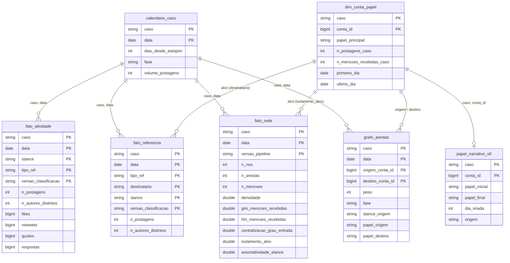
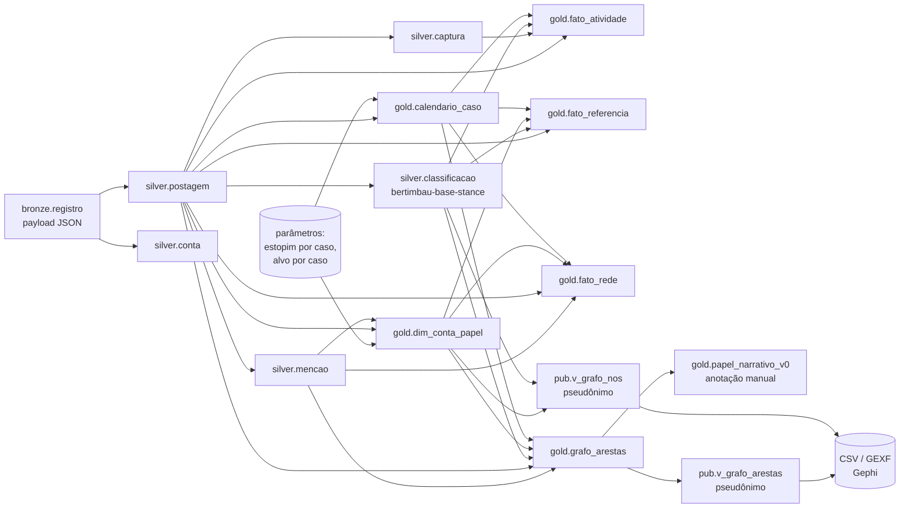

# Catálogo de Dados — camada Gold e views `pub`

Pipeline `scapegoat` · Databricks (Unity Catalog, Delta Lake) · versão de 15/09/2026 (substitui a de 07/09: inclui `fato_referencia`, `papel_narrativo_v0`, as quarentenas e a coluna **domínio** com mínimos e máximos observados)

Este arquivo transcreve a seção 3 do `README.md`. Os comentários de tabela e coluna estão também gravados no Unity Catalog (`COMMENT ON TABLE` / `ALTER COLUMN … COMMENT`) e podem ser consultados em `system.information_schema.tables` e `.columns` com `table_schema = 'gold'`. A Bronze e a Silver estão descritas nas seções 3.2 e 3.3 do README.

## Gold e `pub`

A Gold é a camada analítica: uma constelação com o calendário do caso como eixo comum, uma dimensão de contas e papéis, três fatos e uma tabela de arestas, desnormalizada, sem texto nem handle, construída em SQL puro sobre a Silver (`sql/sql/01_gold_calendario_caso.sql` a `05_gold_grafo_arestas.sql`; comentários do catálogo em `06_` e `07_`). Duas tabelas foram acrescentadas durante a análise sem alterar o esquema existente: `fato_referencia`, para separar o falado *com* do falado *sobre* (P9), e `papel_narrativo_v0`, anotação manual dos papéis narrativos de quarenta contas (P4 e P4b). `dim_stance` (acusador, defensor, neutro) e `dim_mecanismo` (original, reply, quote) são dimensões degeneradas — vivem como colunas dos fatos, porque têm três valores fixos e nenhum atributo além do nome.

A linhagem entre camadas, do payload bruto ao export:

Seis decisões de modelagem ficam registradas. Pico e limiar de declínio são calculados só a partir do estopim, porque o máximo global do Arthur do Val (28/02, 1.359 postagens) pertence a outra polêmica e ancorar o pico nele deixava o caso sem fase `pico`. Os alvos são identificados por lista declarada, não por autoria, porque não têm postagens no corpus; a dimensão de papéis nasce de autores ∪ mencionados. `papel_principal` fica aberto: o MVP marca só `alvo` e `demais`, e os papéis narrativos entram por `papel_narrativo_v0` sem alterar a dimensão. Dimensões degeneradas para stance e mecanismo. Nenhum handle nem texto na Gold; a `pub` expõe views pseudonimizadas por hash estável. E a estrutura do grafo fica separada das métricas: `fato_rede` responde às perguntas, `grafo_arestas` alimenta as figuras, e qualquer janela temporal é um filtro na exportação, não uma tabela nova.

**Pseudonimização (`pub`).** O identificador público de uma conta é `n` seguido de dez caracteres hexadecimais de um SHA-256 calculado sobre um sal e o `conta_id`. A mesma conta recebe o mesmo pseudônimo em qualquer caso, dia ou export, o que permite ver que 533 contas participam dos dois casos; 16.932 linhas de nó (caso × conta) produzem 16.399 pseudônimos distintos, sem colisão. Ninguém tem nome na `pub`, nem o alvo. O valor do sal não aparece neste documento, no repositório nem nas evidências; onde ele está e o que isso implica é tratado na seção 5 do README.

## Catálogo de Dados

Os comentários de tabela e de coluna abaixo estão gravados no Unity Catalog (`COMMENT ON TABLE`, `ALTER COLUMN … COMMENT`) e podem ser consultados em `system.information_schema.tables` e `.columns`; todas as tabelas da Gold carregam as tags `layer = gold`, `owner = carlos`, `domain = scapegoating`, `refresh = manual`, e `classification` igual a `anonimizado` para `calendario_caso`, `fato_atividade`, `fato_rede` e `fato_referencia` (nenhum identificador de conta) e `pseudonimizado` para `dim_conta_papel`, `grafo_arestas` e `papel_narrativo_v0` (carregam `conta_id`). A coluna **domínio** traz, para os categóricos, os valores admitidos pelos `CHECK`, e, para os numéricos e datas, o mínimo e o máximo observados no dado carregado em 15/09/2026 (consulta em `evidencias/bloco5/catalogo_dominios_numericos.png`). Uma leitura desses extremos precisa ser feita com o dia degenerado em mente: o Monark tem um dia com 2 nós (07/02, dia anterior ao estopim), e é ele que produz os máximos de 1,0 em centralização, HHI e parcela do alvo e o mínimo de 0,5 do Gini; a análise exclui dias com menos de 30 nós (README, seção 5). A versão completa do catálogo está em `catalog/catalogo_de_dados.md`.

#### `gold.calendario_caso`

| | |
|---|---|
| **Propósito** | Eixo temporal normalizado de cada caso: traduz a data-calendário em dias desde o estopim e em fase da crise, para comparar casos sem usar volume absoluto. |
| **Grão** | 1 linha por caso × data com pelo menos uma postagem coletada. 26 linhas (Monark 8, Arthur do Val 18). |
| **Linhagem** | `silver.postagem` (volume diário) + parâmetros declarados: estopim `monark` = 2022-02-08, `arthur_do_val` = 2022-03-04. |
| **Regra das fases** | `pre_crise` (data < estopim) · `estopim` (data = estopim) · `escalada` (entre estopim e pico) · `pico` (dia de maior volume **a partir do estopim**) · `declinio` (volume ≥ 25 % do pico) · `pos_rito` (< 25 %). Avaliada dia a dia; não é monotônica. |
| **Atualização** | Manual, `INSERT OVERWRITE`. |

| coluna | tipo | domínio | descrição |
|---|---|---|---|
| `caso` | string | `monark` \| `arthur_do_val` | Slug do caso. Igual a `silver.postagem.caso_slug`. |
| `data` | date | 2022-02-07 a 2022-03-14 | Data-calendário (UTC) das postagens. |
| `dias_desde_estopim` | int | −7 a 10 | `data − data_estopim`. 0 = estopim; negativo = pré-crise. |
| `fase` | string | `pre_crise` \| `estopim` \| `escalada` \| `pico` \| `declinio` \| `pos_rito` | Fase derivada do volume (ver regra). |
| `volume_postagens` | int | 2 a 1.359 | Postagens do caso no dia. Aditiva. |

#### `gold.dim_conta_papel`

| | |
|---|---|
| **Propósito** | Papel de cada conta dentro de cada caso (alvo do bode expiatório vs demais), com contadores de participação. Base de `isolamento_alvo`. |
| **Grão** | 1 linha por caso × `conta_id`. Contas de um caso = autores de postagens do caso ∪ contas mencionadas em postagens do caso. 16.932 linhas. |
| **Linhagem** | `silver.postagem` (autoria) + `silver.mencao ⋈ silver.postagem` (menções) + lista declarada de alvos (`monark` → conta 5238; `arthur_do_val` → conta 5046). |
| **Privacidade** | Só `conta_id` (chave surrogate da Silver). Sem handle, sem texto. |
| **Nota** | Os alvos não postam no corpus (`n_postagens_caso = 0`); existem no grafo apenas como mencionados. |

| coluna | tipo | domínio | descrição |
|---|---|---|---|
| `caso` | string | `monark` \| `arthur_do_val` | Slug do caso. |
| `conta_id` | bigint | chave surrogate | Chave de `silver.conta`. |
| `papel_principal` | string | `alvo` \| `demais` | Papel estrutural no MVP. Os papéis narrativos vivem em `papel_narrativo_v0`. |
| `n_postagens_caso` | int | 0 a 77 | Postagens da conta como autora, no caso. |
| `n_mencoes_recebidas_caso` | int | 0 a 9.132 | Menções recebidas pela conta em postagens do caso. |
| `primeiro_dia` / `ultimo_dia` | date | 2022-02-07 a 2022-03-14 | Primeira e última data em que a conta aparece no caso (autora ou mencionada). |

#### `gold.papel_narrativo_v0`

| | |
|---|---|
| **Propósito** | Papel narrativo de contas selecionadas — `instituicao_legitimadora`, `veiculo`, `lider_acusacao`, `acusador`, `aliado_do_alvo`, `aliado_afastado`, `vitima_secundaria`, `outro` — com papel inicial e final e dia da virada. |
| **Grão** | 1 linha por caso × `conta_id`: 19 contas no Monark, 21 no Arthur do Val. |
| **Origem** | Anotação manual com fonte externa (`origem = declarado`), não medida. Candidatas = as 25 contas não-alvo mais mencionadas de cada caso (`gold.grafo_arestas`) + leitura do caso. |
| **Cuidados** | Três contas do top-10 do declínio do Monark ficaram sem papel (decisão de 11/09) e permanecem como `demais`; papéis com uma ou duas contas têm n pequeno. Semente da futura tabela de rótulos públicos. |
| **Privacidade** | Só `conta_id`; a correspondência com nomes fica fora do repositório. |

| coluna | tipo | domínio | descrição |
|---|---|---|---|
| `caso` | string | `monark` \| `arthur_do_val` | Slug do caso. |
| `conta_id` | bigint | chave surrogate | Chave de `silver.conta`. |
| `papel_inicial` | string | os oito papéis acima | Papel narrativo no início do episódio (ou único, se não há virada). |
| `papel_final` | string | os oito papéis acima; NULL sem virada | Papel após a virada; NULL se o papel não muda. |
| `dia_virada` | int | 1 a 4; NULL sem virada | Dia da virada em `dias_desde_estopim` (0 = estopim). Declarado, não medido. |
| `origem` | string | `declarado` \| `medido` (nenhum `medido` na v0) | `declarado` = atribuído por leitura do caso; `medido` = derivado de métrica. |
| `justificativa` | string | texto livre | Motivo do rótulo, sem nome nem texto de postagem. |
| `decidido_em` | date | 2026-09-08 | Data da decisão. |

#### `gold.fato_atividade`

| | |
|---|---|
| **Propósito** | Atividade diária de cada caso decomposta por posição (stance) e mecanismo de referência. Responde P1–P4 e P7. |
| **Grão** | 1 linha por caso × data × stance × tipo_ref × versao_classificacao. |
| **Linhagem** | `silver.postagem ⋈ silver.captura ⋈ silver.classificacao ⋈ gold.calendario_caso`. |
| **Aditividade** | `n_postagens`, `likes`, `retweets`, `quotes`, `respostas` aditivas. `n_autores_distintos` **semi-aditiva** (não somar entre linhas). |
| **Versionamento** | Reclassificar não sobrescreve: nova `versao_classificacao` gera novas linhas. |
| **Conferência** | Σ `n_postagens` = 4.803 (Monark) + 13.893 (Arthur do Val) = 18.696, igual à Silver. |

| coluna | tipo | domínio | descrição |
|---|---|---|---|
| `caso`, `data` | string, date | como em `calendario_caso` | Chave para `calendario_caso`. |
| `dias_desde_estopim`, `fase` | int, string | como em `calendario_caso` | Copiados de `calendario_caso`. |
| `stance` | string | `acusador` \| `defensor` \| `neutro` \| `sem_rotulo` | Rótulo de `silver.classificacao`; `sem_rotulo` se não classificada (zero ocorrências). |
| `tipo_ref` | string | `original` \| `reply` \| `quote` | Mecanismo de referência da postagem. |
| `versao_classificacao` | string | `hf@a483947` | Commit do classificador. |
| `n_postagens` | int | 1 a 623 | Postagens no grão. |
| `n_autores_distintos` | int | 1 a 530 | Autores distintos no grão. Semi-aditiva. |
| `likes` | bigint | 0 a 333.577 | Soma dos likes (máximo por postagem entre capturas). |
| `retweets` | bigint | 0 a 41.208 | Idem, retweets. |
| `quotes` | bigint | 0 a 4.930 | Idem, citações. |
| `respostas` | bigint | 0 a 2.939 | Idem, respostas recebidas. |

#### `gold.fato_referencia`

| | |
|---|---|
| **Propósito** | Postagens por mecanismo de referência e destinatário (`alvo`, `terceiros`, `nao_se_aplica`), para separar o falado *com* do falado *sobre* (P9). |
| **Grão** | 1 linha por caso × data × tipo_ref × destinatario × stance × versao_classificacao (v1, 10/09). 296 linhas. |
| **Linhagem** | `silver.postagem` (`tipo_ref`, `ref_conta_id`) + `silver.classificacao` + `gold.dim_conta_papel` (alvo) + `gold.calendario_caso`. |
| **Cuidados** | `quote` não tem `ref_conta_id`, logo `destinatario = nao_se_aplica`; o alvo não posta, logo um reply a ele é interpelação a uma postagem fora da coleta. `n_autores_distintos` semi-aditiva. |
| **Histórico** | A v0 tinha `ref_ao_alvo BOOLEAN` na chave e falhou na carga (coluna de PK é NOT NULL implícita no Unity Catalog); está em quarentena como `fato_referencia_v0_quarentena`; as constraints da v1 levam sufixo `_v1`. |
| **Conferência** | Totais 13.893 / 4.803 = `fato_atividade`; replies ao alvo 3.409 / 501. |

| coluna | tipo | domínio | descrição |
|---|---|---|---|
| `caso`, `data` | string, date | como em `calendario_caso` | Chave para `calendario_caso`. |
| `dias_desde_estopim`, `fase` | int, string | como em `calendario_caso` | Copiados de `calendario_caso`. |
| `tipo_ref` | string | `original` \| `reply` \| `quote` | Mecanismo de referência (`silver.postagem.tipo_ref`). |
| `destinatario` | string | `alvo` \| `terceiros` \| `nao_se_aplica` | Para `reply`: `alvo` se `ref_conta_id` é o alvo do caso (`dim_conta_papel.papel_principal = alvo`), senão `terceiros`; `nao_se_aplica` para `original` e `quote`. NOT NULL. |
| `stance` | string | `acusador` \| `defensor` \| `neutro` \| `sem_rotulo` | Rótulo de `silver.classificacao`; `sem_rotulo` se não classificada na versão (zero ocorrências). |
| `versao_classificacao` | string | `hf@a483947` | `silver.classificacao.versao`. Reclassificar gera novas linhas, não sobrescreve. |
| `n_postagens` | int | 1 a 372 | Postagens no grão. Aditiva. |
| `n_autores_distintos` | int | 1 a 357 | Autores distintos no grão. Semi-aditiva: não somar entre linhas. |

#### `gold.fato_rede`

| | |
|---|---|
| **Propósito** | Snapshot diário da estrutura do grafo de menções: concentração, centralização e parcela do alvo. Responde P5, P6 e P9. |
| **Grão** | 1 linha por caso × data × `versao_pipeline`. Grafo do dia: nós = autores ∪ mencionados nas postagens do dia; arestas = pares autor → mencionado, peso = nº de menções. 26 linhas. |
| **Linhagem** | `silver.mencao ⋈ silver.postagem` (arestas) + `gold.dim_conta_papel` (alvo) + `gold.calendario_caso` (fase). |
| **Natureza** | Snapshot — medidas **não aditivas**; nunca somar entre dias. Comparar entre casos apenas por `dias_desde_estopim` e por medida normalizada. |
| **Cuidados** | Dias com poucos nós produzem métricas degeneradas (Monark 2022-02-07: 2 nós); a análise adota mínimo de 30 nós. `assortatividade_stance` é NULL por construção (só autores têm stance). |
| **Versão** | `versao_pipeline = gold-v1` corresponde à tag `v0.4.0` do repositório (rótulo de trabalho gravado na carga de 07/09; não reescrito).  |
| **Conferência** | Σ `n_mencoes` = 5.868 (Monark) + 22.954 (Arthur do Val), igual a `silver.mencao`. |

| coluna | tipo | domínio | descrição |
|---|---|---|---|
| `caso`, `data` | string, date | como em `calendario_caso` | Chave para `calendario_caso`. |
| `dias_desde_estopim`, `fase` | int, string | como em `calendario_caso` | Copiados de `calendario_caso`. |
| `versao_pipeline` | string | `gold-v1` | Versão do cálculo de rede; recalcular gera nova versão. |
| `n_nos` | int | 2 a 1.113 | Contas no grafo do dia. |
| `n_arestas` | int | 1 a 1.958 | Pares distintos autor → mencionado. |
| `n_mencoes` | int | 1 a 2.552 | Soma dos pesos das arestas. |
| `densidade` | double | 0,0011 a 0,5 | `n_arestas / (n_nos · (n_nos − 1))`, grafo dirigido. |
| `gini_mencoes_recebidas` | double | 0,5 a 0,968 | Gini das menções recebidas entre os nós (0 = igualdade, 1 = tudo em um nó). |
| `hhi_mencoes_recebidas` | double | 0,029 a 1,0 | Herfindahl: Σ (participação de cada nó nas menções)². |
| `centralizacao_grau_entrada` | double | 0,16 a 1,0 | Freeman por grau de entrada não ponderado: Σ(grau_max − grau_i) / (n − 1)². 1 = estrela perfeita. |
| `isolamento_alvo` | double | 0,127 a 1,0 | Menções ao alvo / menções do dia. Mede centralidade do alvo (a análise a chama "parcela do alvo"). |
| `assortatividade_stance` | double | NULL | NULL no MVP, por construção. |

#### `gold.grafo_arestas`

| | |
|---|---|
| **Propósito** | Lista de arestas do grafo de menções no grão mais fino, para exportação (Gephi) e para qualquer recorte de janela. `fato_rede` guarda as métricas; esta tabela guarda a estrutura. |
| **Grão** | 1 linha por caso × data × origem → destino (aresta dirigida do autor para a conta mencionada). Qualquer janela é `WHERE` + `SUM(peso)` agrupado por par. |
| **Linhagem** | `silver.mencao ⋈ silver.postagem` + `silver.classificacao` (stance) + `gold.dim_conta_papel` (papéis) + `gold.calendario_caso` (fase). |
| **Privacidade** | Só `conta_id`; a pseudonimização acontece nas views `pub`. |
| **Conferência** | Σ `peso` = 5.868 / 22.954 (= `silver.mencao`); pares = 4.899 / 17.585 (= `fato_rede.n_arestas`); o alvo nunca aparece como origem. |

| coluna | tipo | domínio | descrição |
|---|---|---|---|
| `caso`, `data` | string, date | como em `calendario_caso` | Chave para `calendario_caso`. |
| `dias_desde_estopim`, `fase` | int, string | como em `calendario_caso` | Copiados de `calendario_caso`. |
| `origem_conta_id` | bigint | chave surrogate | Autor da postagem. |
| `destino_conta_id` | bigint | chave surrogate | Conta mencionada. |
| `peso` | int | 1 a 46 | Menções origem → destino no dia. Aditiva. |
| `stance_origem` | string | `acusador` \| `defensor` \| `neutro` | Stance mais frequente entre as postagens que geraram a aresta no dia. |
| `papel_origem`, `papel_destino` | string | `alvo` \| `demais` | De `dim_conta_papel`. `destino = alvo` isola o subgrafo dirigido à vítima. |

#### Camada `pub`

| view | grão | o que faz |
|---|---|---|
| `pub.v_grafo_arestas` | = `grafo_arestas` | Troca os `conta_id` por pseudônimo e nomeia as colunas como o Gephi espera (`source`, `target`, `weight`), mantendo `caso`, `data`, `dias_desde_estopim`, `fase`, `stance_origem`, `papel_origem`, `papel_destino`. |
| `pub.v_grafo_nos` | caso × conta | Um nó por caso com `id` (pseudônimo), `papel` (`alvo` \| `demais`), `stance_modal` (`acusador` \| `defensor` \| `neutro` \| `nao_autor` para quem só é mencionado, inclusive o alvo), `n_postagens_caso`, `n_mencoes_recebidas_caso`, `primeiro_dia`, `ultimo_dia` — atributos para cor e tamanho. |

#### Bronze e quarentenas

`bronze.arquivo` e `bronze.registro` estão descritas na seção 3.2 do README. Duas tabelas da Gold permanecem no catálogo com o sufixo `_quarentena`, por regra do projeto (substituição por `RENAME`, nunca `DROP`): `dim_conta_papel_v0_quarentena`, primeira versão da dimensão, com handle no esquema, substituída em 07/09 pela versão só com `conta_id`; e `fato_referencia_v0_quarentena`, a v0 cuja carga falhou, vazia. Ambas comentadas como "não usar; não exportar".

#### Inventário

Em 13/09/2026 o catálogo `scapegoat` tinha **24 objetos** — 2 na Bronze, 11 na Silver (7 tabelas e 4 views), 9 na Gold (7 tabelas e 2 quarentenas) e 2 views na `pub` — **todos com `COMMENT` de tabela**, e todas as colunas da Gold e da `pub` com `COMMENT` de coluna, conforme `system.information_schema.tables` e `.columns`.
