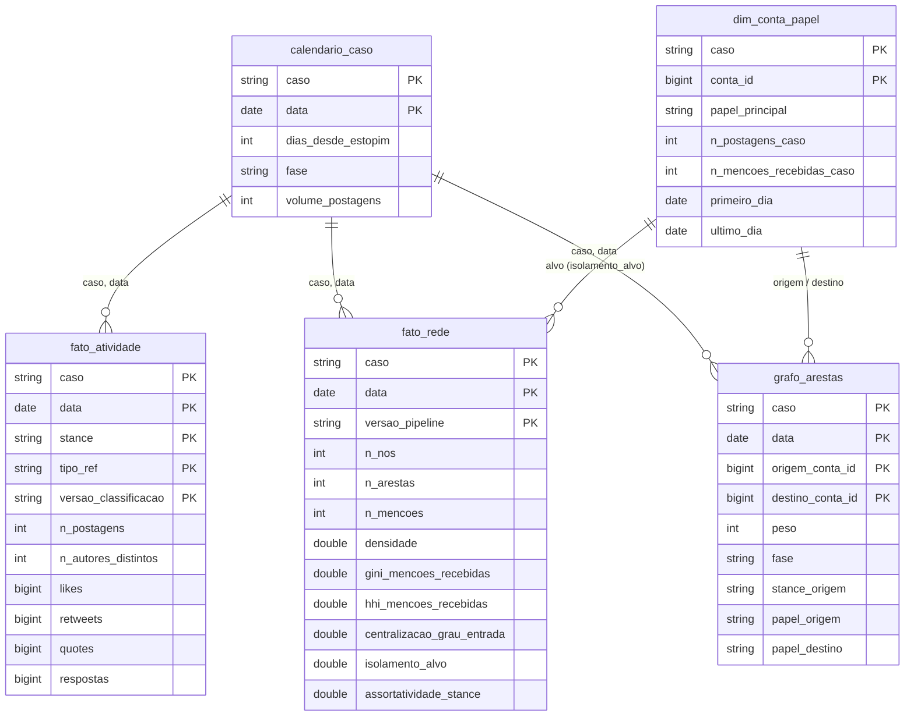
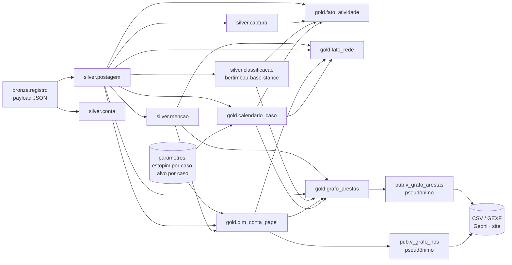

# Catálogo de Dados — camada Gold

Pipeline `scapegoat` · Databricks (Unity Catalog, Delta Lake) · versão de 07/09/2026

A Gold é a camada analítica do MVP: uma constelação com três dimensões, dois fatos e uma tabela de arestas, desnormalizada, sem texto nem handle, construída em SQL puro sobre a Silver. Sobre ela, a camada `pub` expõe views pseudonimizadas — a fronteira do que sai da plataforma. Os comentários de tabela e coluna abaixo estão também gravados no Unity Catalog (`COMMENT ON TABLE` / `ALTER COLUMN … COMMENT`) e podem ser consultados em `system.information_schema.tables` e `.columns` com `table_schema = 'gold'`.

## Esquema estrela

`dim_stance` (acusador · defensor · neutro) e `dim_mecanismo` (original · reply · quote) são dimensões degeneradas — vivem como colunas de `fato_atividade`, sem tabela própria, porque têm três valores fixos e nenhum atributo além do nome.

## Linhagem

---

## `gold.calendario_caso`

| | |
|---|---|
| **Propósito** | Eixo temporal normalizado de cada caso: traduz a data-calendário em dias desde o estopim e em fase da crise, para comparar casos sem usar volume absoluto. |
| **Grão** | 1 linha por caso × data com pelo menos uma postagem coletada. 26 linhas (Monark 8, Arthur do Val 18). |
| **Linhagem** | `silver.postagem` (volume diário) + parâmetros declarados: estopim `monark` = 2022‑02‑08, `arthur_do_val` = 2022‑03‑04. |
| **Regra das fases** | `pre_crise` (data < estopim) · `estopim` (data = estopim) · `escalada` (entre estopim e pico) · `pico` (dia de maior volume **a partir do estopim**) · `declinio` (volume ≥ 25 % do pico) · `pos_rito` (< 25 %). Avaliada dia a dia; não é monotônica. |
| **Atualização** | Manual, `INSERT OVERWRITE`. |

| coluna | tipo | descrição |
|---|---|---|
| `caso` | string | Slug do caso (`monark` \| `arthur_do_val`). Igual a `silver.postagem.caso_slug`. |
| `data` | date | Data-calendário (UTC) das postagens. |
| `dias_desde_estopim` | int | `data − data_estopim`. 0 = estopim; negativo = pré-crise. |
| `fase` | string | Fase derivada do volume (ver regra). |
| `volume_postagens` | int | Postagens do caso no dia. Aditiva. |

## `gold.dim_conta_papel`

| | |
|---|---|
| **Propósito** | Papel de cada conta dentro de cada caso (alvo do bode expiatório vs demais), com contadores de participação. Base de `isolamento_alvo`. |
| **Grão** | 1 linha por caso × `conta_id`. Contas de um caso = autores de postagens do caso ∪ contas mencionadas em postagens do caso. |
| **Linhagem** | `silver.postagem` (autoria) + `silver.mencao ⋈ silver.postagem` (menções) + lista declarada de alvos (`monark` → conta 5238; `arthur_do_val` → conta 5046). |
| **Privacidade** | Só `conta_id` (chave surrogate da Silver). Sem handle, sem texto. |
| **Nota** | Os alvos não postam no corpus (`n_postagens_caso = 0`); existem no grafo apenas como mencionados. |

| coluna | tipo | descrição |
|---|---|---|
| `caso` | string | Slug do caso. |
| `conta_id` | bigint | Chave surrogate de `silver.conta`. |
| `papel_principal` | string | `alvo` \| `demais` no MVP. Reservado para v2: `lider_acusacao`, `vitima_secundaria`, `instituicao_legitimadora`. |
| `n_postagens_caso` | int | Postagens da conta como autora, no caso. |
| `n_mencoes_recebidas_caso` | int | Menções recebidas pela conta em postagens do caso. |
| `primeiro_dia` / `ultimo_dia` | date | Primeira e última data em que a conta aparece no caso (autora ou mencionada). |

## `gold.fato_atividade`

| | |
|---|---|
| **Propósito** | Atividade diária de cada caso decomposta por posição (stance) e mecanismo de referência. Responde P1–P4. |
| **Grão** | 1 linha por caso × data × stance × tipo_ref × versao_classificacao. |
| **Linhagem** | `silver.postagem ⋈ silver.captura ⋈ silver.classificacao ⋈ gold.calendario_caso`. |
| **Aditividade** | `n_postagens`, `likes`, `retweets`, `quotes`, `respostas` aditivas. `n_autores_distintos` **semi-aditiva** (não somar entre linhas). |
| **Versionamento** | Reclassificar não sobrescreve: nova `versao_classificacao` gera novas linhas. |
| **Conferência** | Σ `n_postagens` = 4 803 (Monark) + 13 893 (Arthur) = 18 696, igual à Silver. |

| coluna | tipo | descrição |
|---|---|---|
| `caso`, `data` | string, date | Chave para `calendario_caso`. |
| `dias_desde_estopim`, `fase` | int, string | Copiados de `calendario_caso`. |
| `stance` | string | `acusador` \| `defensor` \| `neutro` (`silver.classificacao.rotulo`); `sem_rotulo` se não classificada. |
| `tipo_ref` | string | `original` \| `reply` \| `quote` (`silver.postagem.tipo_ref`). |
| `versao_classificacao` | string | Commit do classificador (`silver.classificacao.versao`). |
| `n_postagens` | int | Postagens no grão. |
| `n_autores_distintos` | int | Autores distintos no grão. Semi-aditiva. |
| `likes`, `retweets`, `quotes`, `respostas` | bigint | Somas dos contadores (máximo por postagem entre capturas). |

## `gold.fato_rede`

| | |
|---|---|
| **Propósito** | Snapshot diário da estrutura do grafo de menções: concentração, centralização e isolamento do alvo. Responde P5–P9. |
| **Grão** | 1 linha por caso × data × `versao_pipeline`. Grafo do dia: nós = autores ∪ mencionados nas postagens do dia; arestas = pares autor → mencionado, peso = nº de menções. |
| **Linhagem** | `silver.mencao ⋈ silver.postagem` (arestas) + `gold.dim_conta_papel` (alvo) + `gold.calendario_caso` (fase). |
| **Natureza** | Snapshot — medidas **não aditivas**; nunca somar entre dias. Comparar entre casos apenas por `dias_desde_estopim` e por medida normalizada. |
| **Cuidados** | Dias com poucos nós produzem métricas degeneradas (Monark 2022‑02‑07: 2 nós); recomenda-se mínimo de ~30 nós na análise. |
| **Limitação MVP** | `assortatividade_stance` é NULL (exige stance de nós não-autores). Modularidade e clustering ficam para v2 (NetworkX). |
| **Conferência** | Σ `n_mencoes` = 5 868 (Monark) + 22 954 (Arthur), igual a `silver.mencao`. |

| coluna | tipo | descrição |
|---|---|---|
| `caso`, `data` | string, date | Chave para `calendario_caso`. |
| `dias_desde_estopim`, `fase` | int, string | Copiados de `calendario_caso`. |
| `versao_pipeline` | string | Versão do cálculo de rede; recalcular gera nova versão. |
| `n_nos` | int | Contas no grafo do dia. |
| `n_arestas` | int | Pares distintos autor → mencionado. |
| `n_mencoes` | int | Soma dos pesos das arestas. |
| `densidade` | double | `n_arestas / (n_nos · (n_nos − 1))`, grafo dirigido. |
| `gini_mencoes_recebidas` | double | Gini das menções recebidas entre os nós (0 = igualdade, 1 = tudo em um nó). |
| `hhi_mencoes_recebidas` | double | Herfindahl: Σ (participação de cada nó nas menções)². |
| `centralizacao_grau_entrada` | double | Freeman por grau de entrada não ponderado: Σ(grau_max − grau_i) / (n − 1)². 1 = estrela perfeita. |
| `isolamento_alvo` | double | Menções ao alvo / menções do dia. Proxy do foco da multidão na vítima. |
| `assortatividade_stance` | double | NULL no MVP. |

## `gold.grafo_arestas`

| | |
|---|---|
| **Propósito** | Lista de arestas do grafo de menções no grão mais fino, para exportação (Gephi, site) e para qualquer recorte de janela. `fato_rede` guarda as métricas; esta tabela guarda a estrutura. |
| **Grão** | 1 linha por caso × data × origem → destino (aresta dirigida do autor para a conta mencionada). Qualquer janela — caso inteiro, fase, dia, intervalo de `dias_desde_estopim` — é `WHERE` + `SUM(peso)` agrupado por par. |
| **Linhagem** | `silver.mencao ⋈ silver.postagem` + `silver.classificacao` (stance) + `gold.dim_conta_papel` (papéis) + `gold.calendario_caso` (fase). |
| **Privacidade** | Só `conta_id`; a pseudonimização acontece nas views `pub`. |
| **Conferência** | Σ `peso` = 5 868 / 22 954 (= `silver.mencao`); pares = 4 899 / 17 585 (= `fato_rede.n_arestas`); o alvo nunca aparece como origem. |

| coluna | tipo | descrição |
|---|---|---|
| `caso`, `data` | string, date | Chave para `calendario_caso`. |
| `dias_desde_estopim`, `fase` | int, string | Copiados de `calendario_caso`. |
| `origem_conta_id` | bigint | Autor da postagem. |
| `destino_conta_id` | bigint | Conta mencionada. |
| `peso` | int | Menções origem → destino no dia. Aditiva. |
| `stance_origem` | string | Stance mais frequente entre as postagens que geraram a aresta no dia. |
| `papel_origem`, `papel_destino` | string | `alvo` \| `demais`, de `dim_conta_papel`. `destino = alvo` isola o subgrafo dirigido à vítima. |

## Camada `pub` — views de publicação

| view | grão | o que faz |
|---|---|---|
| `pub.v_grafo_arestas` | = `grafo_arestas` | Troca os `conta_id` por pseudônimo e nomeia as colunas como o Gephi espera (`source`, `target`, `weight`). |
| `pub.v_grafo_nos` | caso × conta | Um nó por caso com `papel`, `stance_modal` (`nao_autor` para quem só é mencionado, como o alvo), postagens e menções recebidas — atributos para cor e tamanho. |

**Pseudonimização.** `id = 'n' + 10 hex de SHA‑256(sal ‖ conta_id)`. A mesma conta recebe o mesmo pseudônimo em qualquer caso, dia ou export (16 932 linhas de nó, 16 399 pseudônimos distintos: 533 contas participam dos dois casos). Irreversível sem `silver.conta`. Nomes públicos, quando decididos conta a conta (figuras públicas nos papéis narrativos), entrarão por uma tabela de rótulos (`gold.rotulo_publico`, v2) com `COALESCE(rotulo_publico, pseudonimo)` na view — retirar um nome é apagar uma linha.

**Exportação.** O grafo de uma janela é `SELECT source, target, SUM(weight) … WHERE caso = … AND fase = … GROUP BY 1, 2`, baixado como CSV. Para rede dinâmica, exportar com `data` e importar no Gephi como *timestamp*. O site consome o GEXF exportado do Gephi (com layout) via Sigma.js.

---

## Tags de governança (Unity Catalog)

Todas as tabelas da Gold carregam `layer = gold`, `owner = carlos`, `domain = scapegoating`, `refresh = manual`. `classification` = `anonimizado` para `calendario_caso`, `fato_atividade` e `fato_rede` (nenhum identificador de conta), e `pseudonimizado` para `dim_conta_papel` e `grafo_arestas` (carregam `conta_id`, chave surrogate reversível apenas via `silver.conta`, camada de acesso restrito).

## Decisões registradas nesta versão

1. **Pico e limiar de declínio calculados só a partir do estopim.** O máximo global do Arthur do Val (28/02, 1 359 postagens) é de outra polêmica (viagem à Ucrânia), confirmado por leitura de amostra; ancorar o pico nele deixava o caso sem fase `pico` e com limiar irreal.
2. **Alvos identificados por `silver.conta.handle`, não por autoria.** Os alvos não têm postagens no corpus; a dimensão de papéis nasce de autores ∪ mencionados.
3. **`papel_principal` aberto.** MVP marca só `alvo` e `demais`; os papéis narrativos do site (líderes de acusação, vítimas secundárias, instituições legitimadoras) entram na v2 sem alterar o esquema.
4. **Dimensões degeneradas** para stance e mecanismo.
5. **Sem handle nem texto na Gold**; a camada `pub` expõe views pseudonimizadas por hash estável.
6. **Estrutura do grafo separada das métricas.** `fato_rede` responde às perguntas; `grafo_arestas` alimenta as figuras e o site, e qualquer janela temporal é um filtro na exportação, não uma tabela nova.

## Limitações a declarar na análise

- O classificador de stance foi treinado em Monark + Wagner; o Arthur do Val não tem exemplos rotulados (transferência entre casos não validada).
- A janela de coleta do Arthur do Val (18 dias) não captura o fim da crise: o volume é um platô de ~800/dia até o corte (14/03).
- A regra de fase não é monotônica (Monark: declínio → pós-rito em 13/02 → declínio em 14/02).
- PK/FK no Delta são informativas; unicidade garantida pelos `GROUP BY` do grão e pelas conferências de soma.
